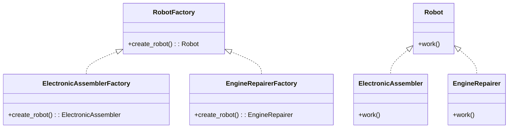

# 「宇宙船工場で働くロボットの冒険」


## ファクトリーメソッドパターンの特徴
ある宇宙船工場では、様々な種類のロボット労働者が働いています。これらのロボットは、異なる部門で専門的な仕事を行っています。例えば、電子部品を組み立てるロボットや、エンジンの修理を担当するロボットなどです。

この宇宙船工場では、新しいロボット労働者を生産するためにファクトリーメソッドパターンが使われています。ファクトリーメソッドパターンは、オブジェクトの生成をサブクラスに任せることで、オブジェクト生成の詳細を隠蔽します。

```python

from abc import ABC, abstractmethod

class RobotFactory(ABC):
    # ロボットを生成するファクトリークラス

    @abstractmethod
    def create_robot(self):
        pass

class ElectronicAssemblerFactory(RobotFactory):
    # 電子部品を組み立てるロボットを生成するファクトリークラス
    def create_robot(self):
        return ElectronicAssembler()

class EngineRepairerFactory(RobotFactory):
    # エンジンの修理を担当するロボットを生成するファクトリークラス
    def create_robot(self):
        return EngineRepairer()

class Robot(ABC):
    # ロボットクラス(抽象クラス)
    @abstractmethod
    def work(self):
        pass

class ElectronicAssembler(Robot):
    # 電子部品を組み立てるロボット(具体的なロボットクラス)
    def work(self):
        return "組立て中"

class EngineRepairer(Robot):
    # エンジンの修理を担当するロボット(具体的なロボットクラス)
    def work(self):
        return "修理中"
```



上記のPythonコードは、ファクトリーメソッドパターンを実装した例です。RobotFactoryは抽象クラスで、具体的なファクトリーであるElectronicAssemblerFactoryとEngineRepairerFactoryがそれを継承しています。各ファクトリークラスは、create_robotメソッドを持っており、それぞれの専門分野のロボットを生成します。Robotは抽象クラスで、具体的なロボットクラスがそれを継承しています。

## ファクトリーメソッドパターンの利点
ファクトリーメソッドパターンの利点は以下の通りです。

- **オブジェクト生成の詳細を隠蔽**: ロボット生成のプロセスが変更された場合でも、コード全体に影響を与えずに変更ができます。
- **柔軟性**: 新しい種類のロボットを追加する際、既存のコードを変更せずに新たなファクトリークラスを追加するだけで対応できます。
- **一貫性**: 同じ種類のオブジェクト生成は、すべての場所でファクトリーメソッドを使用することで一貫性が保たれます。

では、各ファクトリーを使って実際にロボットを生成してみましょう。

```python

def main():
    factories = [ElectronicAssemblerFactory(), EngineRepairerFactory()]

    for factory in factories:
        robot = factory.create_robot()
        print(robot.work())

if __name__ == "__main__":
    main()
```

このmain関数では、ElectronicAssemblerFactoryとEngineRepairerFactoryのインスタンスをリストに格納しています。次に、forループで各ファクトリーからロボットを生成し、workメソッドを実行しています。これにより、各ロボットがどのように働くかが分かります。

## ファクトリーメソッドパターンの欠点
ファクトリーメソッドパターンにもいくつかの欠点があります。

- **クラス数が増加**: 各オブジェクトに対してファクトリークラスが必要になるため、クラス数が増加します。
- **複雑性が増す**: ファクトリーメソッドパターンを使用すると、コードの複雑性が増すことがあります。

## 欠点への対策
欠点への対策として、他のデザインパターンを検討できます。例えば、単純なオブジェクト生成が目的であれば、シンプルファクトリーパターンを使用できます。また、複雑なオブジェクト生成が必要な場合は、抽象ファクトリーパターンやビルダーパターンを検討できます。

最後に、ファクトリーメソッドパターンを使用するかどうかは、プロジェクトの要件や目的によって決定されるべきです。適切なデザインパターンを選択することで、コードの品質や保守性を向上させることができます。