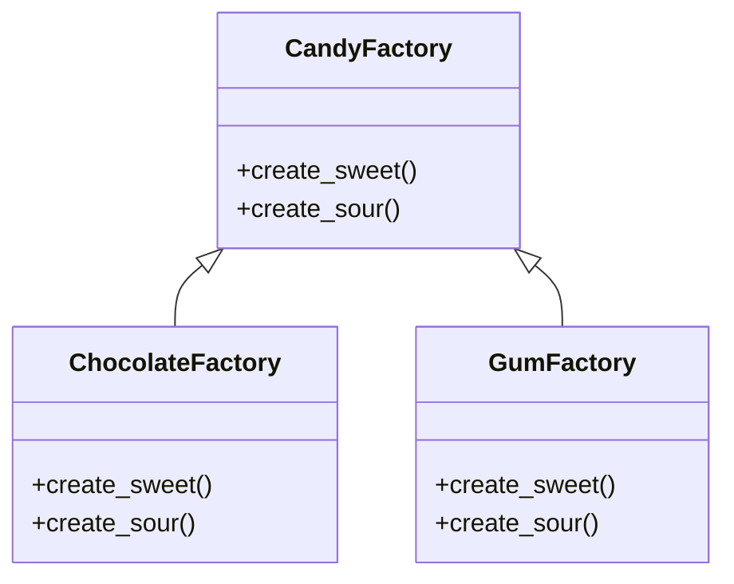

# 「魔法のお菓子王国で繰り広げられるお菓子一家の物語」


## Abstract Factoryパターンの特徴
魔法のキャンディ王国では、さまざまなお菓子がたくさんあります。お菓子家族は、それぞれのお菓子の製造工程を効率化するために、抽象工場パターンを利用しています。

抽象工場パターンは、関連するオブジェクトのグループを作成するインターフェースを提供します。具体的なクラスを指定せずに、オブジェクトのグループを作成できるため、コードの柔軟性が向上します。

この魔法のキャンディ王国では、チョコレート工場とガム工場の2つの具体的な工場があります。どちらの工場でも、それぞれ異なる製品を作成するために、同じ抽象工場インターフェースを利用しています。

```python
from abc import ABC, abstractmethod

# 抽象クラス CandyFactory
class CandyFactory(ABC):
    # 抽象メソッド

    @abstractmethod
    def create_sweet(self):
        pass

    @abstractmethod
    def create_sour(self):
        pass

# チョコレート工場クラス(抽象クラス CandyFactoryを継承)
class ChocolateFactory(CandyFactory):
    def create_sweet(self):
        return "甘いチョコレート"

    def create_sour(self):
        return "酸っぱいチョコレート"

# ガム工場クラス(抽象クラス CandyFactoryを継承)
class GumFactory(CandyFactory):
    def create_sweet(self):
        return "甘いガム"

    def create_sour(self):
        return "酸っぱいガム"

# お菓子を作成する関数
def create_candy(factory: CandyFactory):
    # 抽象工場インターフェースを利用して、お菓子を作成
    sweet_candy = factory.create_sweet() # 甘いお菓子
    sour_candy = factory.create_sour() # 酸っぱいお菓子
    print(f"製作: {sweet_candy}, {sour_candy}")

# メイン処理
def main():
    chocolate_factory = ChocolateFactory() # チョコレート工場
    gum_factory = GumFactory() # ガム工場

    create_candy(chocolate_factory) # チョコレート工場でお菓子を作成
    create_candy(gum_factory) # ガム工場でお菓子を作成

if __name__ == "__main__":
    main()
```




このコードでは、CandyFactoryが抽象工場であり、create_sweetとcreate_sourの2つの抽象メソッドを持っています。ChocolateFactoryとGumFactoryは、それぞれCandyFactoryを継承し、具体的な製品を作成するメソッドを実装しています。これにより、お菓子家族は簡単に新しいお菓子の製造工程を追加できます。

また、お菓子家族は、抽象工場パターンを使用することで、工場ごとに異なる製品を作成する際のコードの変更を最小限に抑えることができます。これにより、新しいお菓子の種類が登場しても、コードの変更や拡張が容易になります。

## Abstract Factoryパターンの利点
抽象工場パターンを利用することで、お菓子家族は以下のような利点を享受できます。

- **柔軟性**: お菓子の種類が増えても、コードを簡単に拡張できます。
- **交換容易性**: 工場の実装を簡単に変更でき、影響を受ける箇所が最小限になります。
- **依存関係の分離**: お菓子の製造に関するコードは、具体的な工場の実装から分離されています。
例えば、お菓子家族が新しいクッキー工場を追加することを決定した場合、CandyFactoryインターフェースを継承したCookieFactoryクラスを作成するだけで済みます。新しい工場の実装が、既存のコードに影響を与えることはありません。

## Abstract Factoryパターンの欠点
抽象工場パターンを利用することで、お菓子家族はいくつかの欠点に直面することもあります。

- **追加のクラスやインターフェース**: 抽象工場パターンを実装するために、追加のクラスやインターフェースが必要になることがあります。これにより、コードが複雑になることがあります。
- **拡張性への制約**: すべての工場が同じインターフェースを実装するため、一部の工場に特有の機能を追加する際に制約が生じることがあります。

## 欠点への対策
欠点に対処するために、お菓子家族は以下のような対策を講じることができます。

- **適切なデザインパターンの選択**: 抽象工場パターンが適切でない場合、別のデザインパターン（例えば、単純なファクトリーパターン）を検討できます。
- **工場ごとの特化したインターフェース**: 一部の工場に特有の機能を追加する際、独自のインターフェースを導入することで柔軟性を向上させることができます。
お菓子家族は、これらの対策を実施することで、抽象工場パターンの欠点を克服し、お菓子の製造プロセスをより効率的かつ柔軟に管理できるようになります。

## まとめ
魔法のキャンディ王国のお菓子家族は、抽象工場パターンを使用して、お菓子の製造プロセスを効率化し、柔軟性を向上させました。このデザインパターンは、関連するオブジェクトのグループを作成するインターフェースを提供し、コードの再利用性と拡張性を向上させます。

しかし、抽象工場パターンには欠点も存在し、コードの複雑性が増加したり、拡張性に制約が生じることがあります。お菓子家族は、適切なデザインパターンの選択や、工場ごとの特化したインターフェースの導入などの対策を講じることで、これらの欠点を克服しました。
