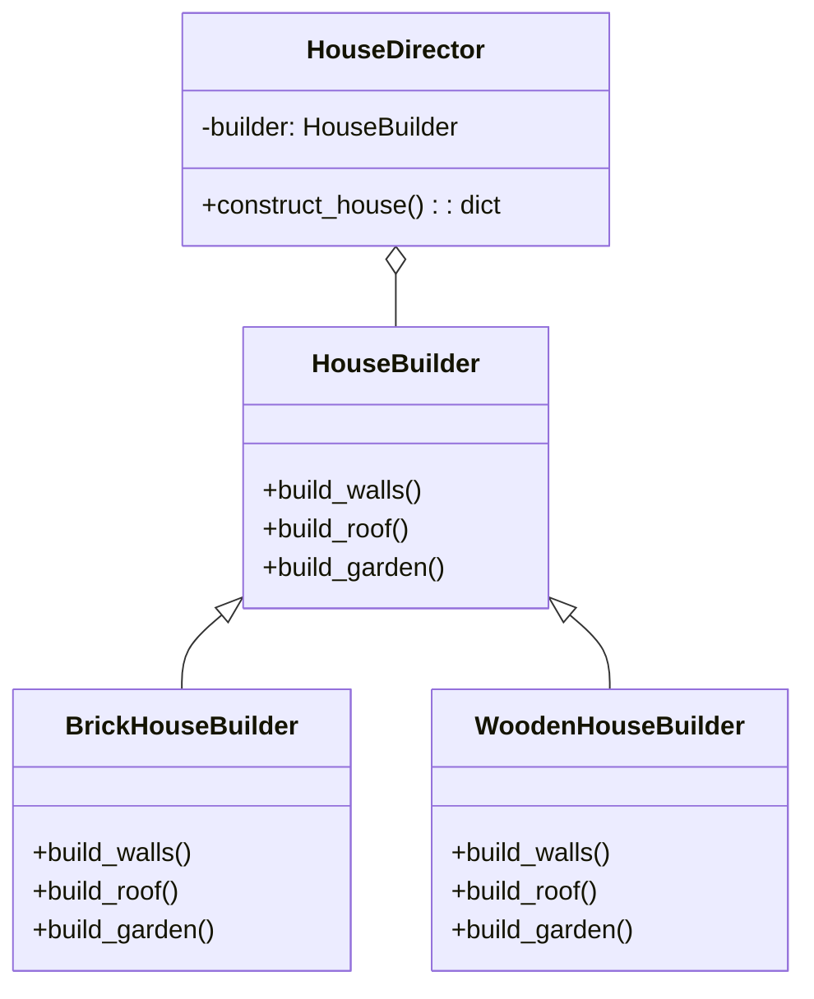

# 「砂漠のオアシスで家を建ている旅人の挑戦」


*夕陽に照らされながら、砂漠のオアシスの風景に溶け込む新築のアドビハウスに見入る旅人*

## 1. 始めに
砂漠のオアシスで家を建てる旅人の挑戦：Builderパターン
ある旅人が、砂漠のオアシスで家を建てることに挑戦しました。彼は家を建てるために、Builderパターンを使用して効率的な建築プロセスを実現しました。この物語を通して、Builderパターンの特徴や利点、欠点を見ていきましょう。

## Builderパターンの特徴
旅人は、家を建てるために、建築家と職人たちと共に働きました。彼は、Builderパターンを利用して、家の生成プロセスを分離し、異なる家のスタイルを簡単に作成できるようにしました。

Builderパターンの特徴を要約すると、以下のようになります。

- 複雑なオブジェクトの構築プロセスを分離
- 同じ構築プロセスで異なるオブジェクトを生成可能

```python
from abc import ABC, abstractmethod

class HouseBuilder(ABC):
    # 家を建てるための抽象クラス

    @abstractmethod # 抽象メソッド
    def build_walls(self):
        # 壁を建てる
        pass

    @abstractmethod # 抽象メソッド
    def build_roof(self):
        # 屋根を建てる
        pass

    @abstractmethod # 抽象メソッド
    def build_garden(self):
        # 庭を作る
        pass

class BrickHouseBuilder(HouseBuilder):
    # レンガの家を建てるための具象クラス

    def build_walls(self): 
        # 壁を建てる
        return "レンガの壁"

    def build_roof(self):
        # 屋根を建てる
        return "瓦の屋根"

    def build_garden(self):
        # 庭を作る
        return "小さな庭"

class WoodenHouseBuilder(HouseBuilder):
    # 木材の家を建てるための具象クラス

    def build_walls(self):
        # 壁を建てる
        return "木材の壁"

    def build_roof(self):
        # 屋根を建てる
        return "木材の屋根"

    def build_garden(self):
        # 庭を作る
        return "大きな庭"

class HouseDirector:
    # 家を建てるためのディレクター

    def __init__(self, builder):
        self.builder = builder # ビルダーをセット

    def construct_house(self):
        house = {}
        house["walls"] = self.builder.build_walls() # 壁を建てる
        house["roof"] = self.builder.build_roof() # 屋根を建てる
        house["garden"] = self.builder.build_garden() # 庭を作る
        return house # 家を返す

# レンガの家を建てる
brick_builder = BrickHouseBuilder() # レンガの家を建てるためのビルダー
director = HouseDirector(brick_builder) # レンガの家を建てるためのディレクター
brick_house = director.construct_house() # レンガの家を建てる

# 木材の家を建てる
wooden_builder = WoodenHouseBuilder() # 木材の家を建てるためのビルダー
director.builder = wooden_builder # 木材の家を建てるためのディレクター
wooden_house = director.construct_house() # 木材の家を建てる
```

このPythonコードでは、Builderパターンを使用して、家の生成プロセスが分離されています。HouseBuilderは抽象クラスであり、build_walls、build_roof、build_gardenというメソッドを持っています。具体的なビルダーであるBrickHouseBuilderとWoodenHouseHouseBuilderは、それぞれ異なる家のスタイルを構築するためのメソッドを実装しています。HouseDirectorクラスは、ビルダーを使用して家を構築する責任を持ちます。

## Builderパターンの利点
旅人は、Builderパターンの利点を活かし、家の生成プロセスを簡潔に表現し、職人たちにも理解しやすくしました。これにより、効率的で綺麗な家が完成しました。

Builderパターンの利点を要約すると、以下のようになります。

- 複雑なオブジェクトの生成を簡潔に表現
- 生成プロセスがコードで理解しやすくなる

## Builderパターンの欠点
しかし、Builderパターンの欠点もありました。オアシスで家を建てるためには、さまざまなビルダークラスが必要で、クラス数が増えてしまいました。また、新しい家のスタイルが必要になるたびに、新しいビルダーを追加する必要がありました。

Builderパターンの欠点を要約すると、以下のようになります。

- クラス数が増加し、コードの複雑性が高まる
- 新しいオブジェクトの生成に新しいビルダーの追加が必要になる場合がある

## 欠点への対策
Builderパターンの欠点に対する対策として、以下のような方法が考えられます。

- オブジェクトの生成が単純であれば、Factory MethodパターンやPrototypeパターンを検討する
- クラス数を減らすために、ビルダーのメソッドを統合する




