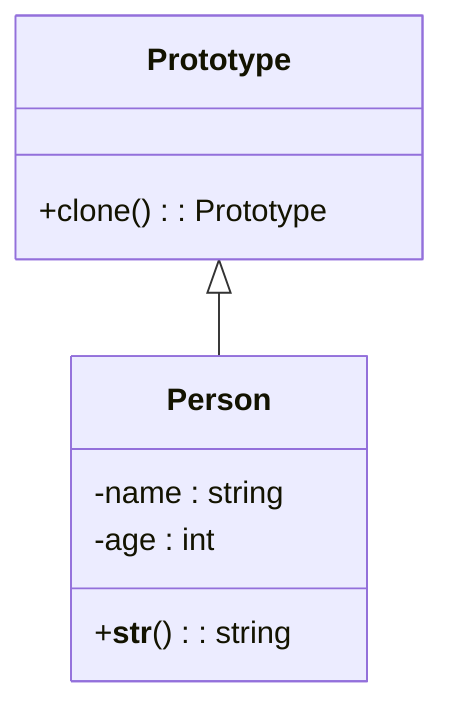

# 「クローンを作る未来都市での個性を見つける探求」

*多様でカラフルなキャラクターが、それぞれの個性を発揮する活気ある街並み。プロトタイプパターンがもたらす新たな創造性と革新性が、彼らの世界を変えています。*
## プロトタイプパターンの概要
未来都市では、人々はクローニング技術を用いて人口を増やしていました。しかし、個性を大切にするある一団の人々は、このクローニング技術を使って、個々の特徴を持った新しい人々を作り出す方法を模索していました。

このような状況で、彼らはプロトタイプパターンというデザインパターンに出会います。プロトタイプパターンは、既存のオブジェクトから新しいオブジェクトを作成する方法を提供します。これにより、オブジェクトの生成コストを削減できます。また、状態を持ったオブジェクトのコピーが容易になります。

## プロトタイプパターンの特徴
プロトタイプパターンの主な特徴は以下の通りです。

- 既存のオブジェクトから新しいオブジェクトを作成
- オブジェクトの生成コストを削減
- 状態を持ったオブジェクトのコピーが容易

この都市では、個々の特徴を持った新しい人々を作り出すために、プロトタイプパターンを利用することにしました。まず、Pythonで実装されたクローニング技術の例を見てみましょう。

```python
import copy

class Person:
    # 人間のクラス

    def __init__(self, name, age, hobbies):
        self.name = name # 名前
        self.age = age # 年齢
        self.hobbies = hobbies # 趣味

    def clone(self):
        return copy.deepcopy(self) # 自分自身のディープコピーを作成

    def add_hobby(self, hobby):
        self.hobbies.append(hobby) # 趣味を追加

    def __str__(self):
        return f"{self.name}, {self.age}歳, 趣味: {', '.join(self.hobbies)}"
```



ここで、Personクラスがあります。このクラスは、cloneメソッドを持っており、copy.deepcopyを使って自分自身のディープコピーを作成しています。これにより、状態を持ったオブジェクトのコピーが容易になります。

また、add_hobbyメソッドを使って、趣味を追加できます。これにより、新しい人々に個々の特徴を付与できます。

## プロトタイプパターンの利点
プロトタイプパターンは、この未来都市のクローニング技術にもたらす利点がいくつかあります。

- 新しいオブジェクトを簡単に作成できる
- オブジェクトの生成コストが低い
- 状態を持ったオブジェクトのコピーが簡単
- オブジェクトの構成が柔軟
プロトタイプパターンを使用することで、人々は個々の特徴を持った新しい人々を簡単に作成できます。また、オブジェクトの生成コストが低く抑えられるため、効率的に人口を増やすことができます。

## プロトタイプパターンの欠点
しかし、プロトタイプパターンにもいくつかの欠点があります。

- オブジェクトのディープコピーが複雑な場合がある
- クローン元とクローン先のオブジェクトの状態が密接に関連している場合、問題が発生する可能性がある

ディープコピーが複雑なオブジェクトの場合、プロトタイプパターンを使用することで問題が発生する可能性があります。また、クローン元とクローン先のオブジェクトの状態が密接に関連している場合、意図しない副作用が発生する可能性があります。

## 問題への対処方法
プロトタイプパターンの欠点に対処する方法として、以下のような対策が考えられます。

- ディープコピーが複雑なオブジェクトには、別のデザインパターンを検討する（例：ファクトリーメソッドパターン）
- クローン元とクローン先のオブジェクトの状態が密接に関連している場合、適切なコピー方法を検討する

プロトタイプパターンの欠点に対処することで、未来都市の人々は個々の特徴を持った新しい人々を効率的に作り出すことができます。個性豊かな未来都市が生まれることでしょう。