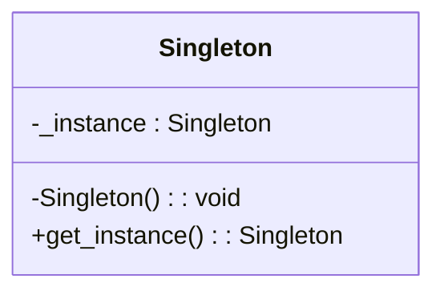

# 「とある村の賢者の栄光と衰退」


*この絵では、一筋の光に照らされた山の上に賢者が立っており、ソフトウェアの世界におけるSingletonパターンのユニークな役割を象徴しています。*

## 始まり
かつて、賢者の住む村がありました。彼は村人たちから尊敬され、彼らの悩みを解決していました。ある日、村人たちは賢者に相談するために一度に押し寄せました。賢者は一度にすべての悩みを解決できませんでしたが、彼は助けを求められると断ることができませんでした。

## シングルトン・パターンの特徴
賢者は、村の唯一の知恵者であることから、シングルトン・パターンの特徴を示しています。このパターンでは、クラスのインスタンスが1つだけ存在し、グローバルなアクセスポイントが提供されます。

```python
class WiseMan:
    _instance = None

    @staticmethod
    def get_instance():
        # インスタンスが存在しない場合にインスタンスを作成
        if WiseMan._instance is None:
            WiseMan._instance = WiseMan()
        return WiseMan._instance

    def __init__(self):
        if WiseMan._instance is not None:
            raise Exception("このクラスはシングルトンです。get_instance()を使用してインスタンスを取得してください。")
        self.advice = "賢明なアドバイス"

# 賢者インスタンスを作成
wise_man1 = WiseMan.get_instance()
print("最初のアドバイス:", wise_man1.advice)

# アドバイスを変更
wise_man1.advice = "新しいアドバイス"

# 別の場所で賢者インスタンスを取得
wise_man2 = WiseMan.get_instance()
print("2番目のアドバイス:", wise_man2.advice)

# さらに別の場所で賢者インスタンスを取得
wise_man3 = WiseMan.get_instance()
print("3番目のアドバイス:", wise_man3.advice)
```



このコードでは、WiseManクラスに_instanceというクラス変数を定義しています。get_instance()メソッドは、_instanceがNoneの場合に新しいWiseManインスタンスを作成し、それを_instanceに格納します。give_advice()メソッドは賢者のアドバイスを返します。

## シングルトン・パターンの利点
- グローバルアクセスポイントを提供します。
- リソースの節約ができます。

シングルトン・パターンは、リソースの節約に役立ちます。賢者がたくさんいると、彼らが持つ知識や経験を共有するのが難しくなるでしょう。しかし、シングルトン・パターンを使用することで、資源を効率的に利用できます。

## シングルトン・パターンの欠点
- シングルトン・インスタンスが変更されると、システム全体に影響を与える可能性があります。
- テストが難しくなることがあります。

シングルトン・パターンの欠点の1つは、システム全体に影響を与える可能性があることです。賢者の例では、賢者が誤ったアドバイスを提供した場合、それが村全体に影響を与えることになります。また、シングルトン・パターンはテストが難しくなることがあります。なぜなら、状態が共有されているため、他のテストケースで影響を受ける可能性があるからです。

## 欠点への対処法
欠点への対処法の1つは、他のデザインパターンを使用することです。例えば、Multitonパターンは、インスタンスを複数作成できるバージョンのシングルトン・パターンです。これにより、特定の条件下で複数の賢者を許可できます。

まとめ
シングルトン・パターンは、特定のリソースやサービスに対して唯一のアクセスポイントを提供することで、リソースの節約や効率的な利用が可能です。しかし、システム全体に影響を与える可能性があり、テストが難しくなることがあるため、注意して使用する必要があります。欠点への対処法として、他のデザインパターンを検討することも検討してください。

