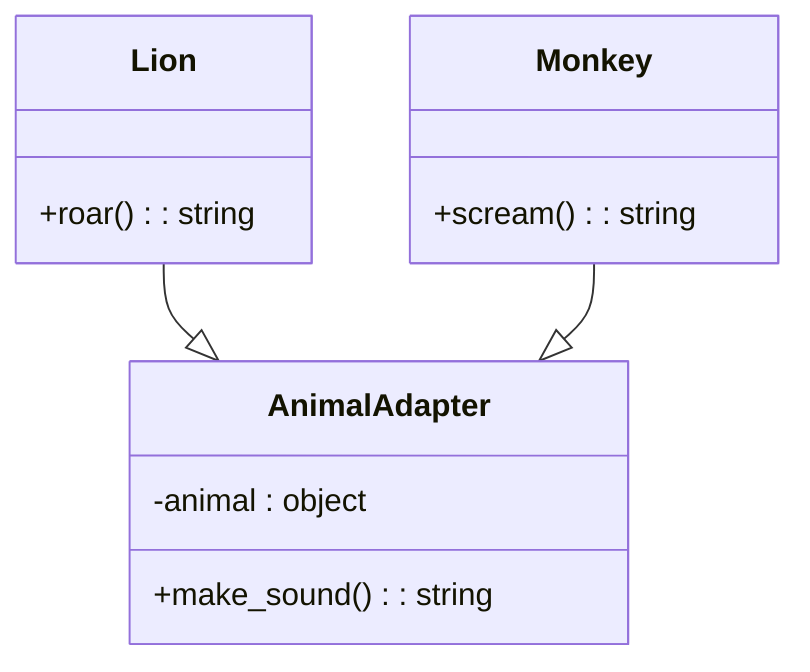

# 「アダプタパターンで調和するジャングル」


*ジャングルの多様な動物たちが、にぎやっかな鳴き声を挙げながら、分かち合うために調和しています。*
## ジャングルのジレンマ

あるジャングルでは、さまざまな動物たちが共存して暮らしていました。しかし、異なる種族の動物たちが互いにコミュニケーションをとることは難しく、誤解やトラブルが絶えませんでした。そこで、ジャングルのリーダーはアダプターパターンを導入することにしました。

アダプターパターンは、異なるインターフェイスをもつクラス同士をつなぐ役割を果たします。これにより、異なる動物たちが同じ言葉でコミュニケーションをとることができるようになりました。

## アダプターパターンの特徴
アダプターパターンの導入により、ジャングルでは以下のような特徴が現れました。

- 既存のクラスを修正せずに、新しいインターフェイスを利用できる
- 異なるインターフェイスを持つクラス間の互換性を確保できる
- クラスの再利用が容易になる

アダプターパターンを用いることで、ジャングルの動物たちは、互いの違いを受け入れながらも円滑にコミュニケーションができるようになりました。また、新しい動物がジャングルにやって来ても、アダプターを使って既存の動物たちとコミュニケーションできるようになりました。

## アダプターパターンの利点
アダプターパターンの導入により、ジャングルの動物たちは以下のような利点を享受できました。

- 互換性のないインターフェイス間の連携が可能になる
- 既存のクラスを変更せずに新しいインターフェイスを利用できる
- コードの再利用がしやすくなる

## アダプターパターンの欠点
しかし、アダプターパターンには以下のような欠点も存在します。

- アダプターのクラスが増えることで、システムの複雑さが増す
- アダプターを作成する手間がかかる

## 欠点への対策
アダプターパターンの欠点に対処するために、動物たちは以下のような対策を講じました。

- アダプターの役割を明確にし、適切な粒度で設計する
- 必要に応じて、別のデザインパターンへ移行する（例：ブリッジパターン）

アダプターパターンをジャングルの動物たちのコミュニケーションに適用したPythonコードの例です。

```python
class Lion:
    def roar(self):
        return "ガオーン"

class Monkey:
    def scream(self):
        return "キーキー"

class AnimalAdapter:
    # アダプターの役割を果たすクラス

    def __init__(self, animal):
        self.animal = animal # 動物のインスタンスを受け取る

    def make_sound(self):
        # 鳴き声を上げるメソッド(動物の種類ごとに処理を切り替え)
        if isinstance(self.animal, Lion):
            return self.animal.roar()
        elif isinstance(self.animal, Monkey):
            return self.animal.scream()

def communicate(animal_adapter):
    print(animal_adapter.make_sound())

# 動物たちのインスタンスを作成
lion = Lion()
monkey = Monkey()

# アダプターのインスタンスを作成
lion_adapter = AnimalAdapter(lion)
monkey_adapter = AnimalAdapter(monkey)

# 鳴き声を出力(アダプターを介しているため、動物の種類に関係なく同じメソッドを呼び出している)
communicate(lion_adapter)
communicate(monkey_adapter)
```

このコードでは、LionクラスとMonkeyクラスが異なるインターフェイスを持っていますが、AnimalAdapterクラスを使って同じmake_soundメソッドで動物たちの鳴き声を出力できるようになっています。



このMermaidコードは、Lionクラス、Monkeyクラス、およびAnimalAdapterクラスの関係を示しています。AnimalAdapterは、LionとMonkeyクラスを適用させるためのアダプターとして機能しています。