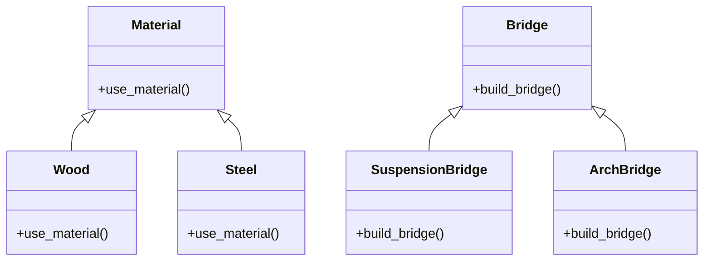

# 「統一された努力で島の架け橋になる」


*2つの島の多様な人々が協力し合い、木と石を組み合わせたユニークな橋を巧みに作りながら、川を渡っていく。*

## 始めに

かつて、2つの孤立した島がありました。それぞれの島には独自の文化が栄えており、互いに交流がない状態でした。ある日、一人の住人が両島を結ぶ橋を建設することを決意しました。しかし、橋の建設にはさまざまな材料と技術が必要であり、どのようにして効率よく橋を建設するかが課題でした。

## Bridgeパターンの特徴
この物語では、Bridgeパターンが島を結ぶ橋の建設に役立ちます。Bridgeパターンは、機能と実装を分離して、それぞれを独立して変更できるようにするデザインパターンです。この物語の橋の建設では、材料（実装）と技術（機能）を分離することで、様々な組み合わせで橋を建設できます。

Bridgeパターンの特徴は以下の通りです。

- 機能と実装を分離
- 独立して変更可能
- Bridgeパターンの利点

## Bridgeパターンの利点
島々を結ぶ橋の建設プロジェクトでは、Bridgeパターンが以下のような利点をもたらします。

- **柔軟性**: 材料や技術が独立して変更できるため、新しい材料や技術が登場した場合でも簡単に取り入れることができます。
- **保守性**: 一方の要素が変更された場合でも、もう一方の要素に影響を与えずに済みます。
しかし、Bridgeパターンには欠点もあります。

## Bridgeパターンの欠点
Bridgeパターンを使用する際の欠点は以下の通りです。

- **複雑さ**: 機能と実装を分離することで、設計が複雑になります。また、初期コストが高くなる可能性があります。
それでも、Bridgeパターンを適切に使用すれば、長期的にはコスト削減や柔軟性向上につながります。

## Bridgeパターンの欠点への対策
Bridgeパターンの欠点に対処するためには、以下の方法が考えられます。

ドキュメントを整備し、設計の複雑さに対処することで、開発者が理解しやすくなるようにする。

デザインパターンの知識をチーム内で共有し、適切なタイミングでBridgeパターンを適用することで、初期コストを抑える。
次に、Bridgeパターンを適用したPythonコードの例を見てみましょう。

```python
from abc import ABC, abstractmethod

class Material(ABC):
    # 材料（実装）を表す抽象クラス
    @abstractmethod # 抽象メソッド
    def use_material(self):
        # 財料を使用する
        pass

class Wood(Material):
    # 木材(実装)を使用する
    def use_material(self):
        return "木材"

class Steel(Material):
    # 鋼材(実装)を使用する
    def use_material(self):
        return "鋼材"

class Bridge(ABC):
    # 橋を建設する(機能)
    def __init__(self, material):
        self.material = material # 材料

    @abstractmethod
    def build_bridge(self):
        # 橋を建設する(機能)
        pass

class SuspensionBridge(Bridge):
    # つり橋を建設する(機能)
    def build_bridge(self):
        return f"つり橋: {self.material.use_material()}"

class ArchBridge(Bridge):
    # アーチ橋(機能)
    def build_bridge(self):
        return f"アーチ橋: {self.material.use_material()}"

wood = Wood() # 木材
steel = Steel() # 鋼材

suspension_wood_bridge = SuspensionBridge(wood) # つり橋: 木材
arch_steel_bridge = ArchBridge(steel) # アーチ橋: 鋼材

print(suspension_wood_bridge.build_bridge())  # つり橋: 木材
print(arch_steel_bridge.build_bridge())  # アーチ橋: 鋼材
```

このコードでは、MaterialとBridgeという抽象クラスを使用して、機能と実装を分離しています。具体的な材料クラス（Wood、Steel）と橋のタイプ（SuspensionBridge、ArchBridge）を定義し、それぞれを組み合わせて橋を建設できます。



このように、Bridgeパターンを適用することで、機能と実装が独立して変更できる柔軟な設計を実現できます。

## まとめ
Bridgeパターンは、機能と実装を分離し、それぞれを独立して変更できるようにするデザインパターンです。この物語では、Bridgeパターンを使って、2つの孤立した島を結ぶ橋を建設するプロジェクトに柔軟性と保守性をもたらしました。ただし、Bridgeパターンを適用する際には設計の複雑さや初期コストを考慮する必要があります。適切な対策を講じれば、Bridgeパターンは長期的にコスト削減や柔軟性向上に役立ちます。