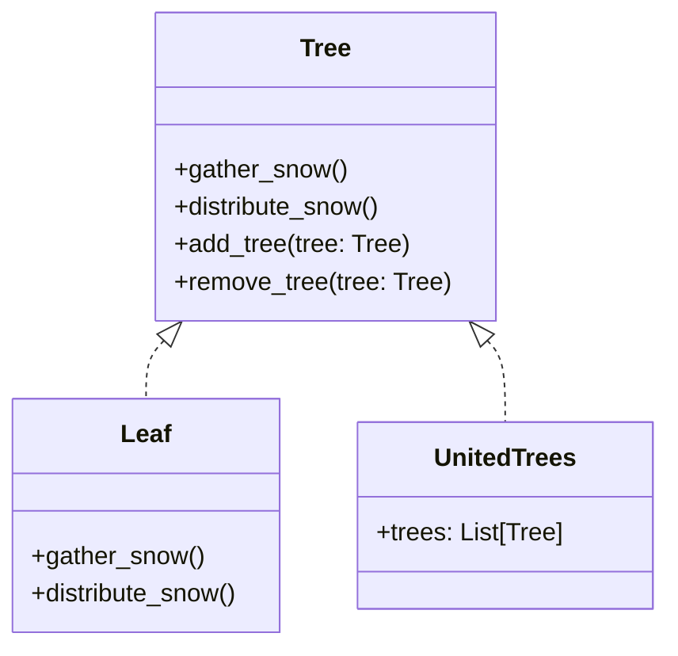

# 「雪の森のユナイテッドツリー」


*雪景色を背景に、互いにつながり、神秘的なエネルギーを放つ木々が力強く立ち並び、敗れた木こりが背を向ける姿は、結束と協力の力を物語っています。*

## 自然界における複合パターン
むかしむかし、雪に覆われた森の中に、激しい吹雪の脅威に直面した木のコミュニティがありました。木々は、嵐に耐え、森を守るために協力しなければならないことに気付きました。この物語は、これらの勇敢な木の物語を通して複合デザイン パターンを理解するのに役立ちます。

## Compositeパターンの概要
Compositeデザイン パターンは、オブジェクトをツリー構造に構成して、部分と全体の階層を表すことができる構造パターンです。これにより、クライアントは個々のオブジェクトとオブジェクトの構成を一様に扱うことができます。

このストーリーでは、各ツリーはコンポーネントを表し、フォレストは複合構造を表します。

## Compositeパターンの特徴
- **コンポーネント インターフェイス**: ツリー (コンポーネント）には、相互に対話できる共通のインターフェイスがあります。
- **リーフ**: リーフは、子を持たない個々のツリーです。コンポジション内のプリミティブ オブジェクトの動作を定義します。
- **複合**: 複合は、子 (他のツリー) を持つことができるツリーです。子コンポーネントを格納し、コンポーネント インターフェイスに子関連の操作を実装します。

それでは、ストーリーをさらに掘り下げて、これらの機能が樹木が吹雪を克服するのにどのように役立つかを見てみましょう。

### コンポーネントインターフェイス: Tree Pact
吹雪と戦うために、木々は「ツリーパクト」として知られる協定を結びました。この協定により、すべての木が通信して連携するための共通のインターフェースが定義されました。 Tree Pactは、各ツリーの責任を概説しています。

- 雪を集める
- 雪を配る
- 隣接する木の追加または削除

このインターフェースにより、ツリーが個々のツリー (リーフ）であるかツリーのグループ (複合）であるかに関係なく、ツリーを均一に処理できます。

### 葉: 独立した木
森の中には、他とのつながりを作ることができない独立した木がたくさんありました。葉として知られるこれらの木は、枝に雪を集め、それを下の地面に再分配する役割を果たしました。近隣の木を追加したり削除したりすることはできませんでしたが、割り当てられたタスクを維持することで、コミュニティで重要な役割を果たしました。

### **コンポジット**: 統一された木
森の中の他の木々は、吹雪の際にお互いを支え合うために複合材と呼ばれるグループを形成しました。これらの団結した樹木のグループは、協力することでより効果的に雪を再分配できました。また、グループに木を追加または削除して、森の変化に適応できるようにすることもできました。

## compositeパターンの利点
- **クライアント コードの簡素化**: 個々のオブジェクトとオブジェクトの構成を均一に処理することにより、クライアントは、構造の詳細を知らなくても、リーフとコンポジットの両方と対話できます。
- **容易に拡張可能**: 既存のコードを変更せずに、新しいコンポーネントまたはコンポジットを追加できるため、オープン/クローズの原則が促進されます。
- **コード編成の改善**: 複合パターンは明確な階層構造を促進し、compositeパターンの短所間の関係を理解しやすくします。

## Compositeパターンの短所
- **過剰な一般化**: 場合によっては、複合パターンが過剰な一般化につながる可能性があります。この場合、設計が複雑になりすぎて、共通インターフェイスに特定のコンポーネントにとって意味のないメソッドが含まれます。
- **タイプを制限することの難しさ**: パターンは高いレベルの柔軟性を可能にするため、コンポジットで許可されるコンポーネントのタイプに特定の制限を適用することは困難な場合があります。

## デメリットへの対策
compositeパターンの欠点に対処するために、次の対策を講じることができます。
- **共通インターフェースを改良する**: コンポーネントの要件により適合するように、コンポーネント インターフェースをより細かくします。これは、インターフェイス分離の原則を使用して実現できます。
- **Decoratorデザイン パターンを使用する**: Compositeパターンが過剰な一般化につながる場合は、Decoratorパターンを使用して、コンポーネントの構造を変更せずにコンポーネントの動作を拡張することを検討してください。
それでは、木と森の物語を表すPythonコードの例を見てみましょう。

```python
from abc import ABC, abstractmethod
from typing import List

class Tree(ABC):
    def gather_snow(self) -> None: # 雪を集める
        pass

    def distribute_snow(self) -> None: # 雪を配る
        pass

    def add_tree(self, tree: Tree) -> None: # 隣接する木の追加
        pass

    def remove_tree(self, tree: Tree) -> None: # 隣接する木の削除
        pass

class Leaf(Tree): # 葉
    def gather_snow(self) -> None: # 雪を集める
        print("枝に積もる雪")

    def distribute_snow(self) -> None: # 雪を配る
        print("雪を地面に散布する")

class UnitedTrees(Tree): # 統一された木
    def init(self) -> None:
        self.trees: List[Tree] = []

    def gather_snow(self) -> None: # 雪を集める
        print("集団で雪かき")
        for tree in self.trees:
            tree.gather_snow()

    def distribute_snow(self) -> None: # 雪を配る
        print("集団で雪を配る")
        for tree in self.trees:
            tree.distribute_snow()

    def add_tree(self, tree: Tree) -> None: # 隣接する木の追加
        self.trees.append(tree)

    def remove_tree(self, tree: Tree) -> None: # 隣接する木の削除
        self.trees.remove(tree)

# 使用例
leaf1 = Leaf() # 単独の木
leaf1.gather_snow() # 雪を集める 
leaf1.distribute_snow() # 雪を配る

united_trees = UnitedTrees() # 統一された木
leaf2 = Leaf() # 単独の木
leaf3 = Leaf() # 単独の木

united_trees.add_tree(leaf2) # 統一された木に隣接する木を追加
united_trees.add_tree(leaf3) # 統一された木に隣接する木を追加

united_trees.gather_snow() # 統一された木の雪を集める
united_trees.distribute_snow() # 統一された木の雪を配る
```



この例では、すべてのツリーに共通のインターフェイスを表す抽象 `Tree` クラスを定義します。 `Leaf` クラスは個々のツリーを表し、`UnitedTrees` クラスは一緒に機能するツリーのグループを表します。

最後に、`Leaf` クラスと `UnitedTrees` クラスの使用法を示し、これらがどのように均一に扱われ、相互に作用するかを示します。

木と森の物語で、複合デザインパターンの特徴、長所、短所、および短所への対策を探りました。このパターンを理解することで、複雑な設計と実装の準備が整います。