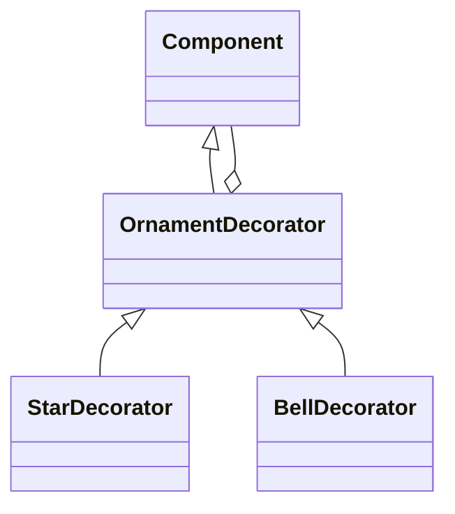

# 「クリスマスツリーの飾りが命を宿す不思議な話」


*家族と愛の温もりに満ちた居心地の良いリビングルームには、美しく飾られたクリスマスツリーがそびえ立ち、枝には鮮やかなオーナメントが飾られ、魔法の天使の見守る中、柔らかで魅惑的な輝きを放ちながら命を吹き込んでいます。*

## オーナメントの魔力覚醒

かつて、クリスマスツリーの飾りが一夜に命を持つという不思議な街がありました。街の人々は、クリスマスの前日にツリーの飾りを作り、ツリーに飾りました。そして真夜中に、それらの飾りは魔法で命を持ち、夜通し楽しく遊びました。

## デコレータパターンの特徴
デコレータパターンは、既存のオブジェクトに新しい機能を追加したい場合に役立ちます。この物語では、各クリスマスツリーの飾りは、基本的な飾りの機能にさまざまな追加機能を持っています。以下は、デコレータパターンの特徴です。

- 柔軟性が高い
- 機能を動的に追加できる
- 継承よりも優れた拡張性

実際のコードでデコレータパターンを表現するために、Pythonのデコレータを使って実装します。

```python
from functools import wraps

def star_decorator(f):
    @wraps(f) # デコレータの中でデコレータを使う場合は、wrapsを使う
    def wrapper(*args, **kwargs):
        print("☆を追加") # 関数の前に実行する処理
        f(*args, **kwargs) # 関数の実行
    return wrapper

def bell_decorator(f):
    @wraps(f) # デコレータの中でデコレータを使う場合は、wrapsを使う 
    def wrapper(*args, **kwargs):
        print("ベルを追加") # 関数の前に実行する処理
        f(*args, **kwargs) # 関数の実行
    return wrapper

@bell_decorator
@star_decorator
def decorate_tree():
    print("ツリーに飾りをつける")

decorate_tree() # ベルを追加 ☆を追加 ツリーに飾りをつける
```

このコードでは、star_decoratorとbell_decoratorという2つのデコレータが定義されています。これらのデコレータを使って、decorate_tree関数に動的に機能を追加しています。


このダイアグラムでは、Componentクラスが基本クラスであり、OrnamentDecoratorがデコレータクラスです。さらに、StarDecoratorとBellDecoratorはOrnamentDecoratorクラスを継承しています。また、OrnamentDecoratorクラスはComponentクラスとの関係を持っています。これにより、デコレータパターンの構造が表現されています。

## デコレータパターンの利点
デコレータパターンには以下のような利点があります。

- コードの再利用性を向上させる
- 動的に機能を追加できる
- 単一責任の原則に従う
- 
街の人々は、飾りの機能を追加するためにデコレータパターンを活用していました。例えば、星の飾りを追加したり、鈴の飾りを追加したりできます。これにより、機能を再利用でき、様々な組み合わせの飾りを作成できました。

## デコレータパターンの欠点
デコレータパターンにもいくつかの欠点があります。

- 多くの小さなオブジェクトが生成される
- コードの複雑性が増す
- 
デコレータパターンを使うと、多くの小さなオブジェクトが生成されることになります。これにより、コードの複雑性が増すことがあります。また、デコレータの使用が過剰になると、コードの可読性が低下することもあります。

## 欠点への対策
デコレータパターンの欠点に対処する方法としては、以下のような方法が考えられます。

- デコレータの使用を最小限に抑える
- コンポジットパターンを併用する
- 
デコレータの使用を最小限に抑えることで、コードの複雑性を軽減できます。また、コンポジットパターンを併用することで、デコレータパターンと組み合わせて効果的にコードの構造を改善できます。