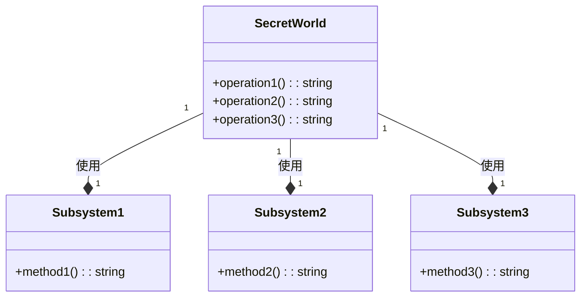

# 「壁の向こうの秘密の世界への入り口を探す子どもたちの冒険」


*不思議な壁の前に立つ子どもたちは、目を見開いて驚いています。隠された扉がきらきらと音を立てて開き、その向こうの世界が見えてきます。*

## Facadeパターンの特徴
ある日、5人の子供たちが、壁の向こうに広がる秘密の世界への入り口を見つけようと決めました。しかし、壁の向こうの世界は非常に複雑で、子供たちはそれぞれの部分を理解しようと苦労しました。そこで、子供たちは互いに協力して、壁にある入り口を見つけるための「入り口案内人」を作成しました。

入り口案内人は、壁の向こうの世界にアクセスするためのシンプルなインターフェースを提供します。子供たちは、この案内人を通じて秘密の世界の機能を簡単に利用できるようになりました。

```python
class SecretWorld:
    def __init__(self):
        # サブシステムのインスタンス化
        self._subsystem1 = Subsystem1()
        self._subsystem2 = Subsystem2()
        self._subsystem3 = Subsystem3()

    def operation1(self):
        # サブシステム1の機能を呼び出す
        return self._subsystem1.method1()

    def operation2(self):
        # サブシステム2の機能を呼び出す
        return self._subsystem2.method2()

    def operation3(self):
        # サブシステム3の機能を呼び出す
        return self._subsystem3.method3()


class Subsystem1:
    def method1(self):
        return "サブシステム1の機能"


class Subsystem2:
    def method2(self):
        return "サブシステム2の機能"


class Subsystem3:
    def method3(self):
        return "サブシステム3の機能"
```

このコードは、Facadeパターンを使用して、秘密の世界の複雑な機能を単純化しています。SecretWorldクラスが入り口案内人（Facade）であり、複数のサブシステムをまとめて操作できます。これにより、子供たちは簡単に壁の向こうの世界の機能を利用できます。



このUML図は、SecretWorld（Facade）がサブシステムの機能にアクセスし、それらをまとめて提供していることを示しています。子供たちは、SecretWorldのシンプルなインターフェースを通じて、簡単に壁の向こうの世界の機能を利用できます。

## 利点
Facadeパターンの利点は、次のとおりです。

- クライアントと複雑なサブシステム間にシンプルなインターフェースを提供し、クライアントがサブシステムを簡単に利用できるようになります。
- 低レベルな機能を直接扱わずに、高レベルなインターフェースを提供することで、クライアントが実装の詳細を知る必要がありません。
- サブシステムの変更に対して、クライアントの影響を最小限に抑えることができます。
## 欠点
Facadeパターンの欠点は、次のとおりです。

- サブシステムのすべての機能を利用する必要がある場合、Facadeが複雑になる可能性があります。
- パフォーマンスが低下する可能性があります。なぜなら、Facadeを介してアクセスすることで、追加のオーバーヘッドが発生するからです。
## 欠点への対策
欠点への対策は、次のとおりです。

- 複雑なFacadeを避けるために、サブシステムの機能を適切に分割し、複数のFacadeを使用してください。これにより、各Facadeが単一の責任を持つことができます。
- パフォーマンスの問題がある場合は、Flyweightパターンを使用して、Facadeのインスタンス化に伴うオーバーヘッドを軽減できます。

Facadeパターンは、クライアントが複雑なサブシステムと簡単にやり取りできるようにするために使用されます。壁の向こうの秘密の世界への入り口を探す子供たちの冒険の物語を通じて、このデザインパターンの特徴、利点、欠点、および欠点への対策が説明されています。この物語を使って、初心者もFacadeパターンを理解しやすくなります。