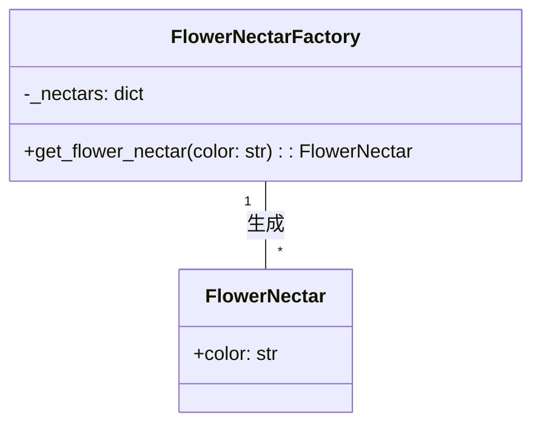
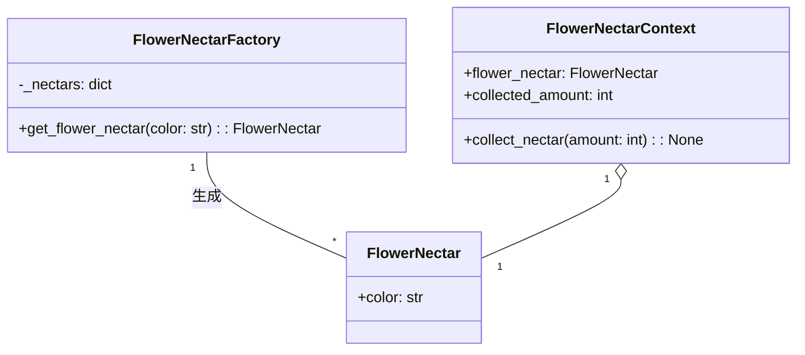

# 「蜂の巣で働くハチたちが効率よく花の蜜を集める物語」


*色とりどりの花が咲き乱れる鮮やかな草原で、さまざまな種類のミツバチが協力して効率よく蜜を集め、繁栄するミツバチの巣の調和に貢献しています。*

## ビーハイブ（The Beehive）

あるところに、美味しい蜜を集めるために一生懸命働く蜜蜂たちがいました。彼らの巣は、効率的な蜜の収集を可能にする独特の構造を持っていました。この物語では、その効率的な構造と、Flyweightデザインパターンの特徴や利点、欠点、そして欠点への対策を学んでいきましょう。

## ハチの巣の構造とFlyweightデザインパターンの特徴
ハチの巣は、六角形の蜜蝋でできた小さな細胞から成り立っています。これにより、限られた空間に多くの細胞を詰め込むことができます。Flyweightデザインパターンでは、同様に共有された状態を使って、複数のオブジェクト間でメモリを効率的に使用できます。

```python
class FlowerNectar:
    # 花の蜜のクラス
    def __init__(self, color):
        self.color = color

class FlowerNectarFactory:
    # 花の蜜のインスタンスを生成して管理するクラス
    _nectars = {}

    def get_flower_nectar(self, color):
        if color not in self._nectars:
            self._nectars[color] = FlowerNectar(color)
        return self._nectars[color]

factory = FlowerNectarFactory() # 花の蜜のインスタンスを生成
flower_nectar1 = factory.get_flower_nectar("red") # 赤い花の蜜のインスタンスを取得
flower_nectar2 = factory.get_flower_nectar("yellow") # 黄色い花の蜜のインスタンスを取得
```



この例では、FlowerNectarクラスが蜜を表し、FlowerNectarFactoryクラスが蜜のインスタンスを生成して管理しています。同じ色の蜜は共有されるため、メモリ使用量が削減されます。

## Flyweightデザインパターンの利点
ハチの巣の構造のように、Flyweightデザインパターンは**メモリ使用量を削減**できるという大きな利点があります。また、**オブジェクトの生成や破棄にかかるコストも軽減**できます。

## Flyweightデザインパターンの欠点
しかし、Flyweightデザインパターンには欠点もあります。共有された状態を使用するため、**オブジェクト間で状態が影響**し合うことがあります。また、**状態を共有することで実装が複雑に**なることもあります。

## Flyweightデザインパターンの欠点への対策
Flyweightデザインパターンの欠点に対処するために、Stateデザインパターンを使用できます。Stateデザインパターンでは、オブジェクトの状態を別のオブジェクトに分離し、状態に応じた振る舞いを実現します。これにより、状態の影響を制御しやすくなり、実装が簡潔になります。

```python
class FlowerNectarContext:
    def __init__(self, flower_nectar):
        self.flower_nectar = flower_nectar
        self.collected_amount = 0

    def collect_nectar(self, amount):
        self.collected_amount += amount

nectar_context1 = FlowerNectarContext(flower_nectar1)
nectar_context2 = FlowerNectarContext(flower_nectar2)

nectar_context1.collect_nectar(10)
nectar_context2.collect_nectar(20)
```

この例では、FlowerNectarContextクラスが状態を管理し、FlowerNectarオブジェクトの影響を受けずに蜜を集めることができます。

また、UMLクラス図を以下のmermaidコードで表現できます。



Flyweightデザインパターンは、ハチの巣のような効率的な構造を実現することで、メモリ使用量やオブジェクト生成のコストを削減できます。ただし、状態が影響し合う問題に対処するために、適切なデザインパターンを組み合わせて使用することが重要です。