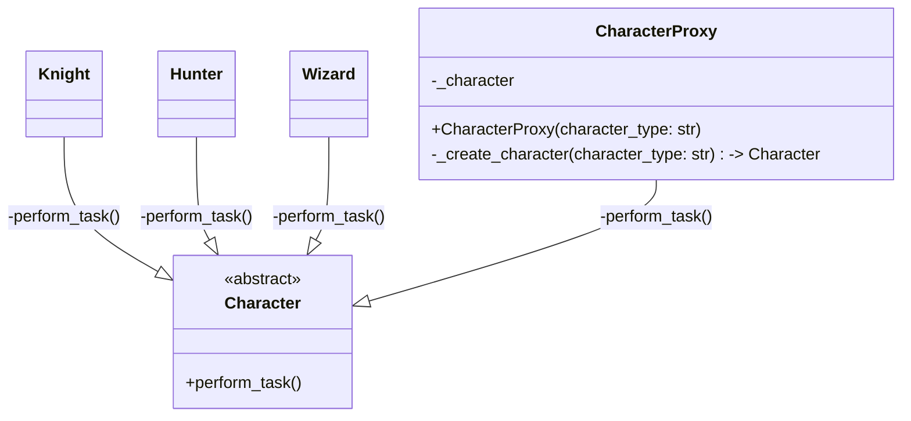

# 「おとぎ話の世界でほかのキャラクタに化ける魔法使いの冒険」


*騎士、王女、農夫など、さまざまなキャラクターに変身した魔法使いが、魔法のオーラに包まれて佇んでいます。*

魔法使いの冒険は、フェアリーテールの世界で様々なキャラクターに変身する能力を持っていました。彼は、必要に応じて騎士、魔法使い、狩人など、さまざまなキャラクターに変身して、様々な問題に対処できるプロキシとして機能していました。プロキシパターンの特徴を理解するために、彼がさまざまなキャラクターに変身する冒険を見ていきましょう。

ある日、王国で竜が暴れているとの報せが入りました。魔法使いはプロキシとして、騎士に変身して竜と戦うことにしました。その後、魔法使いは狩人に変身し、森の中で危険な動物たちから村人たちを守る役割を果たしました。また、彼は魔法使いに変身して、病気に苦しむ人々を助けるための薬を作ることができました。ここで、以下のPythonコードは、プロキシパターンを用いた様々なキャラクターへの変身を示しています。

```python
from abc import ABC, abstractmethod


class Character(ABC):
    # キャラクターの役割を果たすための抽象クラス

    @abstractmethod
    def perform_task(self):
        pass


class Knight(Character):
    # 騎士の役割を果たすための具象クラス
    def perform_task(self):
        print("竜と戦っています")


class Hunter(Character):
    # 狩人の役割を果たすための具象クラス
    def perform_task(self):
        print("森の中で危険な動物たちから村人たちを守っています")


class Wizard(Character):
    # 魔法使いの役割を果たすための具象クラス
    def perform_task(self):
        print("病気に苦しむ人々を助けるための薬を作っています")


class CharacterProxy(Character):
    # キャラクターの役割を果たすためのプロキシクラス
    def __init__(self, character_type: str):
        # キャラクターの種類を指定して、プロキシを初期化する
        self._character = self._create_character(character_type)

    def _create_character(self, character_type: str) -> Character:
        if character_type == "knight":
            # 騎士の役割を果たすための具象クラスを返す
            return Knight()
        elif character_type == "hunter":
            # 狩人の役割を果たすための具象クラスを返す
            return Hunter()
        elif character_type == "wizard":
            # 魔法使いの役割を果たすための具象クラスを返す
            return Wizard()
        else:
            # キャラクターの種類が不正な場合は例外を発生させる
            raise ValueError("無効なキャラクタータイプ")

    def perform_task(self):
        # キャラクターの役割を果たすためのメソッド
        self._character.perform_task()


def main():
    # プロキシを介して、騎士、狩人、魔法使いに変身する

    ## 騎士に変身する
    proxy = CharacterProxy("knight") 
    proxy.perform_task()

    ## 狩人に変身する
    proxy = CharacterProxy("hunter")
    proxy.perform_task()

    ## 魔法使いに変身する
    proxy = CharacterProxy("wizard")
    proxy.perform_task()


if __name__ == "__main__":
    main()
```
プロキシが騎士、狩人、魔法使いに変身し、それぞれの役割を果たすことで王国は救われました。しかし、プロキシパターンにもデメリットがあります。

## パターンのデメリット
プロキシパターンは多くの利点がありますが、デメリットも存在します。以下は、プロキシパターンのデメリットとそれに対処する方法を解説したストーリーです。

- **オーバーヘッド**: プロキシオブジェクトを介して実際のオブジェクトにアクセスすることで、オーバーヘッドが発生します。これは、魔法使いがキャラクターに変身する際に、エネルギーを消耗することに似ています。ただし、プロキシパターンを適切に使用することで、このオーバーヘッドを最小限に抑えることができます。
- **複雑さの増加**: プロキシオブジェクトを追加することで、システム全体が複雑になる場合があります。これは、魔法使いがさまざまなキャラクターに変身する能力を維持するために、より多くの知識やスキルが必要になることに似ています。複雑さを管理するために、プロキシオブジェクトを適切に設計し、整理することが重要です。
- **保守性の低下**: プロキシオブジェクトが増えると、保守性が低下することがあります。これは、魔法使いがさまざまなキャラクターに変身する能力を維持するために、一貫性のある状態を保つことが難しくなることに似ています。保守性を向上させるためには、適切な設計原則を遵守し、コードの品質を確保することが重要です。

## デメリットに対処する方法
プロキシパターンのデメリットに対処する方法の1つは、「アダプターパターン」を使用することです。アダプターパターンを使用すると、異なるインターフェイスを持つオブジェクトを、共通のインターフェイスに変換できます。これにより、プロキシオブジェクトと実際のオブジェクトの間でインターフェイスの違いを解決でき、システムの複雑さを軽減できます。

魔法使いの冒険を通じて、プロキシパターンの特徴や利点、デメリット、そしてデメリットに対処する方法を理解できました。プロキシパターンを適切に使用することで、効率的で柔軟なシステムを構築することが可能です。魔法使いのように、さまざまなキャラクターに変身して、問題に対処できるようなプロキシを設計することで、フェアリーテールの世界を冒険するようなエキサイティングなプログラミング体験が得られるでしょう。

最後に、以下のPythonコードのUMLクラス図のmermaidコードを示します。



このクラス図を通じて、プロキシパターンがどのように機能し、異なるキャラクターに変身するプロキシがどのように構築されているかを理解できます。プロキシパターンをマスターすることで、魔法使いの冒険のような魅力的なシステムを構築し、プログラミングの世界を楽しむことができるでしょう。