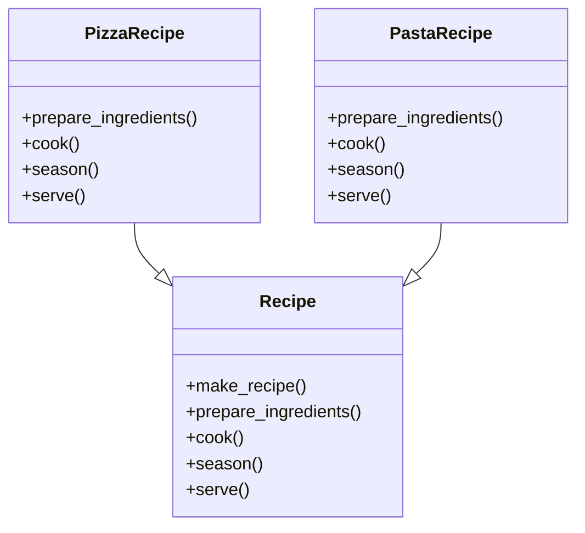

# 「料理学校で独自のレシピを発展させる生徒たちの物語」


*活気ある料理学校の厨房では、若い料理人たちがユニークな形と色彩の料理を作っている。机の片隅にはテンプレートの書かれた紙が置かれている。*

## 名門料理学校
ある小さな町に「キュリナリー・クリエーションズ」という名門料理学校があった。学校には、構造と創造性の重要性を強調する独自の教育アプローチがありました。学生にレシピ作成の技術を教えるために、学校はTemplate Methodデザイン パターンを使用しました。

## Templateメソッドパターンの概要
Templateメソッドパターンは、基本クラスでアルゴリズムの構造を定義する動作設計パターンであり、サブクラスがアルゴリズム全体の構造を変更せずにいくつかのステップをオーバーライドできるようにします。このパターンは、一般的な一連の手順がある場合に特に役立ちますが、一部の手順の実装は異なる場合があります。

この記事のコンテキストでは、Templateメソッドパターンは、学生が一般的なレシピ構造（アルゴリズム）を教えられる料理学校に例えることができ、その後、レシピの特定の部分（個々の手順）を自分の好みに合わせてカスタマイズできます。

```python
from abc import ABC, abstractmethod

class Recipe(ABC):
    # レシピの構造を定義する抽象クラス

    def make_recipe(self):
        # レシピの構造を定義する
        self.prepare_ingredients() # 材料を準備する
        self.cook() # 調理する
        self.season() # 調味料を加える
        self.serve() # 盛り付けて食べる準備をする

    @abstractmethod # 抽象メソッド
    def prepare_ingredients(self):
        # レシピの最初に、材料を準備する
        pass

    @abstractmethod # 抽象メソッド
    def cook(self):
        # レシピの中間に、調理する
        pass

    @abstractmethod # 抽象メソッド
    def season(self):
        # レシピの中間に、調味料を加える
        pass

    @abstractmethod # 抽象メソッド
    def serve(self):
        # レシピの最後に、料理を盛り付けて食べる準備をする
        pass
```

## Templateメソッドパターンの特徴
### 特徴1: 共通構造
Culinary Creationsでは、生徒たちはすべてのレシピに共通の構造があることを教えられました。この構造により、さまざまな料理を準備する際の一貫性と予測可能性が保証されました。 Template Methodパターンは、アルゴリズムの構造が基本クラスで定義されていることを保証し、すべてのサブクラスが同じ一連のステップに従うことを可能にします。

### 特徴2: カスタマイズ可能な手順
Culinary Creationsの学生は、レシピの一般的な構造に従いましたが、特定の手順をカスタマイズすることで創造性を発揮するよう奨励されました。 Template Methodパターンでは、サブクラスは全体の構造に影響を与えることなく特定のステップをオーバーライドできるため、柔軟性とカスタマイズが可能になります。

## Templateメソッドパターンの利点
### 利点1: コードの再利用性
Template Methodパターンは、基本クラスで共通の構造を定義することによってコードの再利用性を促進し、サブクラスでの重複を減らします。料理学校では、これは学生がさまざまな料理に同じレシピ構造を使用することを意味し、時間と労力を節約します。

### 利点2：メンテナンスが容易
Templateメソッドパターンは、一貫した構造とカスタマイズ可能なステップを持つことで、コードの保守と更新を容易にします。アルゴリズムの構造に対する変更は基本クラスで行うことができ、すべてのサブクラスに自動的に影響します。これは、料理学校がレシピ構造を更新するのと似ています。これは、すべての生徒のレシピに適用されます。
## テンプレート メソッド パターンの短所
### 欠点1: アルゴリズム構造の柔軟性の制限
Template Methodパターンはアルゴリズムに固定構造を課しますが、これはすべての状況に適しているとは限りません。料理学校では、これは生徒が自分の料理に完全に合わない場合でも規定のレシピ構成に従わなければならないことを意味し、創造性が制限される可能性があります。

### 欠点2: 複雑さが増す
Template Methodパターンを使用すると、追加のクラスと継承が導入されるため、コードベースの複雑さが増す可能性があります。料理学校の文脈では、これは学生がレシピをカスタマイズするためにさまざまな技術や方法を学ばなければならないことと見なすことができます。

## デメリットへの対策
### 対策1：戦略パターンに切り替える
アルゴリズム構造の柔軟性の制限を軽減するために、代わりにStrategyパターンを使用できます。戦略パターンを使用すると、アルゴリズムのステップを個別のクラスにカプセル化できるため、これらのステップを選択して組み合わせる際の柔軟性が向上します。ただし、このアプローチでは、テンプレート メソッド パターンによって提供される固定構造が失われる可能性があります。

### 対策2：クラス構造を簡素化する
複雑さを軽減するには、深い継承階層を避け、オーバーライドされるメソッドの数を制限して、クラス構造を単純化することを検討してください。料理学校のシナリオでは、これは、生徒が概念を理解しやすくするために、より少ないテクニックとカスタマイズに焦点を当てることを意味する可能性があります。

```python
class PizzaRecipe(Recipe):
    # ピザのレシピを作成するクラス(具象クラス)

    def prepare_ingredients(self):
        print("ピザ生地、トマトソース、チーズ、トッピングの準備です。」)

    def cook(self):
        print("オーブンでピザを焼きます。")

    def season(self):
        print("バジルとオレガノを少々。")

    def serve(self):
        print("ピザを皿に盛る。")

class PastaRecipe(Recipe):
    # パスタのレシピを作成するクラス(具象クラス)

    def prepare_ingredients(self):
        print("パスタ、オリーブオイル、にんにくなどの具材の下ごしらえ。")

    def cook(self):
        print("パスタとソースを別々の鍋で茹でる。")

    def season(self):
        print("塩、こしょう、パセリを加える。")

    def serve(self):
        print("パスタをお皿に盛り、ソースをのせます。")
```

これらのサブクラスを使用して、インスタンスを作成し、それぞれのレシピを実行できます。

```python
pizza = PizzaRecipe() # ピザのレシピを作成
pizza.make_recipe() #　ピザのレシピを実行

pasta = PastaRecipe() # パスタのレシピを作成
pasta.make_recipe() # パスタのレシピを実行
```



## まとめ
結論として、テンプレート メソッド パターンは、Culinary Creationsの学生が一貫した構造に従いながら独自のレシピを開発するのに役立ちました。彼らは自分の好みに合わせて特定のステップをカスタマイズでき、さまざまな創造的でおいしい料理につながりました。

