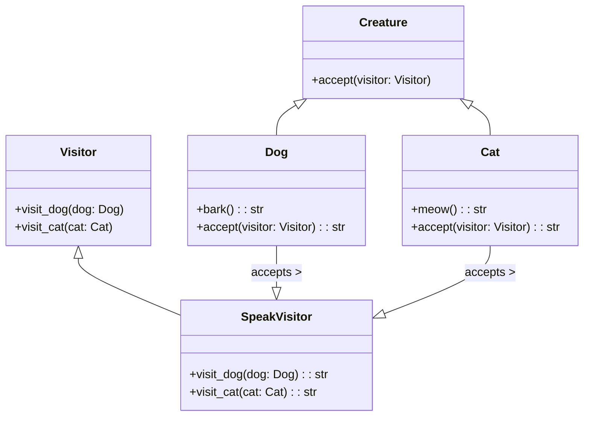

# 「異次元からの訪問者が地球の文化に触れる物語」


*温かく活気のある町の広場で、犬や猫など多様な生物が、神秘的でありながら親しみやすい生物を囲み、独自の習慣や伝統を共有しながら活気と調和のある祝賀会を開いています。*

## 来訪者の到着
むかしむかし、地球上の小さな村に、多様な生き物のコミュニティが住んでいました。各生物には、独自の能力と特性がありました。そんなある日、ヴィヴィという異次元からの来訪者が村にやってきた。ビビには、さまざまな生物とやり取りし、それらを変更することなく能力を理解する力がありました。これは、Visitorデザイン パターンによく似ており、アルゴリズムが動作するオブジェクト構造からアルゴリズムを分離できます。

## Visitorデザインパターンの特徴
ビビの登場で村中が盛り上がりました。村人たちは、ビビがさまざまな生き物と交流する能力を観察するにつれて、彼女の存在にはいくつかの特徴があることに気付きました。

ビビは、内部の状態や行動を変えることなく、さまざまな生き物とやり取りできました。
生物はビビの存在を認識する必要がなく、既存のCreatureクラスを変更せずに新しい相互作用を簡単に追加できました。
訪問者パターンは、Viviの相互作用がCreatureクラスから分離されていたため、問題を明確に分離することを可能にしました。

```python
from abc import ABC, abstractmethod

class Creature(ABC):
    # 生物の抽象クラス

    @abstractmethod
    def accept(self, visitor):
        # 訪問者を受け入れる
        pass

class Dog(Creature):
    def bark(self):
        # 犬が鳴く
        return "ワン!"

    def accept(self, visitor):
        # 訪問者を受け入れる
        return visitor.visit_dog(self)

class Cat(Creature):
    def meow(self):
        # 猫が鳴く
        return "ニャー!"

    def accept(self, visitor):
        # 訪問者を受け入れる
        return visitor.visit_cat(self)

class Visitor(ABC):
    @abstractmethod
    def visit_dog(self, dog):
        # 訪問者が犬を訪問する
        pass

    @abstractmethod
    def visit_cat(self, cat):
        # 訪問者が猫を訪問する
        pass

class SpeakVisitor(Visitor):
    def visit_dog(self, dog):
        # 訪問者が犬を訪問する
        return dog.bark()

    def visit_cat(self, cat):
        # 訪問者が猫を訪問する
        return cat.meow()

# ユーザーコード
dog = Dog() # 犬を作成
cat = Cat() # 猫を作成

speak_visitor = SpeakVisitor() # 訪問者を作成

print(dog.accept(speak_visitor)) # 訪問者が犬を訪問する
                                 # 出力:ワン!
print(cat.accept(speak_visitor)) # 訪問者が猫を訪問する
                                 # 出力:ニャー!

```

上記のPythonコードは、Visitorデザイン パターンの例を示しています。「Creature」抽象クラスには、ビジターを受け取る「accept」メソッドがあります。 2つの具体的なクラス、`Dog` と `Cat` があり、それぞれ独自の動作 (それぞれ `bark` と `meow`) があります。 `Visitor` 抽象クラスは、犬と猫を訪問するための2つの抽象メソッドを使用して、訪問者用のインターフェイスを定義します。 `SpeakVisitor`クラスは `Visitor` インターフェイスを実装し、犬と猫のオブジェクトで実行されるアクションを定義します。





## Visitorデザインパターンの利点

ヴィヴィが村にいることで、いくつかの利点が得られました。

- **懸念事項の分離**: Viviと生物とのやり取りは、クラスから分離されていたため、コードベースがよりクリーンで保守しやすくなりました。
- **拡張性**: 新しい生物が村に到着すると、Viviは既存のCreatureクラスを変更することなく、簡単にそれらとの相互作用を学習できました。
- **柔軟性**: ビビは、特定の生き物の種類に合わせてインタラクションを調整できるため、さまざまなオブジェクトを柔軟に処理できます。

## Visitorデザインパターンの短所
利点にもかかわらず、Viviの存在はいくつかの課題ももたらしました。

- **侵入性**: 各Creatureクラスは、侵入的と見なされる可能性のあるacceptメソッドを実装する必要がありました。
- **二重ディスパッチ**: Visitorパターンは二重ディスパッチ メカニズムに依存しているため、理解と維持がより困難になる可能性があります。
- **動的動作の限定的なサポート**: 生物の動作を実行時に変更する必要がある場合、訪問者パターンは静的操作により適しているため、最適ではありません。

## デメリットへの対策
これらの欠点に対処するために、村人たちはさまざまなアプローチを検討しました。

- **アダプター パターン**: 村人は、元のCreatureクラスを変更せずに、アダプター パターンを使用してCreatureクラスをラップし、acceptメソッドを外部に導入できます。
- **文書化の改善**: 二重派遣メカニズムの理解を助けるために、村人は将来の世代のために明確で簡潔な文書を維持できました。
- **戦略パターン**: 動的な動作が必要な場合、村人は戦略パターンに切り替えることができます。これにより、実行時に動作を簡単に変更できます。

## まとめ
結論として、Viviと生物との相互作用によって表されるVisitorデザイン パターンは、関心の分離、拡張性、および柔軟性など多くの利点を提供します。ただし、侵入性、二重ディスパッチへの依存、動的動作のサポートの制限など、いくつかの欠点もあります。 AdapterパターンやStrategyパターンなどの対策を適用することで、これらの欠点を軽減できます。Visitorパターンはオブジェクトの相互作用に対する強力で柔軟なアプローチを提供し続けることができます。

