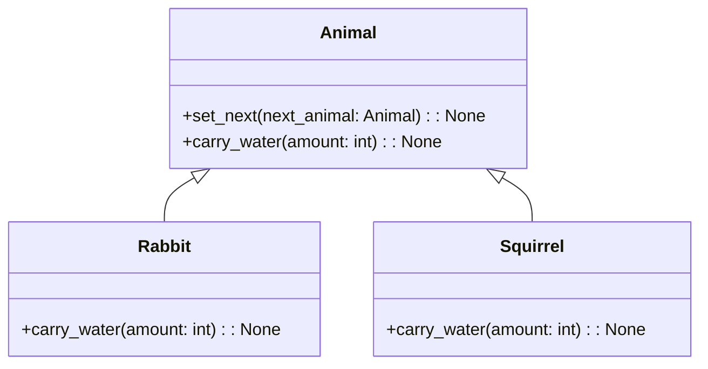

# 「ドミノ倒しでつながる小さな動物たちの協力物語」


*リス、鳥、ウサギが息の合ったコンビネーションで、ドミノの列を組んでバリアを作り、その背景には鮮やかな森が広がっています。*


## 始めに
ある森の中で、さまざまな小動物たちがドミノのようにつながって助け合って暮らしていました。彼らは連鎖の法則を利用して、効率よく問題を解決する方法を見つけ出したのです。

## Chain of Responsibilityパターンとは
Chain of Responsibilityパターンは、複数のオブジェクトが連鎖して、その中のどれかが処理を行うデザインパターンです。連鎖に含まれるオブジェクトは、リクエストを処理できるかどうかを判断し、できない場合は次のオブジェクトにリクエストを渡します。これにより、クライアントは連鎖のどのオブジェクトが処理を行うかを気にせず、リクエストを連鎖に渡すだけで済みます。

## Chain of Responsibilityパターンの特徴
- 連鎖のオブジェクトは、**処理を行うか次のオブジェクトにリクエストを渡すか**を決定します。
- クライアントは、連鎖の**どのオブジェクトが処理を行うかを知る必要がありません**。
- 連鎖に新しいオブジェクトを**追加**したり、既存のオブジェクトを**入れ替え**たりすることが**容易**です。

森の小動物たちがドミノのようにつながっていたところ、突然雷が落ち、森に火が燃え広がりました。火を消すために、小動物たちは連鎖を組んで水を運び始めました。まず、リーダーであるウサギが水を汲み、次の小動物に渡していくのです。

しかし、ある小動物が水を受け取ることができない場合、その小動物は次の小動物に水を直接渡すことにしました。こうして、彼らは効率よく水を運ぶことができました。

## Chain of Responsibilityパターンの利点と欠点
この連鎖の方法は、効率的に問題を解決できる利点があります。クライアントは、連鎖のどの小動物が処理を行うかを知る必要がなく、リーダーであるウサギに水を渡すだけで良いのです。また、連鎖に新しい小動物を追加したり、既存の小動物を入れ替えたりすることが容易です。

しかし、欠点もあります。連鎖が長くなると、処理が遅くなることがあります。また、連鎖の中で誰が最終的に処理を行うかが分かりにくくなることもあります。

## 不利な点への対処方法
連鎖が長くなり処理が遅くなる問題に対しては、連鎖を適切な長さに保つことが重要です。また、処理の優先順位を決めておくことで、連鎖の中で誰が処理を行うかが分かりやすくなります。

さて、ここでチェーン・オブ・レスポンシビリティをPythonで実装してみましょう。

```python
from abc import ABC, abstractmethod

# Handler（処理を行う抽象クラス）
class Animal(ABC):
    def __init__(self):
        # 次の処理を行うオブジェクト
        self.next_animal = None

    def set_next(self, next_animal):
        # 次の処理を行うオブジェクトを設定
        self.next_animal = next_animal

    @abstractmethod # 抽象メソッド
    def carry_water(self, amount):
        # 水を運ぶ処理
        pass

# 具体的なHandler
class Rabbit(Animal):
    def carry_water(self, amount):
        # 水を運ぶ処理
        if amount < 10:
            # 10リットル未満の場合水を運ぶ
            print(f"ウサギが{amount}リットルの水を運びます。")
        elif self.next_animal:
            # 次の処理を行うオブジェクトがある場合は次の処理を行う
            self.next_animal.carry_water(amount)

class Squirrel(Animal):
    def carry_water(self, amount):
        # 水を運ぶ処理
        if 10 <= amount < 20:
            # 10リットル以上20リットル未満の場合水を運ぶ
            print(f"リスが{amount}リットルの水を運びます。")
        elif self.next_animal:
            # 次の処理を行うオブジェクトがある場合は次の処理を行う
            self.next_animal.carry_water(amount)

# クライアント
rabbit = Rabbit() # ウサギ(リーダー)
squirrel = Squirrel() # リス(ウサギの次の処理を行うオブジェクト)

rabbit.set_next(squirrel) # ウサギの次の処理を行うオブジェクトをリスに設定

rabbit.carry_water(5) # ウサギが5リットルの水を運びます(10リットル未満のため)。
rabbit.carry_water(15) # リスが15リットルの水を運びます(10リットル～20リットルのため)。
```

このコードでは、AnimalクラスがHandlerの役割を担い、具体的な動物（ウサギとリス）が処理を行います。連鎖はset_nextメソッドで設定され、ウサギがリスに水を渡すようになっています。carry_waterメソッドでは、動物が運べる水の量に基づいて処理が行われます。運べる量を超える場合、次の動物に処理が渡されます。



このUML図では、Animalクラスが抽象クラスであり、RabbitとSquirrelクラスが具体的な処理を行うクラスとなっています。連鎖は、Animalクラスのnext_animalインスタンス変数とset_nextメソッドで表現されています。

この物語を通じて、チェーン・オブ・レスポンシビリティの特徴や利点、欠点、そして不利な点への対処方法を理解できました。このデザインパターンを使うことで、効率的に問題を解決できるアプリケーションを作成できるでしょう。