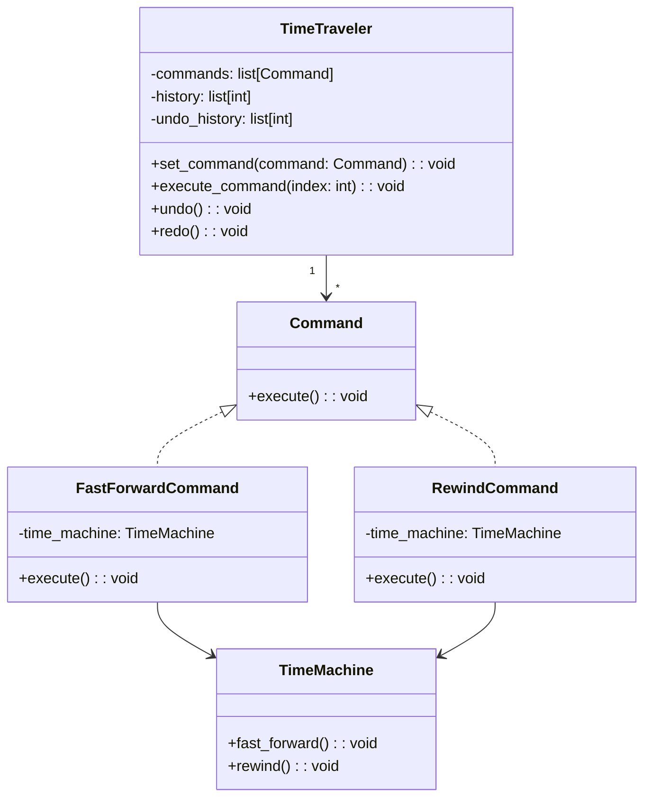

# 「時間を操る時計を使って歴史を守るタイムトラベラーの物語」


*タイムトラベラーが古時計のそばに立ち、その針が時を超えて渦を巻きながら、歴史的な出来事の渦を巻き起こします。*

## タイムトラベラーと時計
時を操る能力を持つ時空旅行者の物語です。彼は歴史を守るために、時計を使って時間を操作します。彼が時計で実行できる操作は、過去へ戻る、未来へ進む、現在に戻る、一時停止などがあります。

## コマンドパターンの特徴
コマンドパターンは、**操作をオブジェクトとして表現**し、実行できるデザインパターンです。これにより、**操作の実行、取り消し、履歴管理などが容易に**なります。

時空旅行者は、時計を使って時間を操作する際にコマンドパターンを使用します。彼は時計に対して、時間操作のコマンドを設定し、実行できます。


```python
from abc import ABC, abstractmethod

class Command(ABC):
    # コマンド抽象クラス

    @abstractmethod
    def execute(self):
        pass

class TimeTraveler:
    # 時空旅行者クラス

    def __init__(self):
        self.commands = [] # コマンドのリスト

    def set_command(self, command: Command):
        # コマンドを設定する
        self.commands.append(command)

    def execute_command(self, index: int):
        # 設定されたコマンドを実行する
        self.commands[index].execute()

class GoBackCommand(Command):
    # 過去へ戻るコマンド
    def execute(self):
        print("過去へ戻ります")

class GoForwardCommand(Command):
    # 未来へ進むコマンド
    def execute(self):
        print("未来へ進みます")

class ReturnToPresentCommand(Command):
    # 現在に戻るコマンド
    def execute(self):
        print("現在に戻ります")

class PauseTimeCommand(Command):
    # 時間を一時停止するコマンド
    def execute(self):
        print("時間を一時停止します")
```

このコードでは、Commandクラスが抽象クラスであり、具体的なコマンドがサブクラスとして実装されています。TimeTravelerクラスでは、設定されたコマンドを実行する機能が提供されています。

## コマンドパターンの利点
コマンドパターンを使用すると、操作をカプセル化し、呼び出し元と実行される操作を分離できます。これにより、機能の追加や変更が容易になります。また、履歴管理や取り消し機能の実装が容易になります。

例えば、時空旅行者が時計で行った操作の履歴を管理することで、過去の操作をやり直すことができます。

## コマンドパターンの欠点
コマンドパターンの欠点は、コードが複雑になりがちであることです。コマンドの追加ごとに新たなクラスを作成する必要があり、管理が煩雑になる場合があります。

## 欠点への対処法
コマンドパターンの欠点に対処する方法の1つは、状況に応じて他のデザインパターンを検討することです。例えば、状態を持たないシンプルな操作の場合、ストラテジーパターンを使用できます。

## 実際のコードでの履歴管理
それでは、TimeTravelerクラスに履歴管理機能を追加してみましょう。

```python
class TimeTraveler:
    def __init__(self):
        self.commands = [] # コマンドのリスト
        self.history = [] # 履歴のリスト 
        self.undo_history = [] # やり直しのリスト

    def set_command(self, command: Command):
        # コマンドを設定する
        self.commands.append(command)

    def execute_command(self, index: int):
        # 設定されたコマンドを実行する
        self.history.append(index) # 履歴に追加
        self.commands[index].execute() # コマンドを実行

    def undo(self):
        # 操作を取り消す
        if not self.history: # 履歴がない場合
            print("これ以上遡れません")
            return
        last_command_index = self.history.pop() # 履歴から最後のコマンドを取り出す
        self.undo_history.append(last_command_index) # やり直しのリストに追加
        print("操作を取り消しました")

    def redo(self):
        # 操作をやり直す
        if not self.undo_history:
            # やり直しのリストが空の場合
            print("やり直す操作がありません")
            return
        last_undo_command_index = self.undo_history.pop() # やり直しのリストから最後のコマンドを取り出す
        self.history.append(last_undo_command_index) # 履歴に追加
        self.commands[last_undo_command_index].execute() # コマンドを実行
```

このコードでは、historyリストに実行されたコマンドのインデックスが追加され、undoメソッドで操作を取り消すことができます。redoメソッドを使って、取り消された操作をやり直すこともできます。TimeTravelerクラスでは、commandsリストにコマンドを登録し、execute_commandメソッドで特定のコマンドを実行します。historyとundo_historyリストは、操作の履歴管理とやり直し機能の実現に使用されています。

具体的なコマンドは、Commandインターフェースを実装したクラスで表現されます。この例では、FastForwardCommandとRewindCommandがその役割を果たしています。




これで、コマンドパターンを使用した時空旅行者のストーリーが完了しました。このストーリーを通して、コマンドパターンの特徴や利点、欠点、そして欠点への対処法を理解できたことでしょう。

