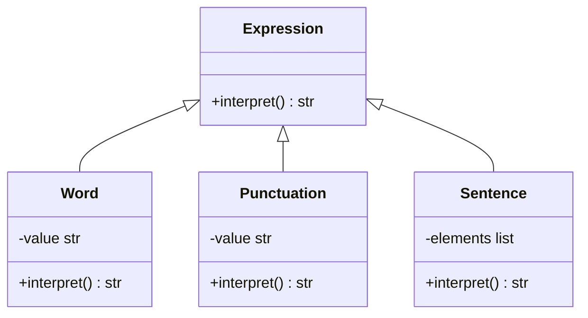

# 「言語を操る魔法使いが世界の謎を解き明らかす冒険」


*古代の書物や巻物に囲まれた若い魔法使いが、謎の石版を研究し、魔法を使ってシンボルを解読し、隠された知識を明らかにしていきます。*

## 魔法の言葉

かつて、魔法の言葉を操る力を持った魔法使いがいました。彼は、さまざまな言語で書かれた古代の文献を読み解き、世界の謎を解き明かす冒険を繰り広げていました。魔法使いは、彼が解読したい言語の文法を理解することで、その言語で書かれた文献を解釈する能力を身につけていました。

## インタプリターパターンの特徴
インタプリターパターンは、言語の文法を表現し、その文法に従って文書を解釈するためのデザインパターンです。魔法使いの冒険において、インタプリターパターンは、言語の文法をクラスで表現し、その文法に従って文書を解釈するプロセスを実現する役割を果たします。

魔法使いは、ある日、未知の言語で書かれた文献を発見しました。この言語は、次のような単純な文法を持っていました。

- 単語はアルファベットのみで構成される。
- 文は単語と句読点（ピリオド）で構成される。
- 単語はスペースで区切られる。
彼は、この言語を解読するためにインタプリターパターンを使ってみることにしました。まず、この言語の文法を表現するためのクラス構造を定義します。このクラス構造には、Expressionインターフェースと、Word, Punctuation, Sentenceクラスが含まれます。

- Expressionインターフェースは、文書を解釈する際に使用されるすべての要素に共通のメソッドを定義します。具体的には、interpretメソッドを持ち、これによって各要素の解釈が行われます。
- Wordクラスは、単語を表現し、interpretメソッドを実装して単語を解釈します。同様に、Punctuationクラスは、句読点を表現し、interpretメソッドを実装して句読点を解釈します。
- Sentenceクラスは、文全体を表現し、interpretメソッドを実装して文を解釈します。文は、単語と句読点から構成されるため、Sentenceクラスは、これらの要素をリストとして保持します。interpretメソッドは、このリスト内のすべての要素に対して解釈を行い、解釈結果を連結して返します。


```python
from abc import ABC, abstractmethod


class Expression(ABC):
    # 文書を解釈する際に使用されるすべての要素に共通のメソッドを定義するインターフェース
    @abstractmethod
    def interpret(self) -> str:
        # 文書を解釈する
        pass


class Word(Expression):
    # 単語を表現するクラス
    def __init__(self, value: str):
        # 単語の値を保持する
        self.value = value

    def interpret(self) -> str:
        # 単語を解釈する
        return self.value


class Punctuation(Expression):
    # 句読点を表現するクラス
    def __init__(self, value: str):
        # 句読点の値を保持する
        self.value = value

    def interpret(self) -> str:
        # 句読点を解釈する
        return self.value


class Sentence(Expression):
    # 文を表現するクラス
    def __init__(self, elements: list[Expression]):
        # 文の要素を保持する
        self.elements = elements

    def interpret(self) -> str:
        # 文を解釈する(単語間にスペースを挿入)
        # # この実装だと単語と句読点の間にスペースが入ってしまうがここでは無視する
        return " ".join(element.interpret() for element in self.elements)

```



魔法使いは、このクラス構造を使って未知の言語で書かれた文献を解釈できました。彼は、文書をExpressionオブジェクトのリストに変換し、Sentenceクラスのインスタンスを生成してinterpretメソッドを呼び出すことで、文書を解釈しました。

インタプリターパターンを使って言語の文法を表現することで、魔法使いは、未知の言語で書かれた文献を効率的に解読できました。

## インタプリターパターンの利点
- 言語の文法をクラス構造で表現することで、構文解析が容易になる
- 新しい文法要素の追加が容易である
しかし、インタプリターパターンには、いくつかの欠点も存在します。

## インタプリターパターンの欠点
- 言語が複雑になると、クラス構造も複雑になりがちである
- 実行時にオブジェクトの生成と破棄が多いため、パフォーマンスが低下する可能性がある

これらの欠点への対策として、次の方法が考えられます。

## 欠点への対策
複雑な言語を処理する場合、パーサジェネレーターなどのツールを利用することで、クラス構造の複雑さを軽減できます。
パフォーマンスを向上させるために、オブジェクトの生成と破棄を最適化する方法を検討する。例えば、Flyweightパターンを適用してオブジェクトを再利用することで、オブジェクトの生成と破棄の回数を減らすことができます

このストーリーを通して、インタプリターパターンの特徴や利点、欠点、および欠点への対策について理解できました。