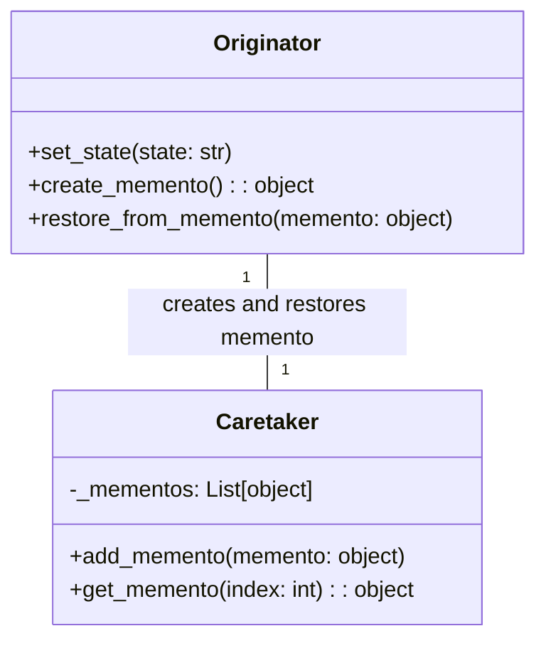

# 「失われた記憶を取り戻すためのタイムカプセルを発見する友達の物語」


*温かい光に包まれた友人たちが、開いたタイムカプセルを囲み、喜びと懐かしさに満ちた表情で、共通の過去から大切な思い出の品々を手にしています。*

## タイムカプセルの発見

あるところに、時の経過とともに失われた貴重な思い出を取り戻す力を持つタイムカプセルがあるという話がありました。その話を聞いた友人たちが、タイムカプセルを見つけ出し、失われた思い出を取り戻す冒険に出かけます。

## Mementoパターンの特徴
Mementoパターンは、オブジェクトの内部状態を保存し、後でその状態に戻すことができるデザインパターンです。このパターンでは、オリジン（Originator）、ケアテイカー（Caretaker）、メメント（Memento）の3つの役割があります。

### オリジン (Originator)
オリジンは、内部状態を持つオブジェクトで、その状態を保存したい時にメメントオブジェクトを作成します。また、メメントオブジェクトを使って状態を復元できます。この例では、友人たちがオリジンとなります。友人たちは、タイムカプセルを使って失われた思い出を取り戻すことができます。

### ケアテイカー (Caretaker)
ケアテイカーは、メメントオブジェクトを保持しておく役割を担います。ケアテイカーは、オリジンからメメントを受け取り、適切なタイミングで状態を復元するためにメメントを返します。この例では、タイムカプセルを見つけた場所がケアテイカーになります。

### メメント (Memento)
メメントは、オリジンの内部状態を保持するオブジェクトです。メメントは、オリジンの内部状態を直接操作できず、オリジンが提供するインターフェースを通じてのみ状態を取得できます。この例では、タイムカプセルがメメントに相当します。

## Mementoパターンの利点
オブジェクトの状態を保存・復元できる： Mementoパターンを使用すると、オブジェクトの状態を簡単に保存・復元できます。
オブジェクトの利点

- **カプセル化を保持**: オリジンの内部状態はメメントオブジェクトによってカプセル化され、外部から直接操作されることはありません。これにより、安全に状態を保持できます。

## Mementoパターンの欠点
- **メモリ消費**: 大量のメメントオブジェクトが作成されることで、メモリ消費が増加する可能性があります。
- **実装が複雑になる**: オリジン、メメント、ケアテイカーの3つの役割を実装する必要があり、コードが複雑になりがちです。

## 欠点への対策
欠点への対策として、メモリ消費を抑えるために、状態の差分のみを保存する方法が考えられます。また、実装の複雑さを軽減するために、コマンドパターンを組み合わせることができます。

```python
from copy import deepcopy

class Originator:
    # オリジン

    def __init__(self, state):
        # オリジンの状態を設定
        self._state = state

    def set_state(self, state):
        # 状態を設定
        self._state = state

    def create_memento(self):
        # 状態をメメントに保存
        return deepcopy(self._state)

    def restore_from_memento(self, memento):
        # メメントから状態を復元
        self._state = deepcopy(memento)

    def __str__(self):
        # オリジンの状態を文字列で返す
        return f"Originator(state={self._state})"

class Caretaker: # ケアテイカー
def init(self):
    self._mementos = [] # メメントのリスト

    def add_memento(self, memento):
        # メメントを追加
        self._mementos.append(memento)

    def get_memento(self, index):
        # メメントを取得
        return self._mementos[index]

# 使用例
if name == "main":
    originator = Originator("initial state")
    caretaker = Caretaker()

    # 状態を保存
    caretaker.add_memento(originator.create_memento())

    # 状態を変更
    originator.set_state("new state")

    # 状態を復元
    originator.restore_from_memento(caretaker.get_memento(0))

    print(originator)  # Originator(state=initial state)
```

この実装では、`Originator`クラスがオリジンの役割を、`Caretaker`クラスがケアテイカーの役割を担います。`deepcopy`を使ってオリジンの状態をコピーし、メメントオブジェクトを作成しています。また、`restore_from_memento`メソッドで状態を復元しています。



このUML図では、OriginatorクラスとCaretakerクラスの関係が示されています。Originatorはメメントを作成・復元する役割を担い、Caretakerはメメントを保持します。
