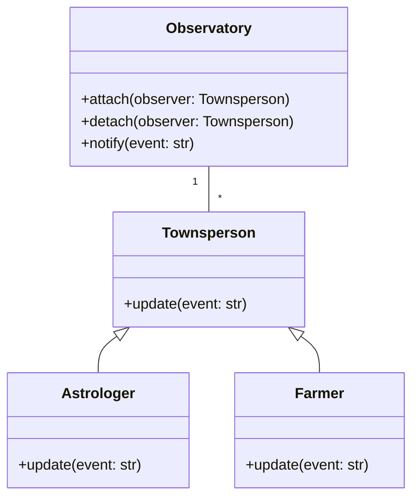

# 「天文台で働く若者が星の動きによるサインを解読する物語」


*若い天文家が古い天文台の上にある望遠鏡で星空を眺め、その背後では町民が天のお告げのもと、さまざまな行事の準備を進めている。*

## 始めに 天文台と若き天文家たち
昔々、遠く離れた小さな町にオリバーという青年がいました。オリバーは天文学に情熱を傾け、地元の天文台で働いていました。彼の仕事は、星の動きから兆候を解読し、その結果を町民に伝えることでした。このストーリーはオブザーバーのデザイン パターンに似ており、オリバーの役割は「サブジェクト」の役割に似ており、町民は「オブザーバー」として行動します。

## Observerパターンの特徴
Observerパターンにはサブジェクトとオブザーバーという2つの大きな特徴があります。
### サブジェクト(観察対象)
青年のオリバーがこの物語のサブジェクトです。彼は、天体の出来事を追跡し、何か重要なことが起こったときに町民に通知する責任があります。オブザーバーパターンでは、サブジェクトはそのオブザーバーのリストを維持し、オブザーバーを追加、削除、および通知するためのメソッドを提供します。

### オブザーバー(観察者)
町民は、この物語のオブザーバーを表しています。彼らは、オリバーから天体の出来事に関する最新情報を受け取ることに関心があります。 Observerパターンでは、各ObserverにSubjectから更新を受け取るメソッドがあります。

## Observerパターンの利点
オブザーバー パターンの利点の1つは、サブジェクトとそのオブザーバーの間の**疎結合**をサポートすることです。サブジェクトは、オブザーバーのインターフェースを知る必要があるだけで、実装の詳細について知る必要はありません。これにより、サブジェクトに影響を与えることなく、オブザーバーを簡単に追加、削除、または変更できます。
もう1つの利点は、サブジェクトとそのオブザーバーの間の**動的な関係が可能**になることです。オブザーバーの数とタイプは実行時に変更できるため、さまざまな状況に柔軟に対応できます。

# Observerパターンの欠点
オブザーバー パターンの主な欠点の1つは、サブジェクトとそのオブザーバーの間に**意図しない依存関係**が生じる可能性があることです。これは、サブジェクトがオブザーバーのリストを適切に管理していない場合に発生する可能性があり、メモリ リークや意図しない動作につながります。
さらに、多数のObserverがある場合や更新が頻繁に行われる場合、**通知がパフォーマンスのボトルネック**になる可能性があります。場合によっては、メッセージ ブローカーを使用して通知をサブスクライバーに非同期的に配信するPublish-Subscribeパターンなど、別の設計パターンを使用する方が効率的である場合があります。

## デメリットへの対策
オブザーバー パターンの欠点に対処するために、サブジェクトとオブザーバー間の通信を管理するメッセージ ブローカーを導入することで、サブジェクトとオブザーバーをさらに分離するパブリッシュ-サブスクライブ パターンへの移行を検討できます。これにより、多数のオブザーバーや頻繁な更新がある状況で、意図しない依存関係を防ぎ、パフォーマンスを向上させることができます。


```python
from abc import ABC, abstractmethod

# サブジェクト クラス
class Observatory(ABC):
    def __init__(self):
        self._observers = [] # オブザーバーのリスト

    def attach(self, observer):
        # オブザーバーを追加
        self._observers.append(observer)

    def detach(self, observer):
        # オブザーバーを削除
        self._observers.remove(observer)

    def notify(self, event):
        # 各オブザーバーに通知
        for observer in self._observers:
            # オブザーバーの update メソッドを呼び出す
            observer.update(event)

# オブザーバー抽象クラス
class Townsperson(ABC):
    @abstractmethod
    def update(self, event):
        # オブザーバーの更新処理
        pass

# 具体的な Observer クラス
class Astrologer(Townsperson):
    # 天文家のオブザーバー

    def update(self, event):
        # オブザーバーの更新処理
        print(f"天文家: {event} イベントを受け取りました。")

class Farmer(Townsperson):
    # 町民のオブザーバー

    def update(self, event):
        # オブザーバーの更新処理
        print(f"町民: {event} イベントを受け取りました。")

# 使用例
oliver = Observatory() # サブジェクト
astrologer = Astrologer() # オブザーバー(天文家)
farmer = Farmer() # オブザーバー(町民)

oliver.attach(astrologer) # オブザーバー(天文家)を追加
oliver.attach(farmer) # オブザーバー(町民)を追加

oliver.notify("流星群") # イベントを通知

```

この例では、Oliverを表すObservatoryクラスと、町民を表すTownsperson抽象クラスがあります。次に、通知を受け取るupdateメソッドを実装する2つの具体的なObserverクラスAstrologerとFarmerを作成します。イベントが発生すると、Observatory` クラスのnotifyメソッドが呼び出され、接続されているすべてのObserverが更新されます。



## まとめ

結論として、Oliverと町民に関する私たちの話は、Observerの設計パターン、その機能、長所と短所、およびPythonでの実装方法を示しています。この設計パターンを理解することで、より柔軟で保守しやすいソフトウェア システムを作成できます。
