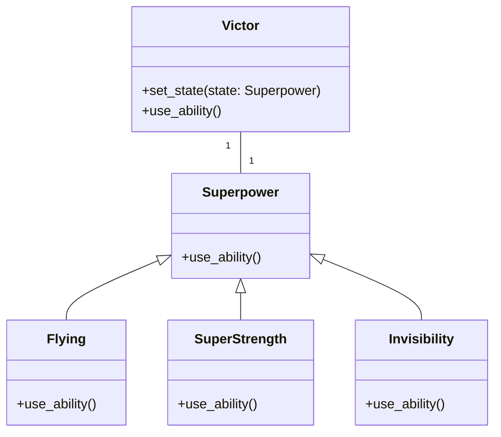

# 「感情によって能力が変わるスーパーヒーローの冒険」


*感情の移り変わりを表す鮮やかなオーラに包まれたスーパーヒーローが、混沌とした街並みの中で脅威のヴィランと戦い、市民は畏怖と希望を抱いている。*


## 感情の力
にぎやかな大都市に、ビクターというスーパーヒーローが住んでいました。ビクターは、気分によって超能力が変化するという点でユニークでした。彼が幸せなとき、彼は飛ぶことができました。彼が怒ったとき、彼は超強力になりました。彼が悲しいとき、彼は見えなくなることができました。このストーリーは、Victorが「コンテキスト」を表し、彼のさまざまな能力がさまざまな「状態」を表すStateデザイン パターンのアナロジーです。

## Stateパターンの特徴
### Context(コンテクスト)
スーパーヒーローであるビクターは、私たちの物語のコンテキストを表しています。 Contextは現在のStateへの参照を維持し、クライアントがそれからアクションを要求できるようにします。

### 状態(ステート)
ビクターの能力（飛行、超強力、不可視）は、さまざまな状態を表しています。 Stateデザイン パターンでは、各Stateはインターフェースまたは抽象クラスであり、具体的なStateクラスによって実装されるメソッドの共通セットを定義します。

### 具体的な状態
具体的な状態は、Victorの能力の特定の実装を表します。各具象Stateクラスは、Stateインターフェイスまたは抽象クラスによって定義されたメソッドを実装します。

## Stateパターンの利点
状態の設計パターンでは、個別のクラス内に状態固有の**動作をカプセル化**できます。これにより、**単一責任の原則が促進**されます。これにより、コードの保守と拡張が容易になります。
さらに、Stateパターンは、さまざまな状態を処理するための大規模な条件ステートメントやスイッチ ケースを不要にすることで、**Contextクラスの複雑さを軽減**するのに役立ちます。よりクリーンでモジュール化された設計になります。

## Stateパターンの短所
Stateパターンの欠点の1つは、状態固有の動作ごとに独自のクラスが必要になるため、**クラスの数が増える**可能性があることです。これにより、特に多くの状態がある場合、コードベースがより複雑になる可能性があります。
もう1つの欠点は、**Contextと具体的Stateクラスの間の密結合**の可能性です。これにより、コードの一部を変更すると、別の部分に意図しない副作用が生じる可能性があるため、システムの変更または拡張が難しくなる可能性があります。

## デメリットへの対策
Stateパターンの欠点に対処するには、Strategyパターンを使用することを検討してください。これは、個別のクラス内にアルゴリズムをカプセル化しますが、Contextに依存して状態遷移を管理しません。これにより、結合を減らし、コードの保守性を向上させることができます。

```python
from abc import ABC, abstractmethod

# 状態インターフェイス
class Superpower(ABC):
    @abstractmethod
    def use_ability(self):
        pass

# 具体的な状態クラス
class Flying(Superpower):
    # 飛行状態クラス
    def use_ability(self):
        print("ビクターが飛んでいます！")

class SuperStrength(Superpower):
    # 超能力状態クラス
    def use_ability(self):
        print("ヴィクトルは超能力を使っている！")

class Invisibility(Superpower):
    # 透明状態クラス
    def use_ability(self):
        print("ビクターが見えない！")

# コンテキスト クラス
class Victor:
    def __init__(self):
        self._state = None

    def set_state(self, state):
        self._state = state

    def use_ability(self):
        self._state.use_ability()

#使用例
victor = Victor() # ビクターを作ります

flying_state = Flying() # 飛行状態を作ります(幸せなとき)
super_strength_state = SuperStrength() # 超能力状態を作ります(怒ったとき)
invisible_state = Invisibility() # 透明状態を作ります(悲しいとき)

victor.set_state(flying_state) # 飛行状態に遷移
victor.use_ability() # ビクターが飛んでいます！

victor.set_state(super_strength_state) # 超能力状態に遷移
victor.use_ability() # ヴィクトルは超能力を使っている！

victor.set_state(invisible_state) # 透明状態に遷移
victor.use_ability() # ビクターが見えない！
```

この例では、Stateインターフェイスを表す「Superpower」抽象クラスと、具体的なStateクラスを表す「Flying」、「SuperStrength」、および「Invisibility」クラスがあります。「Victor」クラスはコンテキストとして機能し、現在の状態を管理し、要求を適切なStateクラスに委譲します。



## まとめ
結論として、Victorと彼の変化する能力に関する私たちの話は、Stateの設計パターン、その機能、長所と短所、およびそれをPythonで実装する方法を示しています。この設計パターンを理解することで、より柔軟で保守しやすいソフトウェア システムを作成できます。