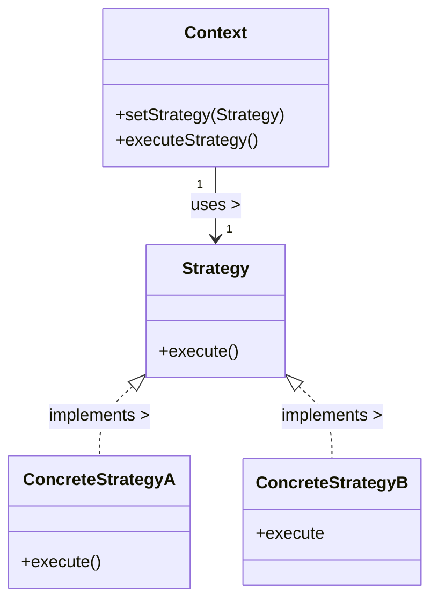

# 「チェス大会で優勝を目指す少年の戦略的な物語」


*この絵では、集中力のある若い2人のチェスプレーヤーが、机を挟んで手強い相手と向かい合って座り、机に置かれたチェス盤の上に手を置いて次の一手を考えているところを、チェスマスターが傍観している。*

## 少年の夢
チェスランディアの国に、イーサンという少年がいました。イーサンはチェスが大好きで、彼の最終的な目標は、王国で最も権威のあるチェス トーナメントであるチェスランディア マスターズ トーナメントで優勝することでした。これを達成するために、彼は他のプレイヤーの中で彼を際立たせる最善の戦略を採用する必要がありました。

## Strategyデザインパターンの特徴
イーサンは、チェスランディア マスターズ トーナメントで優勝するために、事前に定義された1つの戦略に頼ることはできないことに気付きました。彼は、直面した対戦相手と、各試合中に遭遇した状況に合わせて戦術を適用させなければなりませんでした。ここで、Strategyデザインパターンの出番です。
Strategyデザインパターンでは、コンテキストに応じて実行時にアルゴリズムを選択できます。これには、アルゴリズムのファミリーを定義し、それぞれをカプセル化し、それらを交換可能にすることが含まれます。このようにして、アルゴリズムは、それを使用するクライアントとは無関係に選択できます。


## Strategyデザインパターンの利点
- **実行時にアルゴリズムを選択**できます。
- 各アルゴリズムを別々のクラスに**カプセル化**し、交換可能にします。
- 既存のコードを変更せずに新しい戦略を追加できるため、**オープン/クローズの原則を促進**します。

## チェスの戦略

イーサンは、トーナメント中に使用できる主な戦略を3つ特定しました。それは、アタック、ディフェンス、バランスです。Strategyデザインパターンを使用してこれらの戦略を実装するには、`ChessStrategy` インターフェースを定義し、このインターフェースを実装する3つのクラスを作成します： `AttackStrategy`、`DefenseStrategy`、および `BalancedStrategy`。

```python
from abc import ABC, abstractmethod

class ChessStrategy(ABC):
    # チェスゲームの戦略

    @abstractmethod　# 抽象メソッド
    def execute(self):
        # 戦略を実行する
        pass

class AttackStrategy(ChessStrategy):
    # 攻撃戦略
    def execute(self):
        return "相手の王様を攻撃！"

class DefenseStrategy(ChessStrategy):
    # 防御戦略
    def execute(self):
        return "私たちの王を何としてでも守ってください！"

class BalancedStrategy(ChessStrategy):
    # バランス戦略
    def execute(self):
        return "攻守のバランス！"
```

## チェス ゲームのコンテキスト
それでは、ゲームの状況に応じてこれらの戦略を使用するChessGameクラスを作成しましょう。

```python
class ChessGame:
    # チェスゲームのコンテキスト

    def __init__(self):
        self.strategy = None

    def set_strategy(self, strategy: ChessStrategy):
        # 戦略を設定する
        self.strategy = strategy

    def execute_strategy(self):
        
        if self.strategy is None:
            # 戦略が設定されていない場合はエラーを発生させる
            raise ValueError("作戦が設定されていません！")

        # 戦略を実行する
        return self.strategy.execute()
```

`ChessGame`クラスにより、イーサンは必要に応じてさまざまな戦略を設定して実行できるようになりました。

```python
chess_game = ChessGame()

# イーサンは攻撃戦略から始めることにしました。
chess_game.set_strategy(AttackStrategy())
print(chess_game.execute_strategy())  # 出力：相手の王を攻撃！

# Ethan decides to switch to a defense strategy.
chess_game.set_strategy(DefenseStrategy())
print(chess_game.execute_strategy())  # 出力: 何としても国王を守れ!

# イーサンはバランスの取れたゲームをプレイすることにしました。
chess_game.set_strategy(BalancedStrategy())
print(chess_game.execute_strategy())  # 

```





## チェスランディア マスターズ トーナメントの結果
EthanはChesslandia Masters Tournamentで優勝するために戦略デザインパターンを採用しました。試合を通してさまざまな戦略を使用することで、彼は対戦相手の動きに適応し、勝利を収めることができました。彼が戦略デザインパターンを習得したことで、彼のチェス ゲームが改善されただけでなく、適応性と戦略的思考が鍵となる人生の他の分野で成功するための基礎が築かれました。

## Strategyデザインパターンの短所
この話ではStrategyデザインパターンの長所を主に紹介しましたが、短所があることも忘れてはいけません。

- クラスの数が増えたため、**コードがより複雑に**なる可能性があります。
- クライアントは、それらを効果的に使用するために、**さまざまな戦略とその違いを認識している必要**があります。
- 戦略が共通の機能を共有している場合、**コードが重複**している可能性があります。

## デメリットへの対策
Strategyデザインパターンの短所への対策として、以下のようなことを検討できます。

- クラス数の増加を軽減するために、特定のユース ケースで複雑さが不要な場合は、**より単純なパターン**の使用を検討してください。
- さまざまな戦略に対するクライアントの認識に対応するために、各戦略について**明確な文書と使用例を提供**します。必要に応じて、ファクトリ メソッド パターンを実装して、適切な戦略を作成して返すことを検討してください。
- コードの重複を最小限に抑えるには、**テンプレートメソッドデザインパターン**の使用を検討してください。このパターンを使用すると、抽象クラスでアルゴリズムのスケルトンを定義し、サブクラスで全体的な構造を変更することなく、アルゴリズムの特定のステップを再定義できます。

## まとめ
結論として、Strategyデザインパターンは、一連のアルゴリズムをカプセル化し、それらを交換可能にし、実行時に適切なストラテジーを選択できるようにする効果的な方法です。その機能、利点、欠点、および対策を理解することで、この設計パターンが特定のニーズに適しているかどうかを判断し、その利点を活用して、適応可能で保守可能なソフトウェア ソリューションを作成できます。

イーサンの話では、Strategyデザインパターンを使用して、チェスランディア マスターズ トーナメント中にさまざまなストラテジーを切り替え、最終的に勝利に導いた方法を見てきました。この設計パターンをプロジェクトに組み込むことで、柔軟で拡張性が高く、保守が容易なソフトウェアを作成できます。