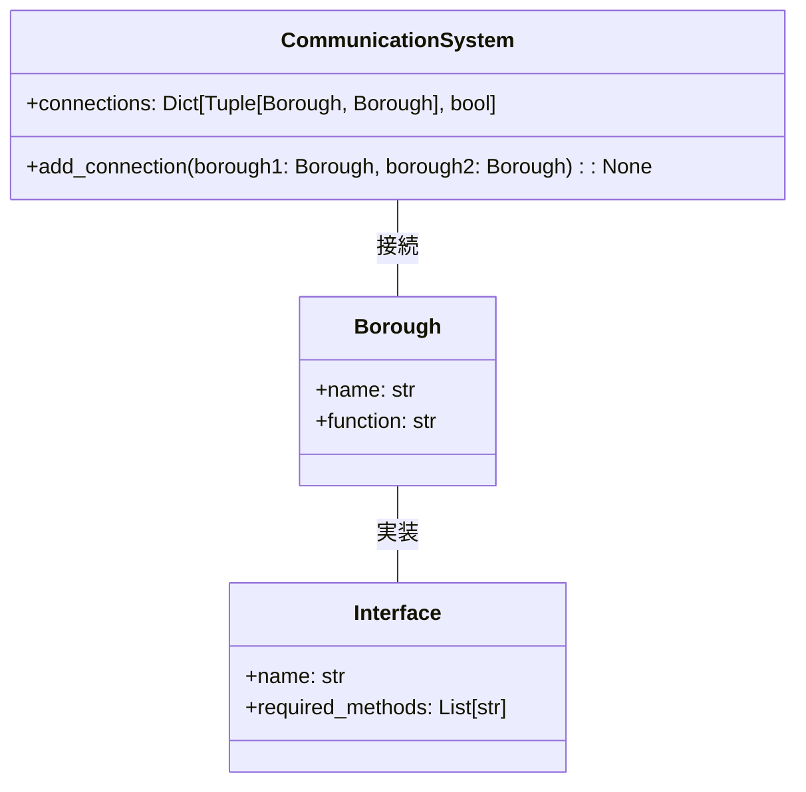

# モジュラー・モノリス コミュニティの協調


*賑やかな街並み、明確に区分された地区が橋のネットワークで結ばれ、調和と相互依存を表現しています。*

## 調和のとれた自治体
あるところに、ユニークな構造と組織で知られる広大な都市がありました。その都市はいくつかの自治区に分かれており、それぞれが特定の機能を持ち、半独立した形で運営されていた。この組織は「モジュラー・モノリス」と呼ばれ、都市は自己完結型の自律的なコミュニティとして繁栄していました。

## コミュニティの基盤
この都市は、行政区と行政区の境界が明確に定義され、それぞれの行政区が特定の機能を担当するように設計されています。この境界線によって、各区はほかの区に干渉されることなく、自分の仕事に集中できる。たとえば、農業区は都市全体の食料を供給することだけに責任を負っていました。

```python
class Borough:
    def __init__(self, name, function):
        self.name = name
        self.function = function

agricultural_borough = Borough("Agricultural Borough", "食料を提供する")
```

## 地域社会におけるコミュニケーション
各区は半独立状態であったが、それでも都市の安定を維持するためには、コミュニケーションと協力が必要でした。
コミュニケーションを円滑にするため、市はすべての行政区を結ぶ集中通信システムを導入していました。

```python
class CommunicationSystem:
    # 通信システムの定義

    def __init__(self):
        self.connections = {} # 行政区の接続を保持する辞書

    def add_connection(self, borough1, borough2): 
        # borough1とborough2を接続する
        self.connections[(borough1, borough2)] = True

communication_system = CommunicationSystem() # 通信システムのインスタンスを作成
# 通信システムに行政区を接続する
communication_system.add_connection(agricultural_borough, another_borough)
```

自治権はあるものの、自治区は相互につながり、資源やサービスの面で互いに依存していました。
そのため、都市内では自治と協調の微妙なバランスが保たれていました。

## 境界と相互作用
都市が成長するにつれて、行政区は複雑さを増し、相互の交流に適応しなければならなくなりました。
そのため、行政区がその内部を公開することなく相互作用できるようにするパブリックインタフェースの開発が行われるようになりました。
これらのインタフェースは、行政区が市に対する責任を確実に果たすための契約を提供するものでありました。

```python
class Interface:
    # インターフェースの定義
    
    def __init__(self, name: str, required_methods: List):
        self.name = name # インターフェースの名前
        self.required_methods = required_methods # インターフェースが提供するメソッド

# 食料を提供するメソッドを提供する
agricultural_interface = Interface("AgriculturalInterface", ["provide_food"]) 
```

## モジュール型モノリスの挑戦
都市は多くの点で繁栄したが、モジュール化されたモノリシック建築の結果、住民はいくつかの困難に直面した。
行政区どうしは互いにつながっているため、行政区どうしの境界を明確にすることが困難な場合がありました。また、ある行政区が変わると、ほかの行政区に連鎖的に影響が及ぶこともありました。

しかし、この都市の構造には利点もありました。行政区がモジュール化されているため、保守や開発が容易だりました。また、中央の通信システムによってコラボレーションが促進され、各区が完全に孤立することを防ぎました。

## まとめ
調和のとれた自律的なコミュニティの物語は、モジュラーモノリシックアーキテクチャの利点と課題を示しています。自律と協調のバランス、そして明確に定義された境界線の重要性を理解することで、この建築的アプローチの長所と短所をより理解できます。



## [付録] マイクロサービスアーキテクチャとの比較
 

| 特性                       | マイクロサービスアーキテクチャ                     | モジュラーモノリスアーキテクチャ                     |
| :------------------------- | :------------------------------------------------- | :--------------------------------------------------- |
| アプリケーション構成       | 複数の独立したサービスから構成される               | 一つのアプリケーションにモジュールが分割される       |
| デプロイメント             | サービスごとに個別にデプロイされる                 | 単一のアプリケーションとしてデプロイされる           |
| スケーラビリティ           | 個別のサービス単位でスケール可能                   | アプリケーション全体でスケールする必要がある         |
| 障害の影響範囲             | 障害が起こったサービスに限定される可能性がある     | 障害がアプリケーション全体に影響を与える可能性       |
| 開発言語の選択             | サービスごとに異なる言語を選択可能                 | 通常はアプリケーション全体で一つの言語を選択         |
| コンポーネント間通信       | サービス間で通信が必要(通常はHTTPやgRPC等)         | モジュール間は直接通信可能(関数呼び出し等)           |
| データベース               | サービスごとに個別のデータストアを持つことが一般的 | 全モジュールで共通のデータストアを利用する場合が多い |
| 開発チームの構成           | サービスごとに専任の開発チームがいることが多い     | 全モジュールを開発するチームがいることが多い         |
| 言語・フレームワークの更新 | 個別のサービスで独立して更新可能                   | アプリケーション全体で更新が必要                     |
| テスト                     | サービス単位でのテストが容易                       | モジュール間の依存関係を考慮したテストが必要         |
| 複雑さ                     | 分散システムの複雑さがある                         | アプリケーション内での複雑さがある                   |
| パフォーマンス             | サービス間通信にオーバーヘッドがある               | モジュール間通信                                     |

 
