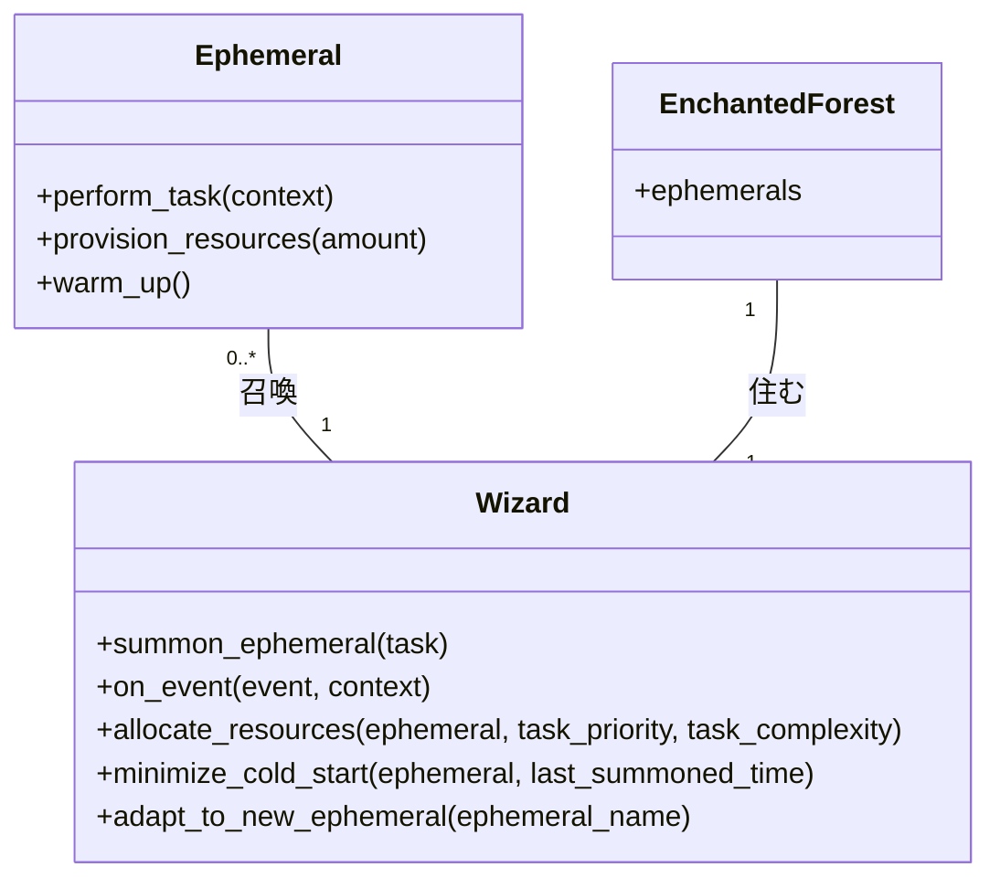

# 魔法しかけのエフェメラル 魔法の森のサーバレスアーキテクチャ


*緑豊かな森の中で、若い魔法使いは、魔法エネルギーのオーラに包まれた輝く儚い生き物を召喚し、魔法使いの命令で任務を遂行する態勢を整える。*

## 魔法の森
エンチャント・フォレストの奥深くには、無数のエフェメラル（「儚きもの」、魔法をかけられた儚い存在）が存在する深い森がある。これらの生き物はユニークな力を持っており、その秘密を知る者は自由に召喚できる。エフェメラルはそれぞれ固有の機能を持ち、呼ばれた時だけ現れ、役目を終えると森の奥へと消えていく。

## 若き魔法使いの旅路
ある日、エルウィンという若い魔法使いが、この魔法の世界を偶然見つけました。エルウィンは、この強力な存在の可能性に興味を持ち、その能力を利用する方法を学ぶことにした。エルウィンは、エフェメラル召喚の技術を習得すれば、森の根本的なインフラを気にすることなく、複雑な仕事を簡単にこなせるようになると考えたのだ。

```python
# エルウィンがエフェメラル召喚する例
def summon_ephemeral(task, *args, **kwargs):
    return ephemeral(task, *args, **kwargs)

# エルウィンのエフェメラル召喚の例
response = summon_ephemeral("cast_spell", spell="healing", target="友人")
```

## エフェメラル・サモニング
エルウィンは、森に分け入っていくうちに、エフェメラル召喚の鍵は特殊な呪文であることを知りました。その呪文は、特定のイベントが発生したときにのみエフェメラルが出現する、イベントドリブンなものであることを知ったのです。

```python
# エルウィンのイベント駆動型インカンテーション
def on_event(event, context):
    # イベントからエフェメラルを召喚する
    ephemeral = summon_ephemeral(event.task)
    # エフェメラルにイベントを伝える
    return ephemeral.perform_task(context)

# エルウィンのイベント駆動型インカンテーションの例
event = {"タスク": "おまじない", "呪文": "保護", "目標": "村"}
# イベントを受け取り、エフェメラルを召喚する
result = on_event(event, context=None)
```

召喚したエフェメラルは、呪文を唱えたり、メッセージを伝えたり、資源を集めたりそれぞれ特定の役割を果たす。必要なときにだけ現れ、その間にしか資源を消費しないエフェメラルは、エルウィンが複雑なタスクを管理するのを容易にした。

## 資源配分とエフェメラル
エルウィンが直面した課題の1つが、リソースの配分でした。エフェメラルは非常に効率的な反面、タスクを遂行するためには一定のエネルギーが必要でした。そこでエルウィンは、タスクの複雑さや緊急度に応じて資源を配分し、エフェメラルが消費するエネルギーを管理することを学びました。この戦略により、彼女は森の資源を最適化し、必要なときにいつでもエフェメラルが利用できるようにしたのです。

```python
# エルウィンの資源配分戦略
def allocate_resources(ephemeral, task_priority, task_complexity):
    # タスクの緊急度に応じてエフェメラルにエネルギーを供給する
    if task_priority == "高い": 
        ephemeral.provision_resources(3 * task_complexity)
    elif task_priority == "中くらい":x
        ephemeral.provision_resources(2 * task_complexity)
    else:
        ephemeral.provision_resources(task_complexity)

ephemeral = summon_ephemeral("おまじない") # エフェメラルを召喚する
# エフェメラルにエネルギーを供給する
allocate_resources(ephemeral, task_priority="高い", task_complexity=5)
```

サーバーレスアーキテクチャの利点は以下の通りです
- **スケーラビリティ**: エフェメラルは必要な時に大量に呼び出すことができるため、エルウィンはさまざまな仕事や需要に簡単に対応できる。
- **費用対効果**: 活動時のみ資源を消費するため、森全体のエネルギー消費を抑えることができる。
- **柔軟性**: エフェメラルはイベント駆動型であるため、エルウィンは刻々と変化する生態系に適応し、新しい生物と能力を取り入れることができた。

## コールドスタートの問題
エルウィンがエフェメラル召喚に習熟するにつれ、エフェメラルが出現するまでに予想以上に時間がかかることがあることに気付いた。「コールドスタート」と呼ばれるこの現象は、エフェメラルがしばらく召喚されていなかったために、その役割を果たす前にウォームアップする時間が必要な場合に起こります。

```python
# コールドスタートを最小限に抑えるエルウィンの戦略
def minimize_cold_start(ephemeral, last_summoned_time):
    # エフェメラルが召喚されてから30分以上経過している場合は、ウォームアップする
    if time_since_last_summoned > timedelta(minutes=30):
        ephemeral.warm_up()
    return ephemeral

# エルウィンのコールドスタートを最小限に抑える例
ephemeral = summon_ephemeral("おまじない")
minimize_cold_start(ephemeral, last_summoned_time)
```

そこでエルウィンは、コールドスタートを最小限に抑えるために、召喚していないエフェメラル（儚いもの）を時折温めるという作戦を立てた。そうすることで、呼び出されたときにすばやく仕事をこなせるようになるのです。

## 常に変化し続けるエコシステム
エルウィンは「魔法の森」の探索を続けるうちに、生態系が常に変化していることに気がついた。新たなエフェメラルが現れ、エフェメラルが消え、進化していく。このダイナミックな環境は、エルウィンが森と調和するために、呪文や戦略を常に変化させなければならないことを意味していた。

```python
# エルウィン、新たなエフェメラルに適応する
def adapt_to_new_ephemeral(ephemeral_name):
    # エフェメラルの名前を学ぶ
    if ephemeral_name not in known_ephemerals:
        learn_new_incantation(ephemeral_name) # 新しい呪文を学ぶ
        known_ephemerals.add(ephemeral_name) # 新しい呪文を知っているエフェメラルのリストに追加する

# エルウィンの新たなエフェメラルに適応する例
adapt_to_new_ephemeral("ephemeral_of_light")
```

サーバーレスアーキテクチャの欠点をまとめると以下の通りです
- **コールドスタート**: 最近召喚されていないエフェメラルが出現するまでに時間がかかることがあり、レスポンスタイムに影響した。
- **複雑さ**: 森の資源を管理し、多数のエフェメラルたちの活動を調整することは、特に生態系が進化するにつれて困難になる可能性があります。
- **森への依存度**: エルウィンのエフェメラル召喚能力は、森そのものと密接な関係があり、森の健康や安定に依存している。

## エフェメラル（儚さ）の力と限界



エルウィンは、魔法の森での旅を通じて、サーバレスアーキテクチャのパワーと限界を学びました。エフェメラルの能力を活用することで、彼女は信じられないほどの効率と柔軟性でタスクを実行でき、同時にダイナミックでリソースが制限された環境に固有の課題を管理することを学びました。