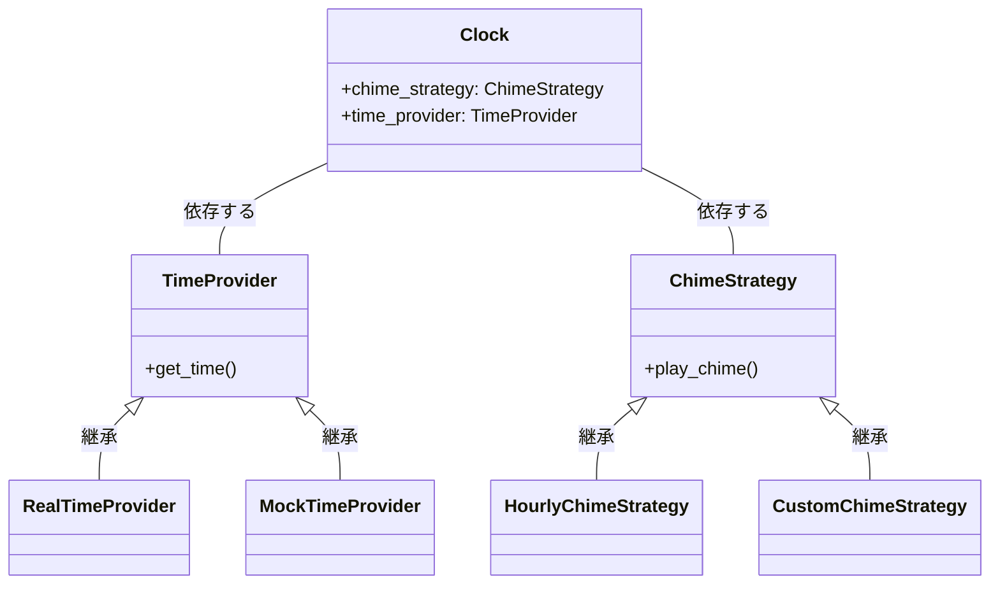

# 時計塔：クリーンな建築のシンボル


*弟子は、高い時計の複雑な歯車や機構を熱心に研究し、組織と抽象化の原則を実際に体現しています。*

## 始まり
にぎやかな都市では、壮大な時計塔が高くそびえ立ち、時間の流れと市民の生活を支配しています。時計塔の複雑な歯車と機構はファサードの後ろに隠され、関心の分離とクリーンな建築の堅実な原則を表しています。

私たちの主人公である若くて意欲的な時計職人は、熟練した時計職人の指導の下、見習いとして旅を始めます。マスタ クロックメーカーは、保守可能、スケーラブル、および適応可能なシステムを作成するために、厳密なアーキテクチャの原則に従うことの重要性を強調しています。

## 歯車: 抽象化を理解する
若い見習いが学ぶ最初のレッスンは、抽象化の概念です。熟練した時計職人は、時計塔内の歯車のさまざまな層を彼に見せます。各歯車は、分針を駆動する最小の歯車からチャイムを制御する大きな歯車まで、特定の機能を果たします。

```python
# Python での抽象化の簡単な例
class Clock:
    # Clock クラスは、時計の機能を提供します

    def __init__(self, hours, minutes):
        self.hours = hours # 0-23
        self.minutes = minutes # 0-59

    def tick(self):
        # 1 分進めます

        self.minutes += 1
        if self.minutes == 60:
            self.minutes = 0
            self.hours += 1
            if self.hours == 24:
                self.hours = 0
```

見習いは、ちょうど時計塔の歯車のように、クリーン アーキテクチャの抽象化によってシステムがそれぞれの責任をもつさまざまなコンポーネントに分割されることを学びます。これにより、システムの理解、維持、および拡張が容易になります。

## メカニズム: 依存関係の逆転
見習いが学習を続けるにつれて、マスタ時計職人は彼に依存関係の逆転の概念を紹介します。彼は、時計塔の歯車は相互に直接依存するのではなく、抽象化に依存する必要があると説明しています。これにより、時計塔の全体的な機能に影響を与えることなく、各ギアを交換または変更できます。

```python
# Python での依存関係の逆転の例
from abc import ABC, abstractmethod

class TimeProvider(ABC):
    @abstractmethod
    def get_time(self):
        # 現在の時刻を返します(実装はサブクラスに任せます)
        pass

class Clock:
    def __init__(self, time_provider: TimeProvider):
        self.time_provider = time_provider # ここで依存関係を注入します

class RealTimeProvider(TimeProvider):
    def get_time(self):
        # 実際のソースから現在の時刻を返します
        pass

class MockTimeProvider(TimeProvider):
    def get_time(self):
        # テスト目的で事前定義された時間を返します
        pass
```

見習いは、依存関係の逆転によって時計塔のコンポーネントを切り離すことができ、システムの柔軟性と保守性が向上することを発見します。

## チャイム：適応
若い時計職人の教育が進むにつれて、彼はクリーンな建築における適応性の重要性を理解し始めます。マスタ時計職人は、都市のニーズに応じて、時計塔のチャイムを変更して、さまざまなメロディーを演奏しました。またさまざまな時間に鳴らしたりもできました。

```python
# Python での適応性の例
class ChimeStrategy(ABC):
    # チャイムを鳴らすための抽象クラスです
    @abstractmethod
    def play_chime(self):
        pass

class Clock:
    # Clock クラスは ChimeStrategy インターフェイスに依存します

    def __init__(self, chime_strategy: ChimeStrategy):
        self.chime_strategy = chime_strategy # ここで依存関係を注入します

    def chime(self):
        # チャイムを鳴らします
        self.chime_strategy.play_chime()

class HourlyChimeStrategy(ChimeStrategy):
    def play_chime(self):
        # 1 時間ごとにチャイムを鳴らします
        pass


class CustomChimeStrategy(ChimeStrategy):
    def play_chime(self):
        # 特定のルールに基づいてカスタム チャイムを再生します
        pass
```

クリーン アーキテクチャの原則を適用することで、時計塔は変化に適応し、次の世代まで機能し続けることができます。


## 得られた教訓: クリーンなアーキテクチャの重要性
何年にもわたる見習いの後、若い時計職人は、壮大な時計塔の複雑なしくみときれいな建築の重要性を理解して、
彼自身の権利でマスタになります。彼は、学んだ原則が時計塔だけでなく、あらゆる複雑なシステムにも適用できることを認識しています。

- 関心の分離： システムを個別のコンポーネントに分割し、それぞれに特定の責任を持たせます。
- 抽象化： コンポーネント間の明確な境界とインタフェースを定義し、実装の詳細を隠します。
- 依存関係の逆転（DIP）: 具体的な実装ではなく抽象化に依存し、柔軟性と保守性を実現します。
- 適応性： システムを簡単に変更できるよう設計し、変化する要件に合わせて進化できるようにします。
熟練した時計職人は、クリーンなアーキテクチャの真の価値を高く評価しています。それは、保守可能で、スケーラブルで適応性があり、時の試練に耐えることができるシステムです。



時代を超越したクリーンな建築の原則を心にしっかりと刻み込んだこのとき計職人は、グラウンド クロック タワーが今後何世代にもわたって安定性と精度の標識であり続けることを保証します。