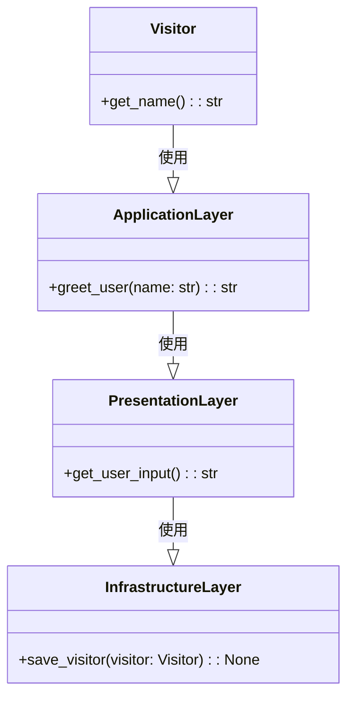

# 悟りの層


*旅人は、古代の寺院の入り口に立っています。その寺院の同心円状の層は、いくつもの扉から見え、それぞれに建築の知恵を垣間見ることができます。*

## 古代寺院と旅
むかしむかし、遠い国に、山の頂上にひっそりとたたずむ古代の寺院がありました。この寺院は同心円状のユニークな部屋で知られており、各部屋には異なるレベルの抽象化に関する知恵と知識が含まれています。寺院の中心には、最も深遠で意味のある概念の核心があります。
私たちの物語の主人公である悟りを求める若い旅行者は、この神秘的な場所の話を聞き、そこにたどり着くための挑戦的な旅に乗り出しました。到着すると、彼らは賢明な長老に迎えられ、寺院の層を案内され、オニオン アーキテクチャの秘密が明らかになりました。

## 第1層（最も外側の層）: プレゼンテーション層
最も外側のリングとして知られる最初の層には、寺院の外の世界と直接やりとりするプレゼンテーション層が含まれていました。ここで、旅行者はユーザーインタフェース、RESTful API、および入力の検証について学びました。

```python
# シンプルなユーザーインターフェイスの例
def get_user_input():
    # ユーザー入力(旅行者の名前)を取得する
    user_input = input("あなたの名前を入力してください：")
    return user_input.strip() # 入力された文字列の前後の空白を削除する
```

## 第2層: アプリケーション層
さらに深く進むと、アプリケーション層を表す2番目の層が明らかになりました。この層は、ビジネス ロジックの調整、要求の処理、および内層と外層の間の情報の流れの管理を担当していました。

```python
# 基本的なアプリケーション層機能の例
def greet_user(name):
    # 旅行者を迎える
    greeting = f"こんにちは、{name}! 私たちの寺院へようこそ。"
    return greeting
```

若い旅行者は、これらのレイヤがどのように分離されているかを理解し始め、より良い組織化と責任の明確な理解を可能にしました。

## 第 3 層: ドメイン層
ドメイン層とも呼ばれる第3層は、寺院の知恵の核心でした。ここで主人公は、システムの動作を定義するコア ビジネス ロジック、ルール、およびエンティティについて学習しました。この層は、寺院を機能させる最も重要な要素と原則を含んでいたため、非常に重要でした。
```python
# 簡単なドメイン層クラスの例
class Visitor:
    # 旅行者のクラス

    def __init__(self, name):
        self.name = name # 旅行者の名前 

    def get_name(self):
        # 旅行者の名前を返す
        return self.name
```
旅行者はドメイン層の価値を認識し、アーキテクチャの整合性と目的を維持する上でのその重要性を理解しました。

## 最内層: インフラストラクチャ
最も内側のレイヤ、つまりインフラストラクチャ レイヤは、データ アクセス、ファイル システム、外部通信などの重要なサービスを提供することで、ほかのレイヤをサポートしていました。この層により、寺院のほかの部分がスムーズに機能し、各部屋が相互に接続されていることが保証されました。

```python

# 単純なインフラストラクチャ レイヤー関数の例
def save_visitor(visitor):
    # 旅行者の名前をファイルに保存する
    with open("visitors.txt", "a") as file:
        file.write(f"{visitor.get_name()}\n") # 旅行者の名前をファイルに書き込む
```

この寺院の最も深いレベルで、主人公は強固な基盤の重要性と、アーキテクチャ全体をサポートするインフラストラクチャ層の役割についての洞察を得ました。

## Onionアーキテクチャの知恵
若い旅行者が寺院の同心円状の層を通り抜ける旅を終えたとき、彼らはオニオン アーキテクチャの知恵と美しさを発見しました。彼らは、懸念事項を分離し、明確でテスト可能で保守可能な構造を維持することの価値を学びました。オニオン アーキテクチャは非常に貴重な教訓を与えてくれました。主人公は新たに得た明晰さと目的を持って神殿を後にしました。
この新たに発見された知識により、旅行者は山を下り、将来の取り組みにオニオン アーキテクチャの原則を適用する準備が整い、柔軟で保守可能でテスト可能なシステムの鍵を理解しました。



旅人は古代寺院を旅する中で、依存関係を逆転させ、利害を分離し、理解しやすく維持しやすい方法でシステムを編成することの重要性を彼らに学びました。