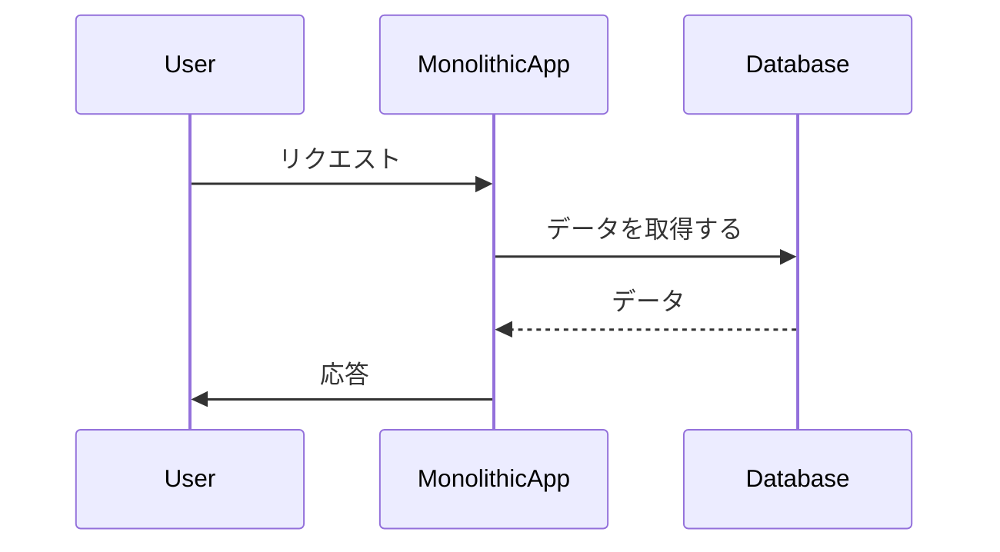
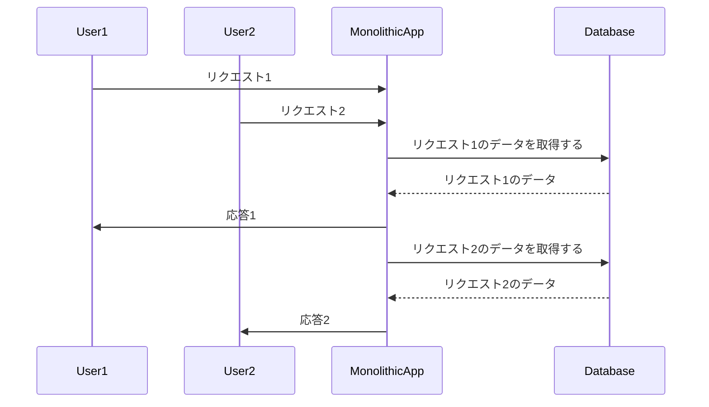
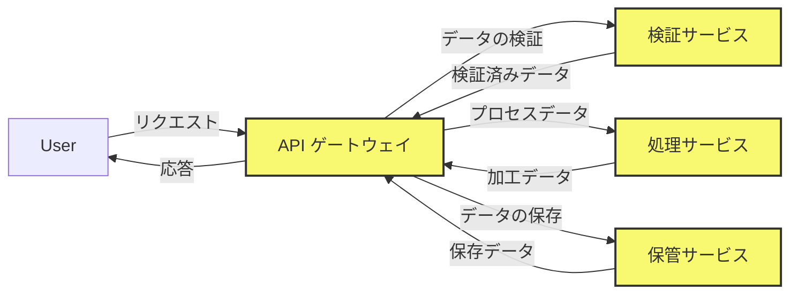

# モノリシック建築の中世の城「モノリチカ」


*街の上にそびえ立つ大きな中世の城、城の入り口は人々で混雑しており、城は住民や屋台でいっぱいですが、壁の石が割れ始めており、王国の崩壊を示しています。*

むかしむかし、モノリシカ王国では、壮大な中世の城が風景の上にそびえ立っていました。その巨大な城壁の中で、王国の人々は生活し、働き、すべての機能が集中していました。

## モノリシカの強み
城のモノリシックな建築は、王国の強固な基盤を提供しました。すべてのコンポーネントが1つのユニットに収められているため、城の構築と保守は簡単でした。モノリシカの人々は、家のシンプルさと効率性に驚嘆しました。

```python
# モノリシック コードの簡単な例
def process_data(data):
    # ステップ 1: データの検証
    validated_data = validate_data(data)
    
    # ステップ 2: データの処理
    processed_data = process_validated_data(validated_data)
    
    # ステップ 3: データを保存する
    store_data(processed_data)
```

## モノリシック アーキテクチャの利点
モノリシック アーキテクチャは、王国にいくつかの利点をもたらしました。

- **シンプルさ**: 城のデザインはシンプルで、住民が理解しやすく、操作しやすいものでした。
- **開発の容易さ**: すべてのコンポーネントが1つのユニットの一部であるため、開発と展開は比較的簡単でした。



## 亀裂が現れ始める
王国が成長し続けるにつれて、モノリシック アーキテクチャの限界が表面化し始めました。城の管理はますます困難になり、その構造を拡張または変更することは困難な作業であることが判明しました。新しい追加や変更が行われるたびに、城全体が不安定になるリスクが高まりました。

## モノリシック アーキテクチャの欠点
王国が直面した課題は、モノリシック アーキテクチャに関連するいくつかの欠点の結果でした。
- **スケーラビリティ**:1つのコンポーネントのサイズまたは容量を増やすには、構造全体をスケーリングする必要があったため、城のスケーリングは困難であることが判明しました。
- **柔軟性**: 城のコンポーネントは緊密に統合されているため、1つの部分を変更すると他の部分に影響を与えることが多く、柔軟性に欠けていました。
- **開発速度**: 城がより複雑になるにつれて、開発と展開が遅くなり、変化に適応する王国の能力に影響を与えました。



## デメリットへの対策
より柔軟で分散化されたアプローチの必要性を認識した王国は、代替のアーキテクチャ オプションを模索し始めました。彼らは、「マイクロサービス アーキテクチャ」と呼ばれる新しいアーキテクチャ スタイルを発見しました。これは、モノリシックな城が直面していた多くの制限に対処することを約束しました。

## マイクロサービス アーキテクチャへの移行
マイクロサービス アーキテクチャでは、城は小さな独立した建物の集合体に置き換えられ、それぞれが王国内の特定の機能を担っています。これらの建物は、明確に定義されたインターフェイスを介して相互に通信し、柔軟性とスケーラビリティを向上させました。

```python
# マイクロサービス コードの例
def validate_data_service(data):
    # データを検証する
    return validated_data

def process_data_service(validated_data):
    # 検証済みデータの処理
    return processed_data

def store_data_service(processed_data):
    # 処理されたデータを保存する
    return
```



## マイクロサービス アーキテクチャの利点
マイクロサービス アーキテクチャを採用することで、王国はいくつかの利点を享受しました。

- **スケーラビリティ**: 各サービスを個別にスケーリングできるため、王国は変化する需要により効率的に対応できます。
- **柔軟性**: システム全体に影響を与えることなく個々のサービスに変更を加えることができるため、王国はより簡単に適応し、進化できます。
- **より迅速な開発**: 小規模で集中的なチームが各サービスに取り組むことができるため、開発速度が向上し、エラーのリスクが軽減されます。

## 未来を受け入れる
王国がマイクロサービス アーキテクチャを採用するにつれて、彼らは、成長し進化する王国の課題を処理するためのより良い準備ができていることに気付きました。かつて強力だったモノリシックな城は、より機敏で適応性が高くスケーラブルなサービスのネットワークに徐々に置き換えられ、モノリシカが繁栄し、人々のニーズを満たすことができるようになりました。

最後に、Monolithicaの話は、プロジェクトに適したソフトウェア アーキテクチャを選択することの重要性についての教訓として役立ちます。モノリシック アーキテクチャは、小規模なプロジェクトではシンプルで効率的ですが、より大規模で複雑なシステムの要求に対処するのに苦労する可能性があります。さまざまなアーキテクチャ スタイルの特性、長所、および短所を理解することで、開発者はより多くの情報に基づいて決定を下し、ニーズにより適したシステムを作成できます。
