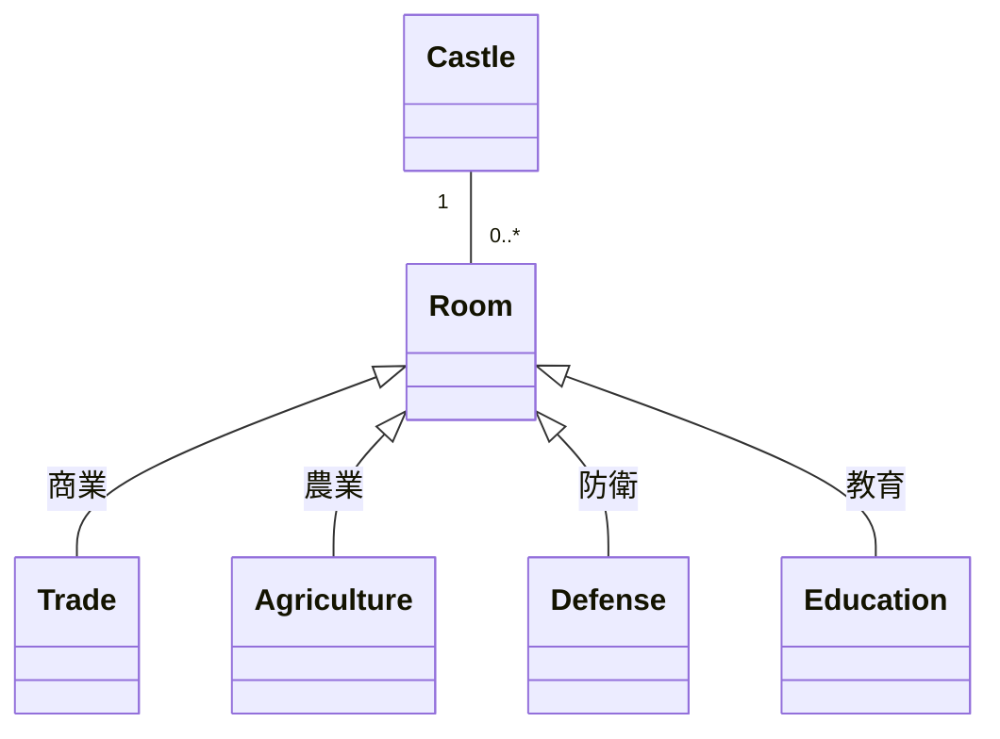

# モノリシック建築の中世の城「モノリチカ」


*街の上にそびえ立つ大きな中世の城、城の入り口は人々で混雑しており、城は住民や屋台でいっぱいですが、壁の石が割れ始めており、王国の崩壊を示しています。*


## グラウンドキャッスル

昔々、遠く離れたとある王国に、中世の巨大な城がありました。その城の中には、王国のすべての住民と機能が収められていました。その強さとシンプルさは、そこに住むすべての人に賞賛されました。

```python
class Castle:
    # 王国の城🏰
    def __init__(self):
        self.rooms = []
        self.towers = []
        self.gates = []

    def add_room(self, room):
        # 部屋を追加する
        self.rooms.append(room)

    def add_tower(self, tower):
        # 城塔を追加する
        self.towers.append(tower)

    def add_gate(self, gate):
        # 城門を追加する
        self.gates.append(gate)
```
## 豊かな王国
王国の繁栄とともに、城は拡張を続けた。王は、貿易、農業、防衛、教育など、それぞれの機能に特化した新しい棟を建設するよう命じた。しかし、城は互いにつながっているため、ほかの棟に影響を与えることなく、新しい棟を変更したり追加したりすることは困難だった。

```python
class Trade:
    # 商業
    pass

class Agriculture:
    # 農業
    pass

class Defense:
    # 防衛
    pass

class Education:
    # 教育
    pass

castle = Castle() # 王国を作成する
castle.add_room(Trade()) # 商業を追加する
castle.add_room(Agriculture()) # 農業を追加する
castle.add_room(Defense()) # 防衛を追加する
castle.add_room(Education()) # 教育を追加する
```
```

## 壁のひび割れ
そのうちに、城壁に亀裂が入るようになった。王国の発展は複雑さを増し、かつてのシンプルな城は維持するのに負担がかかるようになった。住民やそのニーズが進化するにつれ、城は適応するのに苦労し、より柔軟で分散したアプローチが必要であることが明らかになったのです。



## 変革の必要性
城の限界を感じた王は、最も信頼できる助言者たちに助言を求めた。彼らは、より効率的に資源を分配し、変化に対応できるような、新しい王国の組織方法を模索することを提案した。

```python
def reorganize_kingdom(castle):
    # 王国を再編成する
    new_kingdom = [] # 新しい王国

    # 王国の各部屋を取得する
    for room in castle.rooms:
        new_kingdom.append(room)
    return new_kingdom # 新しい王国を返す

new_kingdom = reorganize_kingdom(castle)
```

## モノリシックからの教訓
モノリスの物語は、ソフトウェア・アーキテクチャの拡張性と保守性を考慮することの重要性を教えてくれる。壮大な城のようなモノリシックなアーキテクチャは、小規模でシンプルなアプリケーションには良い解決策かもしれません。しかし、アプリケーションが成長し、進化するにつれて、管理や適応がますます難しくなります。モノリシックなアプリケーションをより小さく、より焦点を絞ったコンポーネントに分解することで、より柔軟で、より簡単なメンテナンス、より優れたスケーラビリティにつながります。