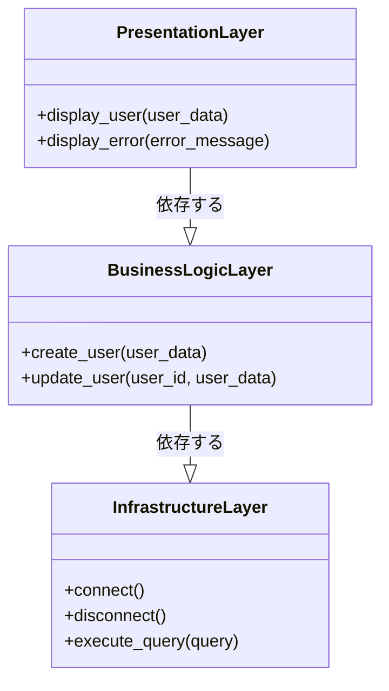

# バランスを追求する 多層シティーのレイヤ建築

*様々な機能を持つ、個性的で活気のある層が垂直に立ち並ぶ都市を、主人公は相互に接続されたプラットフォームを操作し、その調和とバランスを保つことを目指します。*


レイヤードシティでは、すべての建物が特定の目的に役立つように細心の注意を払って設計されています。他の都市と同様に、Layered Cityは美しく効率的な構造を持っています。意欲的な建築家である主人公は、都市のデザインの複雑さを探求し、その層状の建築の背後にある原則をよりよく理解するために旅に出ます。

## 基盤: インフラストラクチャ層
レイヤードシティの基盤には、都市全体の基盤となるインフラストラクチャレイヤーがあります。このレイヤーには、発電所、水処理施設、交通システムなど、市の運営をサポートする重要なサービスが含まれています。
```python
# インフラストラクチャ層: データベース アクセス
class Database:
    def connect(self):
        # データベースへの接続を確立する
        pass

    def disconnect(self):
        # データベースへの接続を切断する
        pass

    def execute_query(self, query):
        # クエリを実行する
        pass
```
主人公がインフラストラクチャレイヤーを調査すると、都市の重要なサービスを上位レイヤーから分離するように設計されていることがわかります。この分離により、インフラストラクチャへの変更が都市の他の部分に与える影響が最小限に抑えられ、安定性と保守性が促進されます。

## 心臓部: ビジネス ロジック層
インフラストラクチャレイヤーの上には、レイヤードシティの心臓部であるビジネスロジックレイヤーがあります。このレイヤーには、市の運営を管理するロジックとルールが含まれており、すべてがスムーズかつ効率的に実行されるようになっています。

```python

# ビジネス ロジック層: サービス
class UserService:
    def create_user(self, user_data):
        # 検証とビジネス ロジックを実行する
        pass

    def update_user(self, user_id, user_data):
        # 検証とビジネス ロジックを実行する
        pass
```

主人公がビジネスロジックレイヤーを詳しく調べると、それが市のサービスとプロセスを調整する役割を担っていることがわかります。この層は、関心事の明確な分離を強制するため、開発者は下位層の複雑さに気を取られることなく、ビジネスルールの実装に集中できます。

## 表面: プレゼンテーション層
階層化された都市の最上位層はプレゼンテーション層で、住民や訪問者が都市をどのように認識するかを担当します。このレイヤーは、公共スペースのデザインからさまざまなアプリケーションのインターフェイスまで、すべてを網羅する美学とユーザー エクスペリエンスに関するものです。

```python
# プレゼンテーション層: ユーザー インターフェイス
class UserInterface:
    def display_user(self, user_data):
        # ユーザーデータを画面にレンダリングする
        pass

    def display_error(self, error_message):
        # ユーザーにエラーメッセージを表示する
        pass
```

主人公は、住民が都市をアクセスしやすく楽しいものにするために、プレゼンテーション層が重要であることを学びます。ユーザー エクスペリエンスとプレゼンテーションに重点を置くことで、このレイヤーは都市が機能的で視覚的にも魅力的であることを保証します。

## レイヤード アーキテクチャの利点
主人公は、層状都市のアーキテクチャの多くの利点を理解するようになります。都市を個別のレイヤーに編成することで、理解、維持、スケーリングが容易になります。各レイヤーは独立して進化できるため、都市はシステム全体を混乱させることなく、変化する要件やテクノロジーに適応できます。

## デメリットと対策
ただし、Layered Cityには課題がないわけではありません。主人公は、階層構造に厳密に従うと、複雑さが増し、パフォーマンスが低下する場合があることに気付きます。これらの問題に対処するために、彼らはマイクロサービス アーキテクチャのようなより柔軟なモジュラー アーキテクチャを採用するなど、別のアプローチを検討しています。

## 結論
階層化された都市を旅する主人公は、階層化されたアーキテクチャの原則とトレードオフについて貴重な洞察を得ることができます。関心の分離の重要性と厳密な階層化の潜在的な課題を理解することで、堅牢で適応性のあるシステムを設計するための準備が整います。

