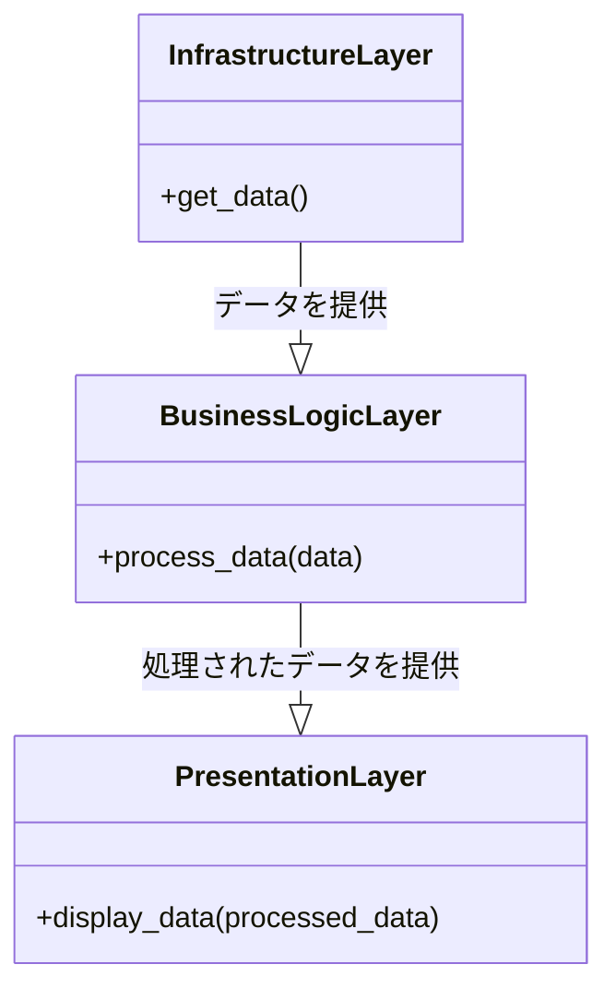
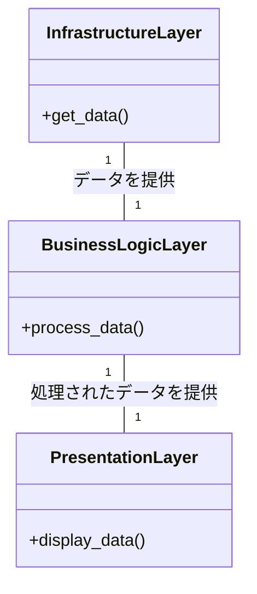

# バランスを追求する レイヤド・シティーのレイヤ建築

*様々な機能を持つ、個性的で活気のある層が垂直に立ち並ぶ都市を、主人公は相互に接続されたプラットフォームを操作し、その調和とバランスを保つことを目指します。*


## 始まり
はるか未来、ある国にほかとは違う都市がありました。この壮大な都市は、垂直方向に層状に構築されており、各層は都市の存在に不可欠な特定の機能を提供していた。最下層はインフラストラクチャー、中間層はビジネスロジック、最上層はプレゼンテーションに特化していた。

主人公が旅に出るとき、バランスと秩序を保つために注意深く計画された街のデザインに驚嘆した。各層にはそれぞれ独自の責任があり、誰もが自分の役割を理解していました。

```python
# Pythonでのレイヤー例
class InfrastructureLayer:
    def get_data(self):
        # データを取得する
        pass

class BusinessLogicLayer:
    def process_data(self, data):
        # データを処理する
        pass

class PresentationLayer:
    def display_data(self, processed_data):
        # データを表示する
        pass
```

## 課題
しかし、時間が経つにつれて、主人公はレイヤ間のバランスを保つことが簡単ではないことに気付きました。レイヤ間の依存関係は密結合をもたらし、1つのレイヤを単独で変更したり拡張したりすることが難しくなっていたのです。



## モジュラリティの追求
より良い分離の必要性を認識した主人公は、レイヤ間に明確な境界を導入することにしました。これにより、依存関係を減らし、モジュール化を促進し、コンポーネントの入れ替えやシステムの拡張を容易にできます。

```python
# Pythonで境界を持つLayerの例を更新しました。
class InfrastructureLayer:
    def get_data(self):
        # データを取得する
        pass

class BusinessLogicLayer:
    def __init__(self, data_provider):
        self.data_provider = data_provider # 依存関係を減らしました。

    def process_data(self):
        # データを処理する
        data = self.data_provider.get_data() # 依存関係を減らしました。
        pass

class PresentationLayer:
    def __init__(self, data_processor):
        self.data_processor = data_processor # 依存関係を減らしました。

    def display_data(self):
        # データを表示する
        processed_data = self.data_processor.process_data() # 依存関係を減らしました。
        pass
```

## ザ・ハーモニー
このような変化により、街は活気付き始めました。各層に住む人々は、それぞれの仕事に集中しながら、ほかの層と容易に融合できるようになった。レイヤド・アーキテクチャの威力を証明するものである。



## レッスンのよう子
レイヤ化された都市でバランスを保とうとする主人公の姿は、効果的なソフトウェア・アーキテクチャを作ろうとする人々への教訓となるものです。レイヤアーキテクチャは、システムコンポーネントを組織化するための構造的なアプローチを提供しますが、調和とバランスを達成するためには、依存関係と境界を慎重に管理する必要があります。