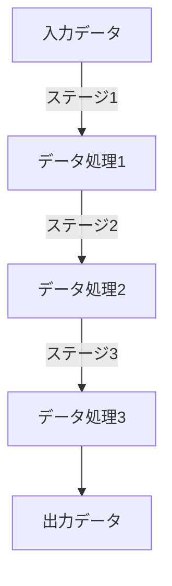

# 知識の流れ パイプライン建築の大水道橋


*パイプ、バルブ、フィルターが相互に接続された広大なネットワークがキャンバスに広がり、複雑な水道橋を表現しています。また、エンジニアは、水がスムーズに流れるように慎重に点検・整備しています。*

## 巨大な水道橋：データの流れ
高度な水道システムに依存する都市では、一連の連結されたパイプ、バルブ、およびフィルタが、パイプラインアーキテクチャのデータ処理の各段階を表しています。この物語では、パイプラインアーキテクチャの直線的でモジュール式の性質が紹介され、専用の技術者たちが水道橋を通じて情報の流れを維持・最適化し、データ変換、並列処理、エラー処理などの課題に取り組む様子が描かれています。

```python
# パイプラインアーキテクチャ: データ処理ステージ
def stage1(data):
    # ステージ1でデータ処理
    pass

def stage2(data):
    # ステージ2でデータ処理
    pass

def stage3(data):
    # ステージ3でデータ処理
    pass

input_data = "入力データ"
output_data = stage3(stage2(stage1(input_data)))
```

## パイプラインアーキテクチャの特徴
パイプラインアーキテクチャは、データ処理を連続したステージに分割し、各ステージが独立して機能することで、効率的なデータ処理を実現します。各ステージは入力データを受け取り、処理を行い、出力データを次のステージに送信することで、システム全体のデータフローが形成されます。

## パイプラインアーキテクチャの利点
パイプラインアーキテクチャは、以下のような利点があります。

- **モジュール性**: 各ステージが独立しているため、個々のステージを追加、削除、または変更して、システム全体に影響を与えることなく機能を拡張できます。
- **再利用性**: 各ステージの機能が明確に定義されているため、他のシステムやプロジェクトで再利用しやすくなります。

## パイプラインアーキテクチャの欠点と対策
パイプラインアーキテクチャには、以下のような欠点があります。

- **データ変換のオーバーヘッド**: ステージ間でデータ形式が変換される場合、オーバーヘッドが発生する可能性があります。これを軽減するために、各ステージ間でのデータ変換を最小限に抑えることが重要です。

- **並列処理の課題**: パイプラインアーキテクチャでは、各ステージが独立しているため、並列処理を導入することが難しい場合があります。これに対処するためには、並列処理をサポートする設計やツールを適切に選択することが求められます。

- **エラー処理の複雑さ**: エラーが発生した場合、その原因を特定し、適切な対処を行うことが難しくなることがあります。エラー処理の複雑さを軽減するためには、各ステージでのエラー検出や報告機能を適切に実装することが重要です。

パイプラインアーキテクチャは、そのシンプルさと効率性が魅力であり、適切な設計や実装が行われることで、これらの欠点を克服できます。例えば、マイクロサービスアーキテクチャへの移行を検討することで、より柔軟なデータ処理や並列処理を実現できるでしょう。



この物語は、パイプラインアーキテクチャがどのようにデータ処理を行い、その特徴や利点、欠点に対処する方法を示しています。これを通じて、初心者がパイプラインアーキテクチャの理解を深め、自分のプロジェクトに適用できるようになることを目指しています。