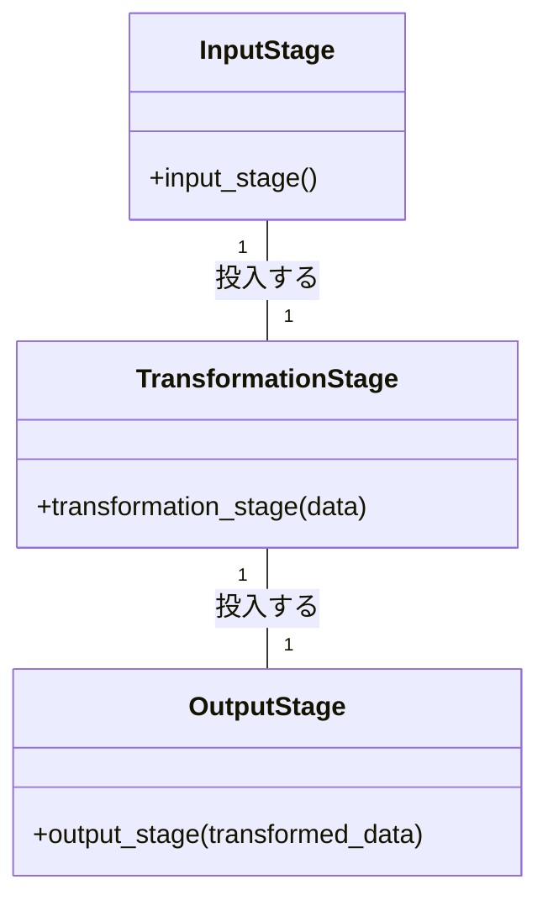

# 知識の流れ パイプライン建築の大水道橋


*パイプ、バルブ、フィルターが相互に接続された広大なネットワークがキャンバスに広がり、複雑な水道橋を表現しています。また、エンジニアは、水がスムーズに流れるように慎重に点検・整備しています。*

## 知識の流れ
情報が水のように貴重な世界に、高度な水道システムに依存する都市があった。大水道」と呼ばれるこのシステムは、パイプ、バルブ、フィルタが連なり、知識を水のように流通させることを目的とした、驚異的なエンジニアリングであった。

## 大水道橋
大水道の設計は、データ処理を明確な段階に分けたパイプライン・アーキテクチャにもとづいています。パイプラインの各段階は、データの入力から変換、そして最後に出力まで、特定の機能を表しています。

```python
# Pythonによるパイプラインの例
def input_stage():
    # データを入力する
    pass

def transformation_stage(data):
    # データを変換する
    pass

def output_stage(transformed_data):
    # 変換されたデータを出力する
    pass
```

## エンジニア集団
大水道を流れる情報の流れを維持し、最適化する仕事を任されたのは、専任のエンジニアのチームでした。彼らは、パイプラインの各段階が効率的かつ効果的に機能することを保証し、データ変換やエラー処理の複雑さを管理しました。



## 課題
パイプライン・アーキテクチャは、直線的でモジュール化された構造を提供しますが、エンジニアはいくつかの課題に直面しました。システムの剛性が高いため、並列処理を導入して性能を向上させることが難しいのです。また、エラーが発生した場合、パイプライン全体が機能不全に陥ることを防ぐために、エラー処理に優れるようにする必要がありました。

```python
# Pythonでエラー処理を行うパイプラインの例
def input_stage():
    # データを入力する
    pass

def transformation_stage(data):
    # データを変換する

    # エラーが発生した場合は、エラーを処理する
    try:
        pass
    except Exception as e:
        # エラーを処理する
        pass

def output_stage(transformed_data):
    # 変換されたデータを出力する
    pass
```

## 勝利
しかし、技術者たちは、この難題にめげず、革新的な解決策を考案した。並列処理の導入やエラー処理のしくみを改善し、情報の流れを最適化することで、街の繁栄を実現したのです。

```python
# Pythonによる並列処理によるパイプラインの例
import concurrent.futures

def input_stage():
    # データを入力する
    pass

def transformation_stage(data):
    # データを変換する
    pass

def output_stage(transformed_data):
    # 変換されたデータを出力する
    pass

# 並列処理を行う
with concurrent.futures.ThreadPoolExecutor() as executor:
    data = input_stage() # データを入力する
    # データを変換する
    transformed_data = executor.map(transformation_stage, data)
    output_stage(transformed_data) # 変換されたデータを出力する
```

## この物語の教訓
大水道橋の物語は、パイプラインアーキテクチャがデータ処理に構造的かつ直線的なアプローチを提供できることを教えてくれる。しかし、その可能性を十分に活かすためには、その限界に留意し、並列処理の導入や堅牢なエラー処理などの課題を克服する準備が必要です。