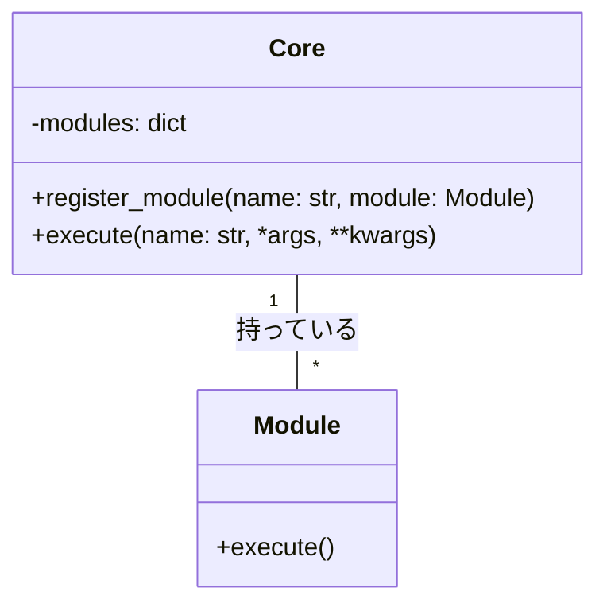

# カーネルの難問：マイクロカーネルアーキテクチャのモジュラーファクトリ


*賑やかなモジュール工場の中心で、中央処理装置（カーネル）と周辺のプラグインモジュールを監督し、施設全体の円滑な運営と調整を図るマネージャー*


## モジュラー工場
刻々と変化するニーズとチャンスに囲まれた土地に、適応力と回復力に定評のあるモジュール工場があった。工場の中心には、カーネルと呼ばれる中央処理装置があり、その周囲には交換可能なさまざまなプラグインモジュールが配置されている。

ファクトリの設計はマイクロカーネルアーキテクチャにもとづいており、最小限のコアで必要な機能を提供し、プラグインモジュールで追加のタスクを処理します。この設計により、ファクトリ挟まざまな状況に迅速かつ効率的に適応できるようになりました。

```python
# Pythonによるマイクロカーネルアーキテクチャの例
class Core:
    def __init__(self):
        self.modules = {} # モジュールの辞書

    def register_module(self, name, module):
        # モジュールを登録する
        self.modules[name] = module

    def execute(self, name, *args, **kwargs):
        # モジュールを実行する
        if name in self.modules:
            return self.modules[name].execute(*args, **kwargs)
        else:
            raise KeyError("モジュールが登録されていません")

class Module:
    def execute(self):
        # モジュールの実行
        pass
```

## 工場長
工場長は、カーネルの安定性を維持しながら、日々進化する工場のニーズに合わせて新しいモジュールを取り入れ、調整する役割を担っていました。彼は、カーネルとモジュールの互換性の確保や、モジュールの追加に伴うシステムの複雑さの管理といった課題に直面しました。



## バランス
工場が大きくなるにつれ、マネージャーはカーネルの安定性とモジュールによる柔軟性のバランスが工場の成功に不可欠であることに気付きました。彼は、カーネルの安定性とミニマリズムを維持しながら、必要に応じてモジュールを追加・削除できるようにする戦略を考案しました。

```python
# Pythonによるマイクロカーネルアーキテクチャのモジュール例
class PrintModule(Module):
    # メッセージを出力するモジュール

    def execute(self, message):
        print(message) # メッセージを出力する

core = Core() # カーネルを作成する
print_module = PrintModule() # モジュールを作成する
core.register_module("print", print_module) # モジュールを登録する
core.execute("print", "こんにちは、世界!") # モジュールを実行する
```

## カーネルの知恵
最終的に、工場のマネージャーは、マイクロカーネルアーキテクチャの適応性と拡張性を最大限に活用しながら、安定した効率的なカーネルを維持できました。工場は繁栄し、土地のニーズを満たし、新たな課題にも容易に適応できるようになりました。

レッスンのよう子
モジュラーファクトリの話は、マイクロカーネルアーキテクチャが安定性と柔軟性のバランスを提供することを教えてくれる。コアをミニマルに保ち、プラグインモジュールに追加のタスクを処理させることで、システム挟まざまな状況に容易に適応できます。しかし、このアーキテクチャの力を真に活用するためには、複雑さを管理し、カーネルとモジュールの間の互換性を確保することが不可欠です。