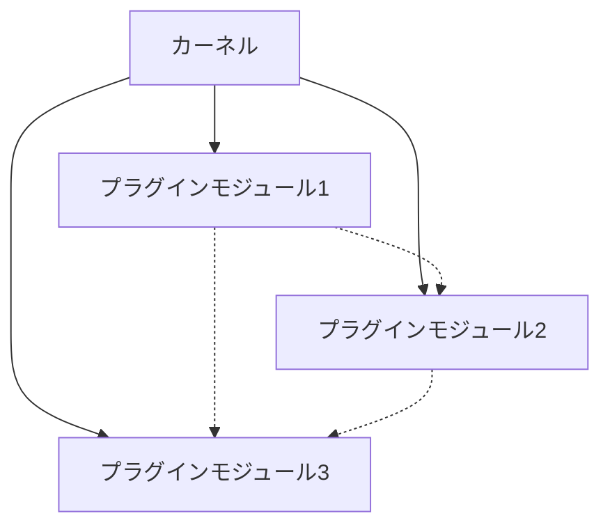

# カーネルの難問：マイクロカーネルアーキテクチャのモジュラーファクトリ


*賑やかなモジュール工場の中心で、中央処理装置（カーネル）と周辺のプラグインモジュールを監督し、施設全体の円滑な運営と調整を図るマネージャー*


## マイクロカーネルアーキテクチャの登場
ある工場がありました。この工場は、中心にある処理ユニット（カーネル）を中心に、さまざまなプラグインモジュールが取り付け可能な構造を持っていました。工場のマネージャーは、安定したカーネルを維持しながら、様々なタスクのために新しいモジュールを組み込み、調整する課題に直面していました。

## マイクロカーネルアーキテクチャの特徴
この工場の特徴は、以下の通りです。

- **カーネル**: 工場の中心にある基本的な機能を提供
- **プラグインモジュール**: 必要に応じて追加・変更が可能
工場のカーネルは、基本的な機能を提供しており、周囲のプラグインモジュールを介してさまざまな機能が実現されています。プラグインモジュールは必要に応じて追加・変更が可能で、工場の機能を柔軟に拡張できるのが大きな特徴です。

```python
# カーネル（基本機能）
class Kernel:
    def execute(self, plugin, *args):
        plugin.run(*args)

# プラグインモジュール（機能追加）
class PluginModule:
    def run(self, *args):
        # 実装された機能を実行
        pass
```

## マイクロカーネルアーキテクチャの利点
マイクロカーネルアーキテクチャの利点は以下の通りです。

- **拡張性**: 必要な機能を追加・変更が容易
- **保守性**: カーネル部分とプラグインモジュールが分離されているため、それぞれ独立して保守・改善が可能
- **適応性**: 新しい技術や要求に対応しやすい
工場マネージャーは、マイクロカーネルアーキテクチャの利点を活かし、工場の生産性を向上させていくことに注力していました。

## マイクロカーネルアーキテクチャの欠点
しかし、マイクロカーネルアーキテクチャには欠点も存在します。

- **性能**: カーネルとプラグインモジュール間の通信にオーバーヘッドが発生
- **複雑さ**: モジュール間の依存関係やインターフェイス管理が複雑になりがち
工場マネージャーは、これらの欠点に対処する方法を検討しなければなりませんでした。特に、性能の問題は、工場の拡大や新しい技術の導入に影響を与える可能性があります。

## 欠点への対策
欠点への対策として、工場マネージャーは以下の方法を検討しました。

1. カーネルとプラグインモジュール間の通信を最適化
1. モジュールの依存関係やインターフェイス管理を明確に定義

まず、カーネルとプラグインモジュール間の通信を最適化することで、性能のオーバーヘッドを軽減できます。次に、モジュールの依存関係やインターフェイス管理を明確に定義することで、複雑さを抑えることができます。

```python
# 通信の最適化
class OptimizedKernel(Kernel):
    def execute(self, plugin, *args):
        # 通信の最適化を実施
        super().execute(plugin, *args)

# 依存関係・インターフェイス管理の明確化
class WellDefinedPlugin(PluginModule):
    def run(self, *args):
        # 依存関係・インターフェイスを明確に定義
        pass
```

## マイクロカーネルアーキテクチャの適用
工場マネージャーは、マイクロカーネルアーキテクチャの利点と欠点を理解し、適切な対策を講じることで、工場の効率と生産性を向上させることができました。この物語は、マイクロカーネルアーキテクチャの柔軟性と拡張性がどのように利用され、その欠点をどのように克服するかを示しています。


