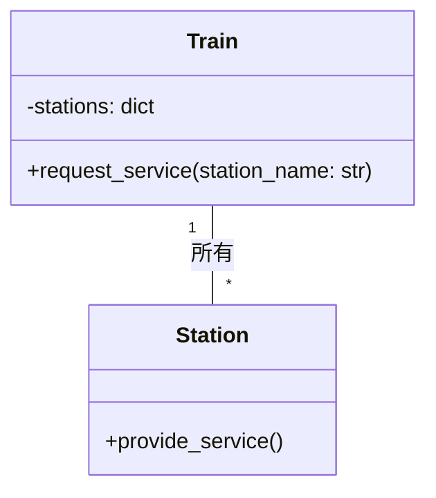

# 運行管理人のコーディネート：サービス指向アーキテクチャの列車ネットワーク

*電車は、乗客にサービスを提供するさまざまな駅をシームレスに結んでいる。若い車掌が地図を手にホームに立ち、熱心にその地図を見ている。*


## 鉄道ネットワーク
それぞれの駅が専門的なサービスを提供する世界では、道路が交差する広大な風景がそれらをつないでいます。鉄道は、駅と駅の間のギャップを埋めるコミュニケーション手段として機能し、駅と駅が協力し合って働くことを可能にしています。

この列車ネットワークは、個々のサービスが互いに通信してタスクを完了するSOA（Service Oriented Architecture）の原則にもとづいて設計されています。物語の中の駅はサービスを表し、列車はサービス間の通信路を象徴しています。

```python
# Pythonによるサービス指向アーキテクチャの例
class Station:
    # 駅はサービスを提供する
    def provide_service(self):
        pass

class Train:
    # 列車は駅間の通信を行う
    def __init__(self, stations):
        self.stations = stations # 駅のリストを保持する

    def request_service(self, station_name):
        # 駅が提供するサービスを要求する
        return self.stations[station_name].provide_service()
```

## ルートマスタを目指す人
列車を編成し、駅が提供するサービスを調整する複雑さを学ぶことを熱望して、若いルートマスタが列車ネットワークに参加するようになりました。彼らの旅は、SOAランドスケープにおける標準化とサービスの発見可能性の重要性を浮き彫りにしています。



## 標準化への挑戦
ルートマスタは、列車ネットワークにおける重要な課題の1つが、駅間の通信を標準化することであることにすぐに気付きました。共通のプロトコルやフォーマットを実装することで、列車ネットワークがより効率的に運用され、駅間の誤解を減らすことができることを知るのです。

```python
# Pythonによる標準化されたサービスの例
class WeatherStation(Station):
    # 天気駅は気温と湿度を提供する
    def provide_service(self):
        return {"気温": 22, "湿度": 45}

# 天気駅を作成する
train = Train({"天気": WeatherStation()})
# 天気駅からサービスを要求する
weather_data = train.request_service("天気")
print(weather_data) # {'気温': 22, '湿度': 45}
```

## サービスディスカバビリティ
ルートマスタは、サービスの発見性という課題にも直面しています。多くの駅がさまざまなサービスを提供しているため、列車が必要な駅を迅速かつ効率的に探し出せるようにすることが不可欠です。ルートマスタは、サービス登録とメタデータを使用して、列車が適切な駅を見つけ、接続できるようにすることを学びます。

```python
# Pythonによるサービスレジストリの例
class ServiceRegistry:
    # サービスレジストリはサービスを登録し、列車がサービスを見つけることを可能にする
    def __init__(self):
        self.services = {} # サービスを保持する

    def register_service(self, name, service):
        # サービスを登録する
        self.services[name] = service

    def locate_service(self, name):
        # サービスが見つからない場合は例外を発生させる
        return self.services[name]

service_registry = ServiceRegistry() # サービスレジストリを作成する
service_registry.register_service("天気", WeatherStation()) # サービスを登録する
train = Train(service_registry.locate_service) # 列車を作成する
weather_data = train.request_service("天気") # サービスを要求する
print(weather_data) # サービスを表示する
```

## ルートマスタの匠の技
若いルートマスタは経験を積むにつれ、列車を編成し、駅が提供するサービスを調整することに熟練していきます。そして、列車ネットワークの円滑な運用を実現するためには、標準化とサービスの発見が重要であることを理解します。

## 教訓
ルートマスタのコーディネートの話は、サービス指向アーキテクチャが、分散型システムを構築するためのモジュラーで柔軟なフレームワークを提供することを教えてくれる。標準化とサービスの発見可能性を確保することで、列車ネットワークは効率的かつ効果的に運用され、駅間のコラボレーションを可能にし、サービスの再利用を促進できます。
