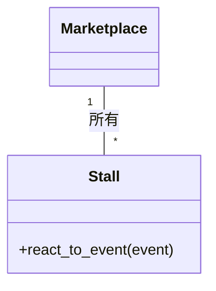

# イベントの祭典： イベント駆動型アーキテクチャの活発なマーケットプレイス

*活気と生命力にあふれた市場の中で、数多くの屋台や店舗は、イベント駆動型建築のさまざまな構成要素を表していました。それぞれの屋台の店主は、アナウンスに耳を傾け、周囲で繰り広げられる出来事に適宜反応していました。*

## 活気付くマーケットプレイス
ある晴れた日の朝、新しいイベントが発表された。ラッパが鳴り響き、屋台の店主たちは皆、耳を傾けた。ある者はそのイベントのために屋台を準備し、ある者はそのイベントのために屋台を準備し、ある者はそのイベントなど自分には関係ないと思い、いつもの仕事を続けた。

```python
# シンプルなイベントドリブンアーキテクチャを表現するPythonコード
class Marketplace:
    # 市場クラスは、イベントを受け取り、それを出店者に伝える役割を持つ
    def __init__(self):
        self.stalls = [] # 出店者のリスト

    def add_stall(self, stall):
        # 出店者を追加する
        self.stalls.append(stall)

    def announce_event(self, event):
        # イベントを受け取り、それを出店者に伝える
        for stall in self.stalls:
            stall.react_to_event(event)

class Stall:
    # 出店者クラスは、イベントを受け取り、それに応じて仕事をする役割を持つ
    def react_to_event(self, event):
        # 特定のイベントに反応するように派生クラスでオーバーライドする
        pass
```

## コーディネートの課題を克服する
マーケットプレイスは複雑な環境にあるため、出店者どうしが連絡を取り合いながら、円滑に運営する必要がありました。そこで、メッセージの受け渡しやイベント情報を共有するシステムを構築したのです。



## 疎結合の美しさ
マーケットプレイスのイベント駆動型であるため、出店者は独立して仕事をし、ほかのイベントに支障をきたすことなく、さまざまなイベントに対応できました。このように構成要素を切り離すことで、全体的な構造に影響を与えることなく、マーケットプレイスを進化・成長させることができました。

## 負荷のバランス
ピーク時には、イベントによって複数の出店者に負荷がかかり、マーケットプレイスの負荷分散に課題がありました。そのため、出店者はタスクを均等に分配するシステムを考案し、誰もがスムーズに利用できるようにしました。

```python
# イベント駆動型アーキテクチャのロードバランサーのPythonコードです。
class LoadBalancer:
    # ロードバランサーは、イベントを受け取り、それを出店者に伝える役割を持つ
    def __init__(self):
        self.stalls = []

    def add_stall(self, stall):
        # 出店者を追加する
        self.stalls.append(stall)

    def balance_load(self, event):
        # イベントを受け取り、それを出店者に伝える
        for stall in self.stalls:
            if not stall.is_busy():
                stall.react_to_event(event)
                break
```

イベントフェスティバルでは、賑やかなマーケットプレイスで、疎結合コンポーネント、柔軟性、適応性といったイベント駆動型アーキテクチャのパワーを披露しました。マーケットの登場人物たちは、複雑な環境の中で協力し、コミュニケーションをとり、成功を収め、このアーキテクチャの可能性を示しながら、その課題を克服していきました。