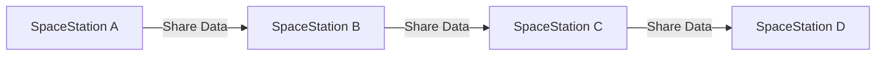
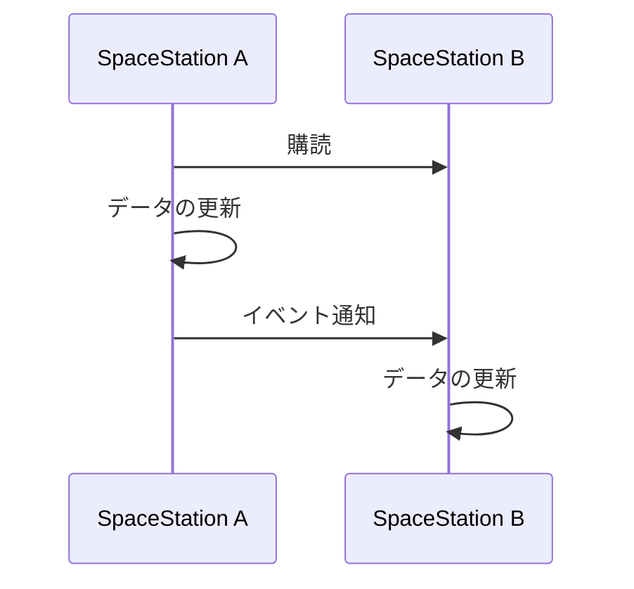

*遥か彼方の銀河系では、宇宙ステーションが相互に接続された広大なグリッドが文明のバックボーンとして機能していました。各宇宙ステーションは、データの処理と保存を担当し、そのグリッドは見事なエンジニアリングの賜物である。*


## 導入：宇宙ステーションのネットワーク
宇宙の広大な領域に無数の宇宙ステーションが存在していました。それらは、データの処理や保存のためのネットワークを構築するために連携していました。この物語は、宇宙ステーションを維持・拡張する技術者チームの活躍を描いています。彼らは、スペースベースアーキテクチャの利点を活かしながら、データ分散、耐障害性、ロードバランシングといった課題に取り組んでいくのです。

```python
# SpaceStationクラスの定義
class SpaceStation:
    # 宇宙ステーションの名前を受け取り、インスタンス変数として保持

    def __init__(self, name):
        self.name = name # 宇宙ステーションの名前
        self.data = [] # 宇宙ステーションに保存されているデータ

    def process_data(self, new_data):
        # データを処理
        self.data.append(new_data)

    def store_data(self, index, new_data):
        # データを保存
        self.data[index] = new_data

    def get_data(self, index):
        # データを取得
        return self.data[index]

# 宇宙ステーション間でデータを共有するためのGalacticGridクラスの定義
class GalacticGrid:
    # 宇宙ステーションを管理するためのクラス

    def init(self):
        self.stations = {} # 宇宙ステーションの名前をキーとして保持

    def add_station(self, station):
        # 宇宙ステーションを追加
        self.stations[station.name] = station

    def get_station(self, name):
        # 宇宙ステーションを取得
        return self.stations.get(name)

    def share_data(self, from_station, to_station, index):
        # 宇宙ステーション間でデータを共有
        to_station.store_data(index, from_station.get_data(index))
```
## 機能：データ分散と耐障害性

宇宙ステーションのネットワークでは、データは複数のステーションに分散して保存されるため、1つのステーションが故障してもデータが失われることはありません。この特徴により、スペースベースアーキテクチャは高い耐障害性を実現しています。


## 利点：スケーラビリティとロードバランシング
スペースベースアーキテクチャのもう1つの利点は、スケーラビリティです。新しい宇宙ステーションを追加することで、容易にデータ処理能力を拡張できます。また、各ステーションが独立してデータ処理を行うことで、ロードバランシングも実現されています。

```python
# 新しい宇宙ステーションを追加してデータ処理能力を拡張
galactic_grid = GalacticGrid() # グリッドを初期化
station_a = SpaceStation("A") # 宇宙ステーションAを初期化
station_b = SpaceStation("B") # 宇宙ステーションBを初期化
galactic_grid.add_station(station_a) # 宇宙ステーションAをグリッドに追加
galactic_grid.add_station(station_b) # 宇宙ステーションBをグリッドに追加
```

## 欠点：データ整合性の課題
スペースベースアキテクチャでは、データが複数のステーションに分散されているため、**データ整合性を保つことが難しい**という欠点があります。特に、同時に複数のステーションが同じデータにアクセス・更新する場合、データの競合が発生する可能性があります。

```python
# データ競合の例
station_a.process_data("data_1") # 宇宙ステーションAでデータ1を処理
station_b.process_data("data_1") # 宇宙ステーションBでデータ1を処理
galactic_grid.share_data(station_a, station_b, 0) # 宇宙ステーションAから宇宙ステーションBにデータ1を共有
station_b.store_data(0, "updated_data_1") # 宇宙ステーションBでデータ1を更新
```

## 対策：データ整合性の確保
データ整合性の問題に対処するため、一部の機能を別のソフトウェアアーキテクチャに移行できます。例えば、イベント駆動アーキテクチャ（Event-Driven Architecture）を導入することで、データの変更を追跡し、データ競合を防ぐことができます。イベント駆動アーキテクチャでは、データ変更時にイベントが発行され、他のステーションがそのイベントを購読してデータの更新を行います。

```python
class Event:
    # イベントを表すクラス

    def __init__(self, action, data):
        # イベントを初期化
        self.action = action # イベントの種類
        self.data = data # イベントのデータ

class EventDrivenSpaceStation(SpaceStation):
    # イベント駆動アーキテクチャに基づく宇宙ステーション

    def __init__(self, name):
        # スーパークラスのコンストラクタを呼び出す
        super().__init__(name) 
        self.subscribers =[] # 購読者のリスト

    def subscribe(self, subscriber):
        # 購読者を追加
        self.subscribers.append(subscriber)

    def notify(self, event):
        for subscriber in self.subscribers:
            # 購読者にイベントを通知
            subscriber.update(event)

    def update(self, event):
        # イベントを受け取り、データを更新
        if event.action == "store_data": 
            # イベントの種類がstore_dataの場合データを更新
            self.store_data(event.data["index"], event.data["new_data"]) 

station_a = EventDrivenSpaceStation("A") # 宇宙ステーションAを初期化
station_b = EventDrivenSpaceStation("B") # 宇宙ステーションBを初期化
station_a.subscribe(station_b) # 宇宙ステーションAから宇宙ステーションBに購読
event = Event("store_data", {"index": 0, "new_data": "updated_data_1"}) # イベントを作成
station_a.notify(event) # 宇宙ステーションAから宇宙ステーションBにイベントを通知
```

これにより、スペースベースアーキテクチャのデータ整合性の課題に対処し、スケーラビリティ、耐障害性、ロードバランシングの利点を維持しながら、より堅牢なシステムを構築できます。



## まとめ
物語「ギャラクティック・グリッド」を通して、スペースベースアーキテクチャの特徴や利点、欠点、対策について学びました。宇宙ステーションのネットワークは、データ分散、耐障害性、ロードバランシングの利点を持ち、スケーラブルなシステムを実現します。ただし、データ整合性の課題に対処するために、イベント駆動アーキテクチャを導入するほうほうなどもあります。