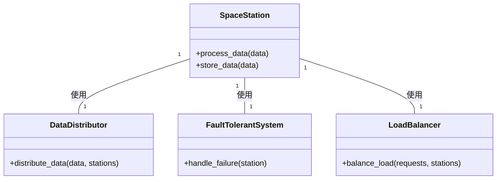

*遥か彼方の銀河系では、宇宙ステーションが相互に接続された広大なグリッドが文明のバックボーンとして機能していました。各宇宙ステーションは、データの処理と保存を担当し、そのグリッドは見事なエンジニアリングの賜物である。*


## 宇宙ステーションのネットワーク
宇宙ステーションは、モジュール式で適応性が高く、それぞれが独立して機能しながらも、ほかのステーションとシームレスに相互接続できるように設計されています。これらのステーションは、ネットワーク全体が障害に耐え、負荷を分散し、銀河のニーズの高まりに対応できるよう拡張できることを保証しています。

```python
class SpaceStation:
    def process_data(self, data):
        # 受信データを処理する
        pass

    def store_data(self, data):
        # 処理したデータを保存する
        pass
```

## 空白の時間への挑戦
熟練した技術者たちが、さまざまな困難に立ち向かいながら、宇宙ステーションの維持・拡張に精力的に取り組んでいます。

## データ配信
エンジニアは、データをステーションに均等に分散させ、1つのステーションが過負荷になるのを防ぐ必要がありました。

```python
class DataDistributor:
    def distribute_data(self, data, stations):
        # 宇宙ステーションに均等にデータを配布する
        pass
```

## フォールトトレランス
故障に備えるため、ステーションに問題が発生してもデータやサービスが失われないよう、フォールトトレラントシステムを導入しました。

```python
class FaultTolerantSystem:
    def handle_failure(self, station):
        # 失敗を処理し、失われたデータやサービスを回復する。
        pass
```

## ロードバランシング
エンジニアはロードバランシング戦略を採用し、ワークロードを分散させ、リクエストに圧倒されるステーションがないようにしました。

```python
class LoadBalancer:
    def balance_load(self, requests, stations):
        # 宇宙ステーションに作業負荷を均等に分散させる
        pass
```

## 時代を超えたグリッド
このような困難にもかかわらず、エンジニアチームは宇宙ステーションの維持とグリッドの拡張に成功しました。彼らの働きによって、銀河系は宇宙ベースのアーキテクチャの堅牢性、拡張性、柔軟性の恩恵を受けることができたのです。



彼らの努力によって、銀河系グリッドは繁栄し続け、銀河系の未来に強い基盤を提供できたのです。