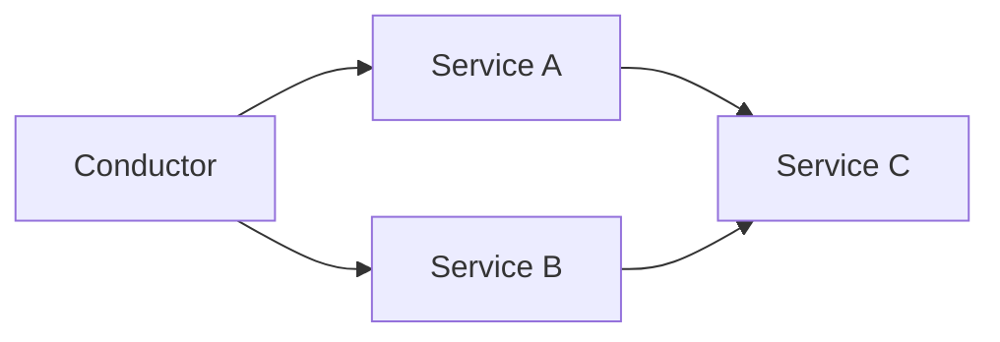

*温かなスポットライトを浴びたエレガントな指揮者が、大舞台で多彩な演奏者のアンサンブルを自信を持ってリードし、調和と協調の感覚を呼び起こす。*

## マエストロの名作
ある壮大な都市に大劇場があり、その都市の豊かな文化遺産を紹介する豪華な演出で有名でした。この劇場は、オーケストレーション駆動型サービス指向アーキテクチャのメタファとして機能し、さまざまなパフォーマーはサービスを、指揮者はオーケストレーターを表しています。

## 若き指揮者
若く野心的な指揮者が、大劇場での新演出を指揮する仕事を任された。彼はすぐに、完璧なパフォーマンスを生み出すために、サービスの調和、情報の流れの管理、意思決定の技術を理解する必要があることに気付きました。

```python
class Conductor:
    def __init__(self):
        # オーケストレーターは、サービスのリストを保持する
        self.services = []

    def orchestrate(self, services):
        for service in services: # サービスのリストをループする
            service.perform() # サービスを実行する
``` 
## リハーサル風景
リハーサルの中で、若い指揮者は、演奏者間の依存関係を管理し、演奏者が互いに同期していることを確認する必要があることを知りました。このことは、オーケストレーション主導のサービス指向アーキテクチャにおける集中制御と調整の重要性を彼に理解させることになった。

```python
class Service:
    def __init__(self, name, dependencies=[]):
        self.name = name # サービス名
        self.dependencies = dependencies # 依存するサービスのリスト

    def perform(self):
        # 依存するサービスを実行する
        for dependency in self.dependencies:
            dependency.perform() # 依存するサービスを実行する
        print(f"{self.name}が演奏しています！")
```
## コーディネートへの挑戦
作品が複雑化するにつれ、若い指揮者はサービスの調整という課題に直面しました。彼は、オーケストレーターとして、エラーケースの処理、サービスの発見性、サービス間の情報の流れを管理し、シームレスなパフォーマンスを確保する必要があることに気付いた。


## 圧巻のパフォーマンス
練習と学習を重ねた若き指揮者は、ついに演奏家チームを率いて、まばゆいばかりの初日を迎えました。観客は、サービスが調和し、サービス間で情報がシームレスに流れる様子に驚嘆し、オーケストレーション駆動型サービス指向アーキテクチャの利点を強調した。

```python
service_c = Service("Service C") # 依存するサービスがない
service_a = Service("Service A", [service_c]) # 依存するサービスがある
service_b = Service("Service B", [service_c]) # 依存するサービスがある

conductor = Conductor() # オーケストレーターを作成する
conductor.orchestrate([service_a, service_b]) # オーケストレーションを開始する
```
## この物語の教訓
この旅を通して、若き指揮者は、集中管理、調整、意思決定といったオーケストレーション駆動型サービス指向アーキテクチャの利点を発見しました。また、エラー処理、サービスの発見性、サービス間の依存関係の管理など、それに付随する課題についても学びました。

大劇場のメタファを通して、うまくオーケストレーションされたサービス指向アーキテクチャが、劇場での見事なパフォーマンスのように、調和のとれた効率的なシステムを作り上げることができることを実証した。