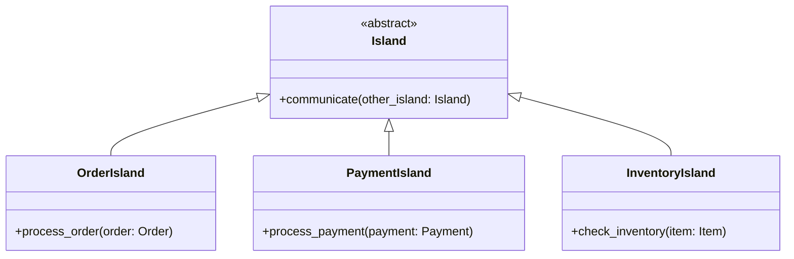

# マイクロサービス列島 独立した島の交流

*様々な島が頑丈な橋で結ばれ、人々が橋の上で物や情報を忙しくやり取りしている様子が描かれています。*


## 孤立の課題
島が点在する世界に、Microservicesという群島がありました。マイクロサービス群島は、各島が1つの機能に特化して地域全体のニーズに応えるというユニークな場所でした。これらの島の住民は、分散化された環境の中でバランスを保ち、繁栄するために、協力し、コミュニケーションし、交易する必要がありました。

当初は、島が孤立していることが課題でした。各島は自分の機能だけに責任を持ち、ほかの島と協力することは困難でした。そのため、各島が独立してリソースやツールを維持する必要があり、冗長性や非効率性を招いていました。

この課題を克服するために、マイクロサービス群島の住人たちは、島々の間に通信路を設けることにしました。橋や船を設置し、情報や物資のやりとりを容易にすることで、島々の連携がより効果的に行われるようになりました。

```python
# 島々の間にコミュニケーションチャンネルを作る
class Island:
    def __init__(self, name, function):
        self.name = name
        self.function = function

    def communicate(self, other_island):
        # 他の島と情報・物品を交換する
        pass
```

## 分散型社会
島々がコミュニケーションをとるようになると、分散型社会の利点を実感するようになりました。各島は独立して進化でき、列島全体に影響を与えることなく、変化するニーズや要件に対応できたのです。この柔軟性により、島々は自分たちのペースで成長し、変化でき、システム全体の失敗のリスクを減らすことができました。

```python
# 島は独立して進化することができる
class Island:
    def adapt(self, new_function):
        # 他の島に影響を与えずに機能を変更する
        self.function = new_function
```

Microservices Archipelagoでは、各島が独自のルールとガバナンスを持っていました。この自律性により、各島はそれぞれのニーズに応じて意思決定を行い、リソースを管理できました。その結果、アーキペラゴは島単位で変更が可能なため、高度にモジュール化され、保守が容易になりました。

```python
# 島には独自のルールとガバナンスがある
class Island:
    def set_rules(self, rules):
        # 島特有のルールを設定する
        self.rules = rules
```

## 確かなコミュニケーションチャネルの確立
各島が連携するようになったことで、マイクロサービス群島の住人たちは、島々の間に強固なコミュニケーションチャンネルを確立することに注力しました。各島がほかの島からのメッセージを理解し応答できるように、情報交換のためのプロトコルと標準を開発しました。

```python
# 通信プロトコルや標準を定義する
class CommunicationProtocol:
    def __init__(self, name, rules):
        self.name = name
        self.rules = rules

    def send_message(self, message, sender, receiver):
        # プロトコルのルールに従ってメッセージを送信
        pass
```

これらのコミュニケーション・チャンネルは、マイクロサービス群島の成功に不可欠なものでした。なぜなら、これらのチャンネルによって、島々は情報を共有し、努力を調整できたからです。また、コミュニケーションに失敗すると、列島全体に問題が連鎖する可能性があるため、住民たちはこれらのチャネルの健全性を監視する必要があることに気付きました。

## マイクロサービス列島のメリットとデメリット
島々が成長し進化し続けるにつれ、マイクロサービス群島の住民は、そのユニークな環境の利点と欠点の両方に気付き始めました。分散型であるため、柔軟性とモジュール性があり、各島が独立して適応し、変化できる。つまり、列島全体が障害や要求の変化に強いということだ。

しかし、住民たちは、分散型の環境に伴う課題も認識していました。島と島の間のコミュニケーションは、成功に欠かせないものでしたが、同時に複雑さや潜在的な失敗の可能性をはらんでいました。さらに、各島の自律性は、島々が効果的に連携するための強力なガバナンスと標準化が必要であることを意味していました。

```python
# 強いガバナンスと標準化の必要性
class Governance:
    def __init__(self, policies, standards):
        self.policies = policies
        self.standards = standards

    def enforce_standards(self, island):
        # ポリシーとスタンダードを島で実施する
        pass
```

このような課題にもかかわらず、マイクロサービス列島の住人は、コミュニケーションチャネル、ガバナンス、標準化プロセスを開発し、改良し続けました。これにより、彼らは独自のアーキテクチャに関連するリスクを軽減し、それが提供する利点を活用できました。


## 島々の協力
マイクロサービス群島の成功の鍵は、各島々の協力とコミュニケーションにありました。それぞれの島には特定の役割があり、協力することで列島全体に包括的なサービスを提供できたのです。

島々がどのように連携しているかを説明するために、次の人魚のクラス図を見てみましょう：



この例では、3つの特化した島を用意しています： OrderIsland、PaymentIsland、InventoryIslandです。それぞれの島は、注文や支払いの処理、在庫の確認など、特定の機能を備えています。ある島の住人がほかの島が提供するサービスを必要とする場合、抽象的なcommunicationメソッドを使用してほかの島と通信します。これにより、各島が効果的に連携し、群島内のバランスを保つことができる。

```python
class OrderIsland:
    def process_order(self, order):
        # 注文を処理し、必要に応じて他の島と通信する。
        payment_status = self.communicate(PaymentIsland)
        inventory_status = self.communicate(InventoryIsland)
        if payment_status and inventory_status:
            # 注文を完了させる
            pass
```

## マイクロサービス列島の教訓を受けやめる
Microservices Archipelagoの内部と外部を学んだので、Microservices Architectureについて教えてくれる教訓と経験について考える時です。島々の住民が直面する課題を観察することで、このアーキテクチャスタイルにどのように取り組むべきか、貴重な洞察を得ることができます。

### コラボレーションとコミュニケーションの促進
島々が効率的に連携するためには、強固なコミュニケーションチャネルを確立する必要がありました。同様に、マイクロサービスベースのシステムでは、サービス間のシームレスな統合と協力を確保するために、堅牢で標準化された通信プロトコルを実装することが重要です。

### レジリエントなシステムの構築
Microservices Archipelagoのレジリエンス（回復力）は、その分散化された性質に由来します。障害を分離することで、逆境に直面しても機能し続けることができたのです。マイクロサービスを設計する際には、障害シナリオを想定し、個々のサービスが停止した場合でもシステム全体の可用性を維持できるような戦略を立てることが重要です。

### 柔軟性と複雑性のバランス
Microservices Archipelagoは、その島々の柔軟性と適応性の恩恵を受けている一方で、複雑性の増大に悩まされていました。柔軟で適応性の高いシステムの利点と、より複雑なアーキテクチャを管理する課題との間でバランスを取ることが不可欠です。

列島の住民のように、技術的な状況やユーザーのニーズが変化し続ける中で、私たちは適応し進化するための準備をしなければなりません。マイクロサービスアーキテクチャの重要なコンセプトである分散化、回復力、適応性を取り入れることで、時の試練に耐える堅牢でスケーラブル、かつ柔軟なシステムを構築できます。