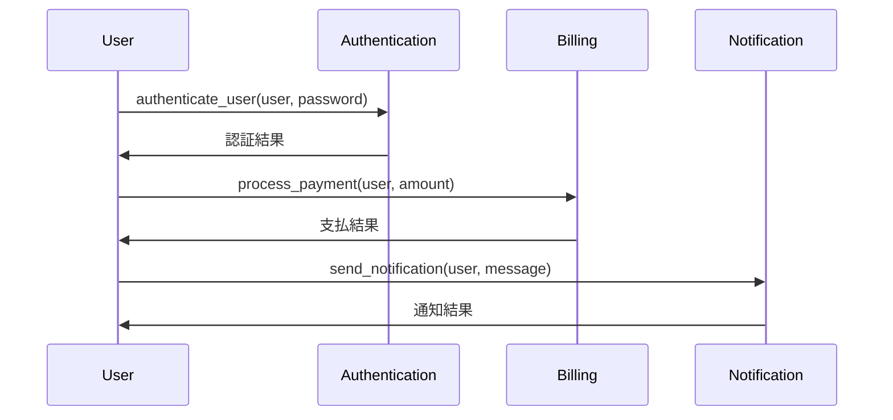

# マイクロサービス諸島 独立した島の交流

*様々な島が頑丈な橋で結ばれ、人々が橋の上で物や情報を忙しくやり取りしている様子が描かれています。*

## 島々の大移動
海の最も遠いところに、マイクロサービス諸島として知られる美しい群島がありました。この群島内の各島はユニークで、地域全体のニーズを満たす特定の機能に特化していました。これらの島々の住民は、バランスを維持して繁栄するために、互いに協力し、通信し、取引する必要がありました。
このストーリーでは、孤立を克服し、強固なコミュニケーション チャネルを確立し、分散型環境を構築するこれらの島々の旅をたどります。

## 多くの島々の土地
マイクロサービス アイランドは、各アイランドが単一の個別のサービスを担当するように設計されています。この設計により、居住者は専門的なタスクに集中できるようになり、可能な限り最高のサービス品質が保証されました。

```python
# マイクロサービス諸島: Python を使用した簡単な例

# A島: 認証サービス
def authenticate_user(user, password):
    # ユーザーを認証するためのコード
    pass

# B島: 請求サービス
def process_payment(user, amount):
    # 支払いを処理するためのコード
    pass

# C島：通知サービス
def send_notification(user, message):
    # 通知を送信するコード
    pass
```



## マイクロサービス諸島の利点

### 1. 開発と展開の高速化
各島の独立性により、住民は群島全体を混乱させることなく、サービスを迅速に開発および展開できました。

### 2. メンテナンスと進化の容易化
システム全体に影響を与えることなく島を更新、維持、または交換でき、群島が独自のペースで進化できるようになりました。

### 3. リソースの有効活用
島々はリソースを効率的に割り当てることができ、他の島が十分に活用されていない間、単一の島に過負荷がかからないようにできました。

## マイクロサービス諸島の欠点
### 1.複雑さの増加
島の数の増加とそれらの相互依存により、システム全体がより複雑になり、管理が困難になる可能性がありました。

### 2. 通信オーバーヘッド
島々は相互に通信する必要があったため、遅延が増加し、堅牢な通信システムが必要になる可能性がありました。

### 3. 分散システムの課題
群島の分散型の性質により、データの一貫性、ネットワークの分割、フォールト トレランスなどの問題が発生しやすくなりました。

## デメリットへの対策
マイクロサービス群島の欠点に対処するために、住民はモノリシック アイランド アーキテクチャへの移行を検討できます。この単一の統合された島にすべてのサービスが収容され、複雑さと通信のオーバーヘッドが削減されます。

ただし、この移行には、スケーラビリティと柔軟性の低下など、独自の一連のトレードオフが伴います。

## ドメイン駆動設計 (DDD) との関係
ドメイン駆動設計 (DDD) は、コア ビジネス ドメインとそれに関連するロジックのモデル化に重点を置いたソフトウェア開発へのアプローチです。ビジネスとその要件について共通の理解を生み出すために、ドメインの専門家とソフトウェア開発者の間のコラボレーションを強調しています。マイクロサービス アーキテクチャのコンテキストでは、DDDは、効果的でスケーラブルで保守可能なシステムの設計と実装において重要な役割を果たします。
マイクロサービス アーキテクチャに貢献するDDDの重要な側面は次のとおりです。

| 側面                  | 概要                                                                                                                                                                                                                                                                                                                                                                                                                                             |
| :-------------------- | :----------------------------------------------------------------------------------------------------------------------------------------------------------------------------------------------------------------------------------------------------------------------------------------------------------------------------------------------------------------------------------------------------------------------------------------------- |
| **境界コンテキスト**  | DDDでは、境界コンテキスト は、特定のドメイン モデルが適用される論理的な境界です。ドメイン、そのルール、およびその動作をカプセル化します。マイクロサービス アーキテクチャでは、各マイクロサービスは独自の境界付けられたコンテキストを持つように設計されており、システムのさまざまな部分間の懸念を分離し、境界を明確にできます。これにより、サービス間の結合が減り、システム全体の保守性と拡張性が向上します。                                     |
| **ユビキタス言語**    | DDDは、ビジネス ドメインに固有の、ドメインの専門家と開発者の間の共通の共有言語の使用を強調しています。この共有言語は、コード、ドキュメント、コミュニケーションなど、システム全体で使用されます。マイクロサービス アーキテクチャでは、ユビキタス言語を使用することで、各サービスに明確で明確に定義された目的を持たせることができます。これにより、システム設計全体の理解が促進され、チーム メンバー間の効果的なコミュニケーションが促進されます。 |
| **集合体**            | 集合体は、1つの単位として扱うことができるドメイン オブジェクトのクラスターです。それらは、境界付けられたコンテキスト内で一貫性とバリアント ルールを適用します。マイクロサービス アーキテクチャでは、集約を使用して、マイクロサービスの範囲とそのデータ整合性の境界を定義します。各マイクロサービスは、1つ以上の集計を管理する役割を果たします。これにより、データの整合性が維持され、サービス内でトランザクションの一貫性が実現されます。        |
| **ドメイン イベント** | ドメイン イベントは、ビジネス ドメイン内の重要な出来事や状態の変化を表します。マイクロサービス アーキテクチャでは、サービス間の通信手段としてドメイン イベントを使用できます。ドメイン イベントを発行およびサブスクライブすることにより、マイクロサービスは、直接結合することなく、システムの他の部分の変更に対応できます。これにより、より柔軟で分離されたスケーラブルなアーキテクチャが可能になります。                                        |
| **戦略的設計**        | DDDは、コンテキスト マッピングなどの戦略的設計パターンを提供して、境界付けられたコンテキスト間の関係と依存関係を識別します。マイクロサービス アーキテクチャでは、これらの関係を理解することは、サービス間の相互作用を設計するのに役立ち、サービスの境界と責任に関してより適切な意思決定を行うことができます。                                                                                                                                    |
| **腐敗防止層**        | マイクロサービスがレガシー システムまたは外部サービスと対話する必要がある場合、Anti-Corruption Layerを使用して、サービスのドメイン モデルと外部システムのモデルの間で変換できます。これにより、マイクロサービスの境界コンテキストがそのまま保持され、サービスが外部の問題で汚染されるのを防ぎます。                                                                                                                                              |

要約すると、ドメイン駆動設計は、モジュラー、スケーラブル、および保守を設計するための原則とパターンを提供することにより、マイクロサービス アーキテクチャで重要な役割を果たします。
